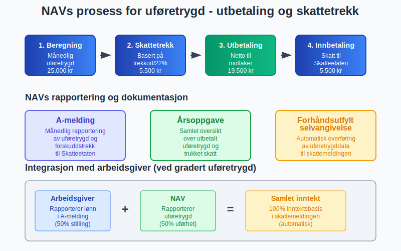

**Skatt på uføretrygd** er et komplekst område innen norsk skatterett som påvirker både private uføretrygdmottakere og arbeidsgivere. [Uføretrygd](/blogs/regnskap/hva-er-uforetrygd "Hva er Uføretrygd? Komplett Guide til Trygdeordninger") regnes som **skattepliktig inntekt** og behandles anderledes enn ordinær [lønn](/blogs/regnskap/hva-er-loenn "Hva er Lønn? Beregning og Regnskapsføring av Lønnskostnader") i både regnskaps- og [skattemessig sammenheng](/blogs/regnskap/hva-er-skatt "Skatt - Komplett Guide til Bedriftsskatt, MVA og Skatteplanlegging").

## Seksjon 1: Grunnleggende om Uføretrygd og Skatteplikt

### 1.1 Hva er Uføretrygd?

**Uføretrygd** er en stønad fra NAV som utbetales til personer som har varig redusert arbeidsevne på grunn av sykdom eller skade. Uføretrygden erstatter tidligere arbeidsrettede rehabiliteringspenger og garantipensjon.


#### Forutsetninger for uføretrygd:
* **Varig nedsatt arbeidsevne** med minst 50%
* **Medlem** i folketrygden
* **Poengår:** Minimum 3 poengår etter fylte 16 år  
* **Alle muligheter** for arbeidsrettede tiltak er vurdert

For å beskytte inntekt utover uføretrygd kan man tegne en privat **uføreforsikring**. Les mer i [Uføreforsikring](/blogs/regnskap/uforeforsikring "Uføreforsikring “ Guide til Private Uføreforsikringer i Norge").

### 1.2 Skatteplikt på Uføretrygd

**Uføretrygd er skattepliktig inntekt** i henhold til skatteloven § 5-40. Dette betyr at mottakerne må betale både [ordinær inntektsskatt](/blogs/regnskap/hva-er-skatt "Skatt - Komplett Guide til Bedriftsskatt, MVA og Skatteplanlegging") og trygdeavgift av uføretrygden.

#### Skattemessig behandling:
| **Element** | **Behandling** | **Særlige regler** |
|-------------|----------------|--------------------|
| **Grunnbeløp** | Skattepliktig | Som ordinær lønn |
| **Barnetillegg** | Skattepliktig | Behandles separat |
| **Kompensasjonstillegg** | Skattefritt | Ikke regnet som inntekt |
| **Hjelpestønad** | Skattefritt | Ikke skattepliktig |


### 1.3 Forskjeller fra Ordinær Lønn

**Uføretrygd behandles annerledes** enn vanlig arbeidslønn:

#### Viktige forskjeller:
* **Ingen arbeidsgiveravgift:** NAV betaler ikke arbeidsgiveravgift
* **Redusert trygdeavgift:** Lavere sats enn for lønnsarbeid
* **Feriepenger:** Uføretrygdmottakere får ikke feriepenger
* **Pensjon:** Opptjening av pensjonspoeng fortsetter
* **Sykerettigheter:** Ved sykdom gjelder spesielle regler for [sykepenger](/blogs/regnskap/hva-er-sykepenger "Hva er Sykepenger? Komplett Guide til Arbeidsgiverperiode og NAV-refusjon") ved gradert uføretrygd

## Seksjon 2: Beregning av Skatt på Uføretrygd

### 2.1 Skattesatser og Beregningsgrunnlag

**Skattesatsene** for uføretrygd følger ordinære satser, men med noen justeringer:

#### Trygdeavgift på uføretrygd (2024):
| **Inntektsnivå** | **Trygdeavgiftssats** | **Sammenligning med lønn** |
|------------------|----------------------|---------------------------|
| Under 2G (≈ 232.000 kr) | 5,1% | Samme som lønn |
| Over 2G | 5,1% | Lavere enn lønn (8,2%) |

#### Beregningseksempel:
```
Årlig uføretrygd: 300.000 kr
Trygdeavgift: 300.000 × 5,1% = 15.300 kr
Ordinær skatt (eksempel): 300.000 × 22% = 66.000 kr
Total skatt: 15.300 + 66.000 = 81.300 kr
```


### 2.2 Forskuddstrekk og Skattekort

**NAV trekker forskuddsskatt** av uføretrygden basert på:

#### Trekkgrunnlag:
* **Prosentsats** fra skattekort eller 22% (standard)
* **Tabelltrékk** basert på antall trekkdager per måned
* **Fradrag** for personfradrag og andre standardfradrag

#### Særlige bestemmelser:
* **Minstegrense:** Trekk først når uføretrygd overskrider personfradrag
* **Maksgrense:** Ikke trekk mer enn 50% av månedlig uføretrygd
* **Justeringer:** Kan justeres ved endringer i trekksats

### 2.3 Tilleggsfradrag og Spesielle Fradrag

**Uføretrygdmottakere** kan ha rett til særlige fradrag:

#### Uførefradrag:
* **Størrelse:** Inntil 19.000 kr (2024) for personer med varig nedsatt ervervsevne
* **Vilkår:** Minimum 2/3 uførhet
* **Beregning:** Graderes etter uføregrad

#### Andre relevante fradrag:
| **Fradragstype** | **Beløp (2024)** | **Vilkår** |
|------------------|------------------|------------|
| **Personfradrag** | 67.000 kr | Standard for alle |
| **Uførefradrag** | Inntil 19.000 kr | Ved uførhet |
| **Foreldrefradrag** | 25.000 kr | Enslige forsørgere |
| **Minstefradrag** | Minimum 4.000 kr | Som vanlig inntekt |


## Seksjon 3: Regnskapsføring av Uføretrygdutbetalinger

### 3.1 Arbeidsgivers Regnskapsføring

**Arbeidsgivere** som utbetaler lønn til ansatte som mottar gradert uføretrygd må føre dette korrekt:

#### Bokføringseksempel for gradert uføretrygd (50% stilling):
```
Lønn for 50% stilling: 250.000 kr/år
Uføretrygd fra NAV: 150.000 kr/år

Månedlig bokføring:
Debet: Lønnskostnad              20.833 kr
Kredit: Skyldig lønn            20.833 kr

Debet: Skyldig lønn             20.833 kr  
Kredit: Bank                    16.666 kr (netto utbetaling)
Kredit: Forskuddstrekk           2.917 kr
Kredit: Arbeidsgiveravgift       1.250 kr
```


### 3.2 Arbeidsgivers Sosiale Kostnader

**Sosiale kostnader** påvirkes når ansatte mottar uføretrygd:

#### Arbeidsgiveravgift beregning:
* **Full stilling:** Arbeidsgiveravgift av full lønn
* **Gradert uføretrygd:** Arbeidsgiveravgift kun av lønnsdelen
* **Ingen avgift** på uføretrygddelen som utbetales av NAV

#### Eksempel sosiale kostnader:
| **Element** | **Fulltidsstilling** | **50% stilling + uføretrygd** |
|-------------|---------------------|-------------------------------|
| Grunnlønn | 500.000 kr | 250.000 kr |
| Arbeidsgiveravgift (14,1%) | 70.500 kr | 35.250 kr |
| Pensjon (2%) | 10.000 kr | 5.000 kr |
| **Total kostnad** | **580.500 kr** | **290.250 kr** |

### 3.3 NAVs Regnskapsføring og Rapportering

**NAV** håndterer både utbetaling og skattetrekk av uføretrygd:

#### NAVs prosess:
1. **Beregning** av månedlig uføretrygd
2. **Skattetrekk** basert på trekkort eller standardsats
3. **Utbetaling** av netto beløp til mottaker
4. **Innbetaling** av forskuddstrekk til Skatteetaten
5. **Rapportering** via A-melding og årsoppgave



## Seksjon 4: Selvangivelse og Årsoppgjør

### 4.1 Selvangivelse for Uføretrygdmottakere

**Uføretrygdmottakere** må innlevere selvangivelse som andre skattytere:

#### Forhåndsutfylt informasjon:
* **Uføretrygd** fra NAV (post 2.1.1)
* **Forskuddstrekk** trukket av NAV
* **Relevante fradrag** beregnet automatisk

#### Informasjon mottaker må fylle ut:
* **Andre inntekter** (arbeid, kapital)
* **Fradrag** som ikke er standard
* **Formue** og gjeld
* **Endringer** i personlige forhold

### 4.2 Kombinasjon med Arbeidsinntekt

**Kombinert inntekt** fra arbeid og uføretrygd krever særlig oppmerksomhet:

#### Skattemessige konsekvenser:
| **Inntektstype** | **Trygdeavgift** | **Skattefradrag** |
|------------------|-------------------|-------------------|
| **Lønn fra arbeid** | 8,2% (over 2G) | Minstefradrag på lønn |
| **Uføretrygd** | 5,1% | Uførefradrag |
| **Samlet** | Beregnes separat | Kombineres i selvangivelse |

#### Beregningseksempel kombinert inntekt:
```
Lønn (50% stilling): 250.000 kr
Uføretrygd: 200.000 kr
Total inntekt: 450.000 kr

Trygdeavgift:
- Lønn: 250.000 × 8,2% = 20.500 kr
- Uføretrygd: 200.000 × 5,1% = 10.200 kr
- Total: 30.700 kr

Ordinær skatt: 450.000 × 22% = 99.000 kr
Minus personfradrag og uførefradrag: -19.000 kr
= 80.000 kr

Total skatt: 30.700 + 80.000 = 110.700 kr
```


### 4.3 Restskatt og Tilbakebetaling

**Årsoppgjøret** kan resultere i både restskatt og tilbakebetaling:

#### Vanlige årsaker til restskatt:
* **For lavt skattetrekk** i løpet av året
* **Andre inntekter** ikke dekket av forskuddstrekk
* **Endringer** i uføregrad eller andre forhold

#### Vanlige årsaker til tilbakebetaling:
* **For høyt skattetrekk** av NAV
* **Større fradrag** enn forhåndsberegnet
* **Redusert inntekt** gjennom året

## Seksjon 5: Arbeidsgiver og Uføretrygd

### 5.1 Inkludering og Arbeidsplassvurdering

**Arbeidsgivere** har viktige oppgaver når ansatte mottar uføretrygd:

#### Arbeidsgivers ansvar:
* **Tilrettelegging** av arbeidsoppgaver
* **Medisinsk oppfølging** og HMS-vurderinger
* **Kompetanseutvikling** tilpasset arbeidsevne
* **Rapportering** til NAV ved endringer

#### Økonomiske incentiver for arbeidsgivere:
| **Ordning** | **Formål** | **Maksimalt tilskudd** |
|-------------|------------|------------------------|
| **Tilretteleggingstilskudd** | Fysisk tilrettelegging | 200.000 kr |
| **Mentortilskudd** | Oppfølging og støtte | 75.000 kr/år |
| **Lønnssubsidiering** | Redusert produktivitet | 75% av lønn |


### 5.2 Overganger mellom Ordninger

**Overganger** mellom ulike trygdeordninger påvirker regnskapsføringen:

#### Typiske overganger:
1. **Sykepenger → Arbeidsavklaringspenger → Uføretrygd**
2. **Gradert uføretrygd → Full uføretrygd**
3. **Uføretrygd → Alderspensjon**

#### Regnskapsmessige konsekvenser:
* **Endret arbeidsgiveravgift** ved overgang til uføretrygd
* **Opphør av sykepengerefusjon** fra NAV
* **Nye rapporteringskrav** i A-melding

### 5.3 Rapportering og Compliance

**Arbeidsgivere** må rapportere korrekt om ansatte med uføretrygd:

#### A-melding rapportering:
* **Lønn** fra arbeidsgiver rapporteres normalt
* **Uføretrygd** rapporteres av NAV
* **Arbeidsforhold** må være korrekt klassifisert
* **Endringer** i stillingsprosent meldes umiddelbart

## Seksjon 6: Spesielle Situasjoner og Utfordringer

### 6.1 Midlertidig vs. Varig Uføretrygd

**Forskjellene** mellom midlertidig og varig uføretrygd påvirker skattebehandlingen:

#### Midlertidig uføretrygd:
* **Maksimal varighet:** 3-5 år avhengig av alder
* **Revurdering** regelmessig
* **Samme skattebehandling** som varig uføretrygd
* **Mulighet** for arbeidsrettede tiltak

#### Varig uføretrygd:
* **Permanent** ytelse (med mulighet for revurdering)
* **Alderspensjon** fra 67 år
* **Pensjonsopptjening** fortsetter
* **Skattemessig behandling** som permanent inntekt


### 6.2 Internasjonale Forhold

**Uføretrygd** for personer bosatt i utlandet eller med utenlandsk statsborgerskap:

#### Skatteplikt i Norge:
* **Norsk statsborger** bosatt i utlandet: Begrenset skatteplikt
* **Utenlandsk statsborger** i Norge: Full skatteplikt
* **Trygdeavtaler** kan påvirke beskatningen
* **Kildeskatt** kan være aktuelt

#### Eksportabilitet:
| **Land/region** | **Eksportabilitet** | **Skattemessige konsekvenser** |
|----------------|---------------------|-------------------------------|
| **EØS-land** | Full eksport | Skatt til oppholds-/bostats-land |
| **Trygdeavtale-land** | Begrenset eksport | Følger avtalens bestemmelser |
| **Andre land** | Meget begrenset | Kan miste rett til uføretrygd |

### 6.3 Etterbetaling og Omberegning

**Etterbetaling** av uføretrygd kan skape komplekse skattemessige situasjoner:

#### Årsaker til etterbetaling:
* **Forsinket saksbehandling** hos NAV
* **Endret uføregrad** med tilbakevirkende kraft
* **Feil beregninger** som rettes senere
* **Klagesaker** som gir medhold

#### Skattemessig behandling av etterbetaling:
* **Inntektsår:** Skattes i det år etterbetalingen utbetales
* **Skattetrekk:** NAV trekker skatt av hele etterbetalingen
* **Progressionsvirkning:** Kan gi høy marginalskatt
* **Lemping:** Mulig å søke om lemping ved høy ekstraskatt


## Seksjon 7: Digitale Verktøy og Systemer

### 7.1 NAV og Digitale Tjenester

**NAVs digitale løsninger** forenkler administrasjon av uføretrygd:

#### Viktige systemer:
* **nav.no:** Hovedportal for alle tjenester
* **Ditt NAV:** Personlig område med oversikt
* **Aktivitetsplaner:** Oppfølging av arbeidsrettede tiltak
* **Meldekort:** Rapportering av aktivitet og inntekt

#### Integrasjon med skattesystemet:
* **Automatisk overføring** av data til Skatteetaten
* **A-melding** fra NAV for uføretrygd
* **Forhåndsutfylling** av selvangivelse
* **Sanntidsrapportering** av endringer

### 7.2 Skatteetatens Systemer

**Skatteetaten** håndterer uføretrygd gjennom sine digitale kanaler:

#### Relevante tjenester:
* **Altinn:** Selvangivelse og korrespondanse
* **MinID/BankID:** Sikker pålogging
* **Skattemelding:** Digital innlevering
* **Forskuddsskatt:** Endring av trekksats


### 7.3 Regnskapssystemer og Integration

**Moderne regnskapssystemer** håndterer uføretrygd-relaterte poster:

#### Funksjonalitet:
* **Automatisk klassifisering** av lønnsarter
* **Beregning** av sosiale kostnader
* **A-melding** integrasjon
* **Rapportering** til myndighetene

#### Systemkrav:
| **System** | **Uføretrygd-funksjonalitet** | **Integrationsgrad** |
|------------|-------------------------------|---------------------|
| **Tripletex** | Full støtte for gradert uføretrygd | Høy |
| **Visma** | Komplett lønn og sosiale kostnader | Høy |
| **PowerOffice** | Grunnleggende støtte | Medium |
| **Excel/manuelt** | Begrenset funksjonalitet | Lav |

## Seksjon 8: Fremtidige Endringer og Utvikling

### 8.1 Pågående Reformer

**Trygdereformen** og andre initiativ påvirker fremtidig behandling:

#### Foreslåtte endringer:
* **Økt arbeidsgrad** for uføretrygdmottakere
* **Bedre overganger** mellom ordninger
* **Digitalisering** av saksbehandling
* **Individuell oppfølging** og tilrettelegging

#### Skattemessige konsekvenser:
* **Endret skatteberegning** ved gradert arbeid
* **Nye fradragsordninger** for arbeidsrelaterte kostnader
* **Forenklet rapportering** mellom NAV og Skatteetaten

### 8.2 Teknologisk Utvikling

**Automatisering** og AI vil påvirke fremtidig administrasjon:

#### Forventede utviklingstrekk:
* **Automatisk saksbehandling** hos NAV
* **Prediktiv analyse** for arbeidsevnevurdering
* **Sanntidsintegrasjon** mellom systemer
* **Personalisert veiledning** og støtte


### 8.3 EU/EØS Harmonisering

**Europeisk koordinering** av trygdeordninger påvirker norske regler:

#### Pågående arbeid:
* **Portabilitet** av rettigheter mellom land
* **Digitale sertifikater** for trygderettigheter
* **Automatisk informasjonsutveksling** mellom myndigheter
* **Forenklede prosedyrer** for grensearbeidere

## Seksjon 9: Praktiske Eksempler og Case

### 9.1 Case 1: Overgang fra Sykepenger til Uføretrygd

**Situasjon:** Arbeidstaker går fra 100% sykepenger til 70% uføretrygd

#### Før overgang (sykepenger):
```
Månedslønn: 45.000 kr
Sykepengerefusjon fra NAV: 45.000 kr
Arbeidsgiveravgift: 45.000 × 14,1% = 6.345 kr
```

#### Etter overgang (uføretrygd):
```
Uføretrygd fra NAV: 31.500 kr/mnd (70%)
Restarbeidsevne: 30%
Potensiell lønn: 13.500 kr/mnd

Hvis ikke i arbeid:
- Ingen lønnskostnad for arbeidsgiver
- Ingen arbeidsgiveravgift
- Ansettelsesforhold kan opprettholdes
```


### 9.2 Case 2: Gradert Uføretrygd med Deltidsarbeid

**Situasjon:** 50% uføretrygd kombinert med 40% stilling

#### Inntektsfordeling:
```
Full lønn tilsvarende: 500.000 kr/år
Uføretrygd (50%): 250.000 kr/år fra NAV
Arbeidslønn (40%): 200.000 kr/år fra arbeidsgiver
Total inntekt: 450.000 kr/år
```

#### Skattemessig behandling:
```
Trygdeavgift:
- Uføretrygd: 250.000 × 5,1% = 12.750 kr
- Lønn: 200.000 × 8,2% = 16.400 kr
- Total trygdeavgift: 29.150 kr

Ordinær skatt:
- Skattegrunnlag: 450.000 kr
- Personfradrag: -67.000 kr
- Uførefradrag: -19.000 kr
- Skattbart beløp: 364.000 kr
- Skatt (22%): 80.080 kr

Total skatt og avgifter: 109.230 kr
```

### 9.3 Case 3: Etterbetaling med Skattemessige Konsekvenser

**Situasjon:** Etterbetaling av uføretrygd på 120.000 kr

#### Opprinnelig situasjon:
```
Årlig uføretrygd: 200.000 kr
Årlig skatt og avgifter: 42.200 kr
Netto inntekt: 157.800 kr
```

#### Med etterbetaling:
```
Etterbetaling: 120.000 kr
Total inntekt i etterbetalingsåret: 320.000 kr
Økt skatt og avgifter: 26.400 kr
Netto etterbetaling: 93.600 kr

Progressionseffekt:
- Høyere marginalskatt på etterbetalingen
- Mulig søknad om lemping
```


## Seksjon 10: Compliance og Kvalitetssikring

### 10.1 Kontrollrutiner for Arbeidsgivere

**Systematisk kontroll** sikrer korrekt håndtering av uføretrygd:

#### Månedlige kontroller:
- [ ] Korrekt klassifisering av lønnsarter
- [ ] Riktig beregning av arbeidsgiveravgift  
- [ ] Oppdaterte stillingsprosenter
- [ ] A-melding kontroll og validering

#### Kvartalsvise kontroller:
- [ ] Avstemming med NAV-utbetalinger
- [ ] Kontroll av skattetrekk og rapportering
- [ ] Oppdatering av arbeidsavtaler
- [ ] HMS og tilretteleggingsvurderinger

#### Årlige kontroller:
- [ ] Årsoppgave for lønnsforhold
- [ ] Kontroll av pensjonsopptjening
- [ ] Evaluering av tilretteleggingstiltak
- [ ] Compliance med arbeidsmiljøloven

### 10.2 Dokumentasjon og Arkivering

**Strukturert dokumenthåndtering** er essensielt:

#### Viktige dokumenter:
* **Uførevedtak** fra NAV
* **Arbeidsevnevurderinger** og legeerklæringer
* **Tilretteleggingsplaner** og oppfølging
* **Korrespondanse** med NAV og Skatteetaten

#### Oppbevaringstid:
| **Dokumenttype** | **Oppbevaringstid** | **Lovgrunnlag** |
|------------------|-------------------- |-----------------|
| **Lønnsbilag** | 5 år | Regnskapsloven |
| **Skattebilag** | 10 år | Skatteloven |
| **NAV-korrespondanse** | 5 år | Folketrygdloven |
| **Arbeidsavtaler** | Permanent | Arbeidsmiljøloven |


### 10.3 Risikofaktorer og Mitigering

**Identifikasjon** og håndtering av risikoområder:

#### Hovedrisikofaktorer:
* **Feil klassifisering** av ansettelsesforhold
* **Incorrect rapportering** til myndighetene
* **Manglende oppdatering** ved endringer
* **Insufficient dokumentasjon** av tilrettelegging

#### Mitigeringstiltak:
| **Risiko** | **Mitigering** | **Ansvarlig** |
|------------|----------------|---------------|
| **Feil lønnsrapportering** | Automatiserte kontroller | Lønnsansvarlig |
| **Manglende tilrettelegging** | HMS-system og oppfølging | HR/HMS |
| **Skattemessige feil** | Ekstern rådgivning | Økonomisjeef |
| **NAV-kommunikasjon** | Dedicated kontaktperson | HR-leder |

## Konklusjon

**Skatt på uføretrygd** er et komplekst område som krever grundig forståelse av både trygderett, skatterett og regnskapsføring. For både private uføretrygdmottakere og arbeidsgivere er det essensielt å forstå de ulike reglene og konsekvensene som følger av uføretrygd som skattepliktig inntekt.

**Nøkkelinnsikter:**

* **Skatteplikt:** Uføretrygd er skattepliktig inntekt som behandles delvis annerledes enn ordinær lønn
* **Lavere trygdeavgift:** 5,1% vs. 8,2% for høye lønninger gir skattefordel
* **Spesielle fradrag:** Uførefradrag på inntil 19.000 kr reduserer skattegrunnlaget  
* **Arbeidsgiverpåvirkning:** Reduserte sosiale kostnader ved overgang til uføretrygd

**Praktisk anvendelse:**

For regnskapsførere og HR-ansvarlige er det viktig å:
- **Korrekt klassifisere** og rapportere uføretrygd-relaterte poster
- **Beregne riktig** arbeidsgiveravgift ved gradert uføretrygd
- **Sikre compliance** med rapporteringskrav til NAV og Skatteetaten
- **Dokumentere** tilretteleggingstiltak og oppfølging

**Fremtidsperspektiv:**

Digitalisering og automatisering vil fortsette å forenkle administrasjon av uføretrygd, mens pågående reformer sikter mot økt [arbeidsdeltagelse](/blogs/regnskap/hva-er-arbeidsdeltagelse "Hva er Arbeidsdeltagelse? Måling og Betydning for Samfunnsøkonomi") og bedre overganger mellom ordninger. Arbeidsgivere som investerer i inkluderende arbeidsplasser og systematisk oppfølging vil være best posisjonert for å dra nytte av både menneskelige ressurser og økonomiske incentiver.

**Strategisk betydning:**

Korrekt håndtering av skatt på uføretrygd bidrar ikke bare til regelverksetterlevelse, men også til sosial inkludering og [bærekraftig](/blogs/regnskap/hva-er-barekraft "Hva er Bærekraft? ESG og Bærekraftig Regnskapsføring") virksomhetsdrift. Ved å forstå og anvende reglene proaktivt kan både privatpersoner og organisasjoner optimalisere både økonomiske og sosiale utfall.


