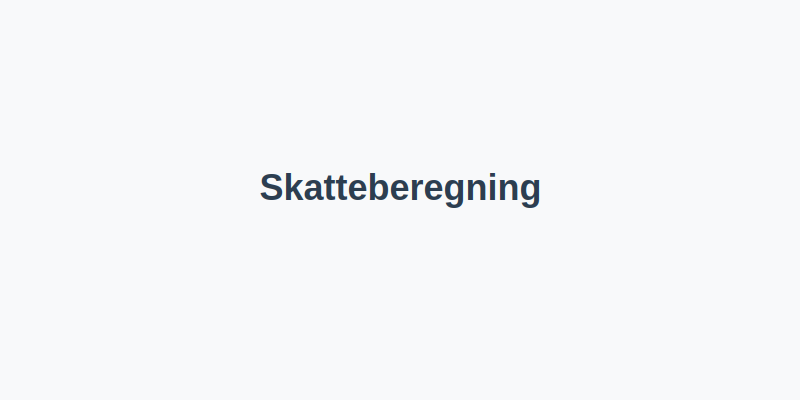

---
title: "Skatteberegning"
seoTitle: "Skatteberegning | Slik beregnes skatt for personer og bedrifter"
description: "Skatteberegning fastsetter skattepliktig inntekt og beregner hvor mye skatt som skal betales av bedrifter og privatpersoner. Guiden forklarer trinnene, vanlige justeringer og hvordan satser anvendes i praksis."
summary: "Kort guide til hvordan skatteberegning fungerer for personer og selskaper, med trinn, justeringer og satser."
---

**Skatteberegning** er prosessen for å fastsette **skattepliktig inntekt** og beregne skatt som skal betales av både bedrifter og privatpersoner. Dette innebærer å justere regnskapsmessige resultater for skattemessige forskjeller, anvende gjeldende skattesatser og rapportere korrekt via [skattemeldingen](/blogs/regnskap/skattemelding "Skattemelding - Komplett Guide til Utfylling og Innlevering").

For en samlet oversikt over gjeldende **skattesatser**, se [Skattesats](/blogs/regnskap/skattesats "Skattesats: Oversikt over Norske Skattesatser").

## 1. Grunnleggende steg i skatteberegning

En strukturert fremgangsmåte sikrer korrekt resultat og forenkler rapportering:

| Steg | Beskrivelse |
|------|-------------|
| 1    | Beregn regnskapsmessig resultat |
| 2    | Juster for skattemessige forskjeller |
| 3    | Fastsett skattepliktig inntekt |
| 4    | Anvend gjeldende skattesats |
| 5    | Beregn forskuddsskatt og restskatt |
| 6    | Rapporter via skattemeldingen |

## 2. Justeringer for skattemessige forskjeller

| Type justering          | Beskrivelse |
|-------------------------|-------------|
| Permanente forskjeller  | Ufradragsberettigede kostnader og skattefrie inntekter |
| Midlertidige forskjeller | Tidsforskjeller som reverseres, for eksempel avskrivninger |

Se også [Hva er Permanente Forskjeller?](/blogs/regnskap/permanente-forskjeller "Hva er Permanente Forskjeller? Midlertidige vs Permanente Forskjeller") og [Hva er Midlertidige Forskjeller?](/blogs/regnskap/midlertidige-forskjeller "Hva er Midlertidige Forskjeller? Tidsforskjeller i Skattemessig Behandling").

## 3. Fastsett skattepliktig inntekt

Beregningen av **skattepliktig inntekt** tar utgangspunkt i [årsresultatet](/blogs/regnskap/hva-er-arsresultat "Hva er Årsresultat? Beregning og Betydning i Regnskap") justert for forskjellene over. Les mer i [Hva er Skattepliktig Inntekt?](/blogs/regnskap/hva-er-skattepliktig-inntekt "Hva er Skattepliktig Inntekt? Beregning og Optimalisering").

## 4. Anvend gjeldende skattesats

| Type skattesats    | Sats | Kommentar |
|--------------------|------|-----------|
| Bedriftsskatt      | 22%  | Ordinær sats for aksjeselskap (2024) |
| Personlig marginalskatt | Varierende etter trinn | Se [Hva er Marginalskatt?](/blogs/regnskap/hva-er-marginalskatt "Hva er Marginalskatt? Hvordan Beregnes Marginalskatt") |
## 5. Personlig skatteberegning

Oversikt over hovedtrinn ved beregning av skatt for privatpersoner:

* Beregn **alminnelig inntekt**: bruttoinntekt minus fradrag som [minstefradrag](/blogs/regnskap/hva-er-minstefradrag "Hva er Minstefradrag? Standardfradrag i Norsk Skatt") og personfradrag.
* Beregn **trygdeavgift** og **trinnskatt** i henhold til gjeldende satser.
* Fastsett total **marginalskatt** og gjennomsnittlig skattesats.

| Trinn | Inntektsintervall (2024) | Trinnskatt |
|-------|--------------------------|------------|
| 1     | 190 350 “ 267 900 kr     | 1,7 %      |
| 2     | 267 900 “ 643 800 kr     | 4,0 %      |
| 3     | 643 800 “ 969 200 kr     | 13,2 %     |
| 4     | Over 969 200 kr          | 16,2 %     |

Se [Hva er Alminnelig Inntekt?](/blogs/regnskap/alminnelig-inntekt "Hva er Alminnelig Inntekt? Beregning av Skattepliktig Inntekt for Personer") og [Hva er Tabelltrekk?](/blogs/regnskap/hva-er-tabelltrekk "Hva er Tabelltrekk? Komplett Guide til Skattetrekk og Trekkberegning").

## 6. Eksempel på skatteberegning

Diagrammet over illustrerer hovedflyten fra regnskapsmessig resultat til endelig skattekalkyle.

## 7. Videre steg: Forskuddsskatt og restskatt

Etter beregning av skatt fastsettes **forskuddsskatt**. Se [Hva er Forskuddsskatt?](/blogs/regnskap/hva-er-forskuddsskatt "Hva er Forskuddsskatt? Betaling av Skatt i Forkant").

Konsekvensene av differanse mellom beregnet og innbetalt skatt fører til **restskatt** eller tilbakebetaling.

Mer om endelig skatt i skatteoppgjøret se [Utlignet skatt](/blogs/regnskap/utlignet-skatt "Utlignet skatt “ Forklaring av endelig skatteoppgjør").

---

Gjennom en systematisk tilnærming til skatteberegning sikres korrekt rapportering og bedre oversikt over skatteforpliktelser.

