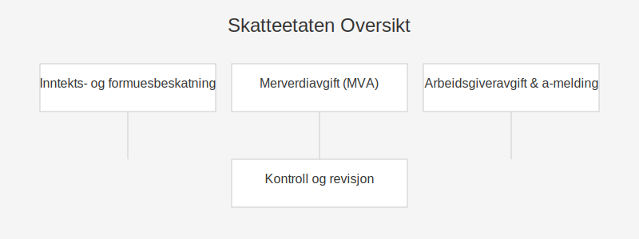

---
title: "Skatteetaten"
seoTitle: "Skatteetaten"
meta_description: '## Innledning'
slug: skatteetaten
type: blog
layout: pages/single
---

## Innledning
Skatteetaten er **Norges sentrale skattemyndighet** og har ansvar for innkreving, kontroll og forvaltning av skatter og avgifter. Et effektivt skattesystem forutsetter klare retningslinjer, pålitelige digitale tjenester og gode kontrollrutiner.

Skatteetaten spiller en avgjørende rolle både for privatpersoner og bedrifter:

* **Skattemelding og skatteberegning** via [Skattemelding](/blogs/regnskap/skattemelding "Skattemelding - Komplett Guide til Utfylling og Innlevering")
* **Digital selvbetjening** gjennom [Altinn](/blogs/regnskap/hva-er-altinn "Hva er Altinn? Digital Portal for Offentlig Rapportering")
* **Kontroll og revisjon** ved bokettersyn og forhåndsfastsetting

## 1. Skatteetatens hovedoppgaver

| **Oppgave**                     | **Beskrivelse**                                                                                       |
|---------------------------------|------------------------------------------------------------------------------------------------------|
| Inntekts- og formuesbeskatning | Fastsette og kreve inn personlig skatt og selskapsskatt                                             |
| Merverdiavgift (MVA)            | Registrering, innkreving og kontroll av [MVA-meldinger](/blogs/regnskap/hva-er-avgiftsplikt-mva "Hva er Avgiftsplikt (MVA)?") |
| Arbeidsgiveravgift og a-melding | Mottak og kontroll av [A-melding](/blogs/regnskap/hva-er-a-melding "Hva er A-melding? Rapportering til Skatteetaten for Arbeidsgivere") |
| Skattekort og forskuddsskatt    | Utstedelse av skattekort og beregning av forskuddstrekk                                               |
| Bokettersyn og revisjon         | Kontroll av regnskaper og dokumentasjon                                                               |

## 2. Digitale tjenester og selvbetjening

Skatteetaten satser på **brukervennlige digitale løsninger** for å forenkle rapportering og betaling:

* [Altinn](/blogs/regnskap/hva-er-altinn "Hva er Altinn? Digital Portal for Offentlig Rapportering") for levering av skattemeldinger, a-meldinger og andre skjemaer
* [Skattekort](/blogs/regnskap/hva-er-skattetrekkskonto "Hva er Skattetrekkskonto?") i nettbank og påmelding i Altinn
* **eSkatt**-løsningen for digital innsending av krav og klager

## 3. Viktige frister for rapportering

| **Tjeneste**         | **Frist**                                                                              |
|----------------------|----------------------------------------------------------------------------------------|
| Skattemelding (AS)   | 31. mai                                                                                |
| A-melding            | 5. hver måned                                                                          |
| MVA-melding          | 10. i hver andre måned                                                                 |
| Forskuddsskatt       | 15. februar, april, juni, august, oktober og desember                                  |

## 4. Skatteetatens kontroll og tilsyn

Skatteetaten utfører **bokettersyn** og kan foreta **forhåndsfastsetting** dersom skattemelding mangler eller inneholder vesentlige feil. Se mer i [Bokettersyn](/blogs/regnskap/bokettersyn "Hva er bokettersyn? Guide til Skatteetatens kontroll av regnskap") og [Forhåndsfastsetting](/blogs/regnskap/forhandsfastsetting "Hva er Forhåndsfastsetting?").

## 5. Skatteetaten i bedriftslivet

For bedrifter er det avgjørende å følge Skatteetatens retningslinjer for:

* Rapportering av [skatt](/blogs/regnskap/hva-er-skatt "Hva er Skatt? Komplett Guide til Bedriftsskatt, MVA og Skatteplanlegging")
* Innlevering av [skattemelding](/blogs/regnskap/skattemelding "Skattemelding - Komplett Guide til Utfylling og Innlevering")
* Betaling av [forskuddsskatt](/blogs/regnskap/hva-er-forskuddsskatt "Hva er Forskuddsskatt? Guide til Forskuddsskyldighet og Beregning")

## Konklusjon

Skatteetaten er navet i det norske skattesystemet, og gode digitale tjenester, klare frister og grundig kontroll sikrer at både privatpersoner og bedrifter oppfyller sine forpliktelser. Besøk [Skatteetaten](/blogs/regnskap/skatteetaten "Skatteetaten “ Norges Skatteadministrasjon og Skatteforvaltning") for mer informasjon.

