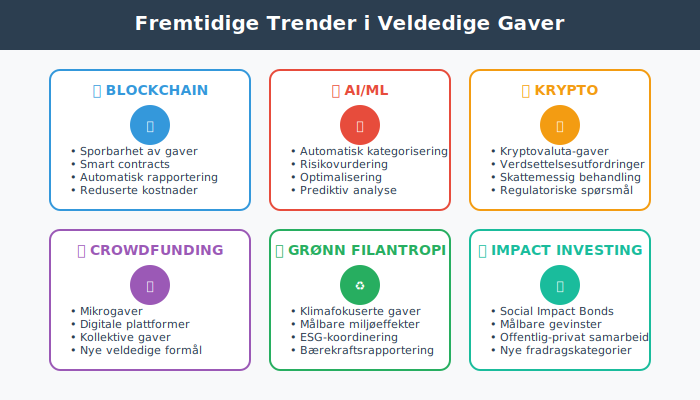

**Skattefradrag for gaver til veldedige organisasjoner** er en viktig del av norsk skattepolitikk som både fremmer filantropi og gir skattemessige fordeler for givere. Disse fradragene reduserer den [skattepliktige inntekten](/blogs/regnskap/hva-er-skattepliktig-inntekt "Hva er Skattepliktig Inntekt? Beregning og Optimalisering") og kan være betydelige for både privatpersoner og bedrifter. Ordningen balanserer samfunnets behov for frivillig støtte til veldedige formål med skattemessige incentiver.

## Seksjon 1: Grunnleggende om Fradrag for Gaver til Veldedighet

[Skattefradrag](/blogs/regnskap/hva-er-skatt "Skatt - Komplett Guide til Bedriftsskatt, MVA og Skatteplanlegging") for veldedige gaver er en **statlig incentivordning** som oppmuntrer til filantropi ved å redusere giverens skattebelastning. Dette systemet gjør det mer attraktivt å støtte viktige samfunnsformål samtidig som det reduserer statens direkte finansieringsbehov for veldedige organisasjoner.


### 1.1 Hvem Kan Gi Fradragsberettigede Gaver?

**Både privatpersoner og bedrifter** kan få fradrag for gaver til kvalifiserte organisasjoner:

#### Privatpersoner:
* **Alle skattepliktige** i Norge
* **Gaver minimum 500 kr** per organisasjon per år
* **Maksimalt fradrag** på 50.000 kr per år (2024)
* **Dokumentasjonskrav** med kvittering fra mottaker

#### Bedrifter:
* **Alle skattesubjekter** som [aksjeselskap](/blogs/regnskap/hva-er-aksjeselskap "Hva er Aksjeselskap? Organisering og Regnskapsføring") og [ansvarlige selskap](/blogs/regnskap/hva-er-ansvarlig-selskap "Hva er Ansvarlig Selskap? Struktur og Regnskapsføring")
* **Minimum gave 500 kr** per organisasjon per år
* **Maksimalt fradrag** tilsvarer 15% av [skattepliktig inntekt](/blogs/regnskap/hva-er-skattepliktig-inntekt "Hva er Skattepliktig Inntekt? Beregning og Optimalisering") (opptil 40 millioner kr)
* **Regnskapsføring** som fradragsberettiget kostnad

### 1.2 Kvalifiserte Mottakerorganisasjoner

**Godkjente organisasjoner** må oppfylle strenge kriterier:

| **Organisasjonstype** | **Hovedkriterier** | **Eksempler** |
|-----------------------|-------------------|---------------|
| Allmennyttige organisasjoner | Humanitære, kulturelle, sosiale formål | Røde Kors, Redd Barna, Leger Uten Grenser |
| [Stiftelser](/blogs/regnskap/hva-er-stiftelse "Hva er Stiftelse? Juridiske og Regnskapsmessige Forhold") | Allmennyttige stiftelser med skattefritak | Helseforskningsstiftelser, kulturstiftelser |
| Forskningsinstitusjoner | Forskning og utdanning | Universiteter, forskningsinstitutter |
| Religiøse organisasjoner | Trossamfunn og menigheter | Den norske kirke, andre trossamfunn |
| Kulturorganisasjoner | Kunst, kultur, historie | Museer, teatre, orkestre |

**Viktige vilkår:**
* **Registrert** i [Enhetsregisteret](/blogs/regnskap/hva-er-enhetsregisteret "Hva er Enhetsregisteret?")
* **Allmennyttig formål** som hovedaktivitet
* **Norsk organisasjon** eller tilsvarende i EØS-land
* **Ikke-kommersiell** virksomhet som hovedregel


## Seksjon 2: Regelverket for Privatpersoner

### 2.1 Minimumsbeløp og Maksimalgrenser

**Beløpsgrenser** sikrer at ordningen brukes for substantielle gaver:

#### Minimumsgrensen (500 kr):
* **Per organisasjon per år** - ikke totalt
* **Beskytter** mot administrative byrder ved små beløp
* **Gaver under 500 kr** gir ikke fradrag
* **Flere gaver** til samme organisasjon kan summeres

#### Maksimalgrensen (50.000 kr):
* **Total grense** for alle fradragsberettigede gaver per år
* **Beskytter** mot for store skattemessige tap for staten
* **Ikke overførbar** til senere år hvis ikke brukt
* **Inflasjonsjustering** vurderes regelmessig

**Eksempel beregning:**
```
Gave til Røde Kors: 5.000 kr
Gave til Redd Barna: 3.000 kr  
Gave til lokalt bibliotek: 2.000 kr
Totalt fradragsberettiget: 10.000 kr

Ved marginalskatt 35%:
Skattebesparelse = 10.000 × 35% = 3.500 kr
```

### 2.2 Dokumentasjonskrav og Regnskapsføring

**Dokumentasjon** er essensielt for å kunne kreve fradraget:

#### Krav til kvittering:
* **Organisasjonens navn** og organisasjonsnummer
* **Giverens navn** og fødselsnummer
* **Gavebeløp** og dato for gave
* **Bekreftelse** på at mottaker er fradragsberettiget
* **Underskrift** eller elektronisk bekreftelse

#### Oppbevaring:
* **Minimum 10 år** etter det år fradraget kreves
* **Digital lagring** er tillatt
* **Tilgjengelig** for skattemyndighetenes kontroll
* **Organisert arkivering** anbefales


### 2.3 Særlige Regler og Unntak

#### Gaver til religiøse organisasjoner:
* **Trossamfunn** må være offentlig registrert
* **Kollekt og offer** i gudstjenester kvalifiserer ikke
* **Sponsorat** av religiøse arrangement kan kvalifisere
* **Medlemskontingent** er normalt ikke fradragsberettiget

#### Gaver til politiske organisasjoner:
* **Politiske partier** kvalifiserer ikke for fradrag
* **Politiske kampanjer** og valgkamp får ikke fradrag
* **Think tanks** kan kvalifisere hvis de oppfyller kravene til allmennyttig formål

#### Gaver i form av verdipapirer:
* **Markedsverdi** på overdragelsestidspunktet legges til grunn
* **Gevinst/tap** ved salg påvirker ikke fradragsretten
* **Kostpris** for giver vs. **markedsverdi** for fradrag kan skape fordel

## Seksjon 3: Regelverket for Bedrifter

### 3.1 Fradragsberettigelse for Selskaper

**Bedrifter** har noe andre regler enn privatpersoner:

#### Generelle vilkår:
* **Samme minimumsbeløp** (500 kr per organisasjon)
* **Maksimum 15%** av [skattepliktig inntekt](/blogs/regnskap/hva-er-skattepliktig-inntekt "Hva er Skattepliktig Inntekt? Beregning og Optimalisering") eller 40 millioner kr
* **Tilknytning til bedriftens virksomhet** ikke påkrevd
* **Regnskapsføring** som driftskostnad

#### Skattemessig behandling:
```
Bokført kostnad:
Debet: Gaver til veldedige organisasjoner (kostnad)
Kredit: Bank (eller Leverandørgjeld)

Skattemessig justering:
Skattepliktig inntekt reduseres med fradragsberettiget del
```

### 3.2 Beregning av Maksimalfradrag

**15%-regelen** gir fleksibilitet basert på bedriftens størrelse:

#### Beregningsmetode:
```
Skattepliktig inntekt før justering for gaver: 10.000.000 kr
Maksimalt fradrag = min(10.000.000 × 15%, 40.000.000) = 1.500.000 kr

Faktisk gave: 800.000 kr
Fradragsberettiget beløp: 800.000 kr (under maksimum)
```

#### Planlegging for store gaver:
* **Spredning over flere år** hvis gave overstiger 15%-grensen
* **Timing** av gaver i forhold til inntektsnivå
* **Koordinering** med andre [skattefraderag](/blogs/regnskap/hva-er-skatt "Skatt - Komplett Guide til Bedriftsskatt, MVA og Skatteplanlegging")


### 3.3 Konserninternt og Samarbeid

#### Konsernstrukturer:
* **Hver juridisk enhet** har egen fradragsrett
* **Konsernbidrag** kan ikke brukes til å øke fradragsrammen
* **Morselskap** kan ikke "låne" fradrag fra datterselskap
* **Felles gaver** må fordeles basert på reell givere

#### Strategisk planlegging:
* **Konsolidering** av gaver gjennom ett selskap
* **Taktisk timing** basert på [resultatutvikling](/blogs/regnskap/hva-er-arsresultat "Hva er Årsresultat? Beregning og Betydning i Regnskap")
* **Koordinering** med andre sponsorat og støtteordninger

## Seksjon 4: Regnskapsføring og MVA-behandling

### 4.1 Regnskapsmessig Behandling

**Korrekt regnskapsføring** sikrer både compliance og optimal skatteposisjon:

#### For bedrifter:
```
Kontoplankode: 7700 - Gaver til veldedige organisasjoner

Ved gaveløfte:
Debet: 7700 Gaver til veldedige organisasjoner
Kredit: 2940 Skyldige gaver til veldedige organisasjoner

Ved betaling:
Debet: 2940 Skyldige gaver til veldedige organisasjoner  
Kredit: 1920 Bank
```

#### Noter i årsregnskapet:
* **Note om vesentlige gaver** hvis de påvirker sammenlignbarhet
* **Kategorisering** etter mottakerkategori
* **Eventuelle forpliktelser** til fremtidige gaver

### 4.2 MVA-behandling

**Merverdiavgift** påvirkes ikke av veldedige gaver:

#### Hovedprinsipper:
* **Ingen MVA** på gaver til veldedige organisasjoner
* **Ikke fradragsberettiget inngående MVA** på kjøp relatert til gaver
* **Sponsored gaver** (med motytelse) kan ha MVA-konsekvenser
* **Arrangementer** vs. rene gaver har ulik MVA-behandling

#### Eksempel - sponsored arrangement:
```
Sponsing av veldedig arrangement: 100.000 kr
Motytelse i form av markedsføring: 25.000 kr

Gave-komponent: 75.000 kr (ikke MVA)
Markedsføring: 25.000 kr + 6.250 kr MVA
```


### 4.3 Rapportering og Oppfølging

#### Skattemeldingen:
* **Post 3.1.9** - Fradrag for gaver til frivillige organisasjoner
* **Vedlegg** med dokumentasjon ved forespørsel
* **Spesifisering** av mottakere ved større beløp

#### Internkontroll:
* **Godkjenningsrutiner** for gaver over visse beløp
* **Oppfølging** av fradragsrammer og dokumentasjon
* **Ã…rsrapportering** av total gavepolitikk

## Seksjon 5: Strategisk Gaveplanlegging

### 5.1 Skatteoptimal Timing

**Timing** av gaver kan optimalisere skattegevinsten:

#### Inntektsbasert planlegging:
* **År med høy inntekt** - maksimer gaver for høyere marginaleffekt
* **Ã…r med lav inntekt** - vurder utsettelse hvis mulig
* **Pensjoneringstransisjon** - planlegg gaver før inntektsreduksjon
* **Bedriftsutvikling** - koordiner med [omstrukturering](/blogs/regnskap/hva-er-omstrukturering "Hva er Omstrukturering? Fusjon, Fisjon og Selskapsendringer")

#### Maksimalgrenser:
| **Scenario** | **Strategi** | **Fordel** |
|--------------|--------------|------------|
| Store engangsbeløp | Spre over flere år | Unngå tap av fradrag over grense |
| Jevn inntekt | Årlige gaver nær maksimum | Maksimal skattegevinst |
| Variabel inntekt | Fleksible beløp | Tilpasning til inntektsnivå |

### 5.2 Organisasjonsvalg og Due Diligence

**Valg av mottakerorganisasjon** påvirker både fradragsrett og samfunnseffekt:

#### Evaluringskriterier:
* **Fradragsberettigelse** bekreftet hos skattemyndighetene
* **Finansiell transparens** og årsrapportering
* **Effektivitet** i bruk av mottatte midler
* **Samfunnsmessig impact** og måloppnåelse
* **Reputasjon** og etiske standarder

#### Risikoområder:
* **Nye organisasjoner** uten etablert track record
* **Organisasjoner** under etterforskning eller tvist
* **Potensielle interessekonflikter** med givere
* **Politiske overtoner** som kan påvirke bedriftens omdømme


### 5.3 Koordinering med CSR og Bærekraftsmål

#### Integration med bærekraftsstrategi:
* **ESG-mål** og rapportering koordineres med gavepolitikk
* **[CSRD-rapportering](/blogs/regnskap/hva-er-csrd "Hva er CSRD? Corporate Sustainability Reporting Directive")** kan inkludere veldedige bidrag
* **Stakeholder engagement** gjennom strategiske gaver
* **Bransjespesifikke utfordringer** adresseres gjennom målrettede gaver

#### Måling og oppfølging:
* **KPI-er** for samfunnseffekt av gaver
* **Return on Investment** i form av samfunnsgevinst
* **Rapportering** til styret og aksjonærer
* **Externe rankinger** og anerkjennelse

## Seksjon 6: Internasjonale Aspekter

### 6.1 Gaver til Utenlandske Organisasjoner

**EØS-reglene** utvider fradragsretten til visse utenlandske organisasjoner:

#### Kvalifikasjonskrav:
* **EØS-tilknytning** - organisasjon etablert i EØS-land
* **Tilsvarende status** som norske kvalifiserte organisasjoner
* **Dokumentasjon** av status fra hjemlandets myndigheter
* **Samme formålstyper** som godkjente norske organisasjoner

#### Praktiske utfordringer:
* **Språkbarriere** i dokumentasjon
* **Ulike rapporteringskrav** i forskjellige land
* **Valutaomregning** og kursgevinster/-tap
* **Skattemessig verifikasjon** på tvers av landegrenser

### 6.2 Transfer Pricing Hensyn

**Multinasjonale selskaper** må være oppmerksomme på transfer pricing-aspekter:

#### Armlengdeprinsippet:
* **Gaver mellom nærstående parter** kan utfordres
* **Dokumentasjon** av forretningsmessig begrunnelse
* **Markedsmessige vilkår** for eventuelle motytelser
* **Allokering** av kostnader i konsernsammenheng

#### Compliance-rammeverk:
* **Lokal dokumentasjon** i alle relevante jurisdiksjoner  
* **Master file** og country-by-country reporting
* **Risikostyring** for potensielle justeringer
* **Samordning** mellom skattefunksjon og transfer pricing


### 6.3 Skatteavtaler og Dobbeltbeskatning

#### Relevante bestemmelser:
* **Informasjonsutveksling** om store gaver
* **Residensbestemmelser** for giver og mottaker
* **Fordelingsnøkler** ved transnasjonale aktiviteter
* **Mulige konflikter** mellom nasjonale regelverk

## Seksjon 7: Kontrollfokus og Compliance

### 7.1 Skattemyndighetenes Kontrolltiltak

**Skatteetaten** fokuserer på flere risikoområder:

#### Høyrisikoområder:
* **Store bedriftsgaver** som utgjør vesentlig del av fradrag
* **Gaver til "nye" organisasjoner** uten etablert historie
* **Familietilknyttede organisasjoner** og potensielle interessekonflikter
* **Timing** av gaver i forbindelse med omstruktureringer

#### Kontrollmetoder:
* **Cross-checking** mellom givers fradrag og mottakers rapportering
* **Bransjebenchmarking** av gavemønstre
* **Automatiske konsistenssjekker** i skattemeldinger
* **Målrettede revisjoner** basert på risikoprofil

### 7.2 Best Practice for Compliance

**Proaktive tiltak** reduserer risiko for problemer:

#### Organisatoriske tiltak:
* **Gavepolitikk** vedtatt av styret eller ledelse
* **Godkjenningsrutiner** for alle gaver over visse beløp
* **Due diligence-prosesser** for nye mottakerorganisasjoner
* **Ã…rlig review** av gavepolitikk og utbetalinger

#### Dokumentasjonssystem:
```
Gavemappe per mottaker:
- Bekreftelse av fradragsberettigelse
- Organisasjonsinformasjon og vedtekter
- Korrespondanse og beslutningsgrunnlag  
- Kvitteringer og betalingsbevis
- Oppfølging av anvendelse (hvis relevant)
```


### 7.3 Konsekvenser ved Regelbrudd

#### Administrative sanksjoner:
* **Bortfall av fradrag** ved mangelfull dokumentasjon
* **Tilleggsskatt** ved bevisst feilrapportering
* **Renter** på for lite betalt skatt
* **Overtredelsesgebyr** ved gjentatte feil

#### Reputasjonsrisiko:
* **Offentliggjøring** av skattemessige overtredelser
* **Mediefokus** på bedriftens gavepraksis
* **Stakeholder-reaksjoner** på opplevde misbruk
* **Langsiktige konsekvenser** for tillitsrelasjoner

## Seksjon 8: Fremtidige Trender og Utviklingsområder

### 8.1 Digitalisering av Gaveadministrasjon

**Teknologiske løsninger** forenkler administrasjon:

#### Blockchain for transparens:
* **Sporbarhet** av gaver fra giver til sluttmottaker
* **Smart contracts** for betingede gaver
* **Automatisk rapportering** til skattemyndigheter
* **Reduserte administrative kostnader**

#### AI og maskinlæring:
* **Automatisk kategorisering** av mottakerorganisasjoner
* **Risikovurdering** av nye organisasjoner
* **Optimalisering** av gavepolitikk basert på historiske data
* **Prediktiv analyse** av samfunnseffekt

### 8.2 Utvidet MÃ¥lgruppe og Nye Gaveformer

#### Kryptovaluta-gaver:
* **Verdsettelsesutfordringer** ved volatile valutaer
* **Skattemessig behandling** av gevinster/tap
* **Praktisk gjennomføring** og dokumentasjon
* **Regulatoriske utfordringer**

#### Crowdfunding og sosiale medier:
* **Mikrogaver** gjennom digitale plattformer
* **Kollektive gaver** og delingsøkonomi
* **Automatiserte gaver** basert på trigger-events
* **Nye former for veldedige formål**



### 8.3 Bærekraft og Impact Investing

#### Grønn filantropi:
* **Klimafokuserte gaver** og miljøorganisasjoner
* **Målbare miljøeffekter** som evalueringskriterium
* **Koordinering** med bedriftens klimastrategi
* **Rapportering** i henhold til bærekraftsrammeverk

#### Social Impact Bonds:
* **Hybride instrumenter** mellom gaver og investeringer
* **MÃ¥lbare samfunnsgevinster** som grunnlag for utbetaling
* **Offentlig-privat samarbeid** om finansiering
* **Potensielt ny fradragskategori**

## Seksjon 9: Praktiske Verktøy og Ressurser

### 9.1 Sjekklister for Givere

**Før giving:**
- [ ] Bekreftet at mottaker er fradragsberettiget
- [ ] Vurdert egen fradragsramme for året
- [ ] Planlagt optimal timing av gaven
- [ ] Dokumentert forretningsmessig begrunnelse (for bedrifter)
- [ ] Innhentet nødvendig intern godkjenning

**Ved giving:**
- [ ] Sikret korrekt betalingsmetode og sporbarhet
- [ ] Mottatt komplett kvittering med alle påkrevde opplysninger
- [ ] Arkivert dokumentasjon systematisk
- [ ] Registrert gave i regnskapssystem (bedrifter)

**Etter giving:**
- [ ] Fulgt opp anvendelse av gaven (hvis relevant)
- [ ] Inkludert i skattemelding
- [ ] Vurdert fremtidig gavepolitikk basert på erfaring

### 9.2 Kalkuleringshjelp

#### Skattegevinst-kalkulator:
```
Gavebeløp: [Input felt]
Marginalskatt: [Input felt]
Fradragsberettiget del: [Beregnet]
Skattebesparelse: [Beregnet]
Netto kostnad: [Beregnet]
```

#### Fradragsramme for bedrifter:
```
Skattepliktig inntekt: [Input felt]
15% av inntekt: [Beregnet]
Maksimum (40 mill): 40.000.000
Tilgjengelig ramme: [Minimum av over]
Allerede brukt: [Input felt]
Resterende ramme: [Beregnet]
```


### 9.3 Kontaktinformasjon og Ressurser

#### Offentlige ressurser:
* **Skatteetaten:** Offisiell veiledning og organisasjonslister
* **Brønnøysundregistrene:** Verifikasjon av organisasjonsstatus
* **Frivillighet Norge:** Samordning av frivillige organisasjoner

#### Profesjonell rådgivning:
* **Skatterådgivere:** Spesialisert planlegging og optimalisering
* **Revisorer:** Regnskapsmessig behandling og compliance
* **Advokatfirmaer:** Juridisk veiledning ved komplekse problemstillinger

## Konklusjon

**Skattefradrag for gaver til veldedige organisasjoner** representerer en viktig bro mellom privat filantropi og offentlig finansiering av samfunnsgoder. Ordningen balanserer behovet for statlige inntekter med incitamenter til frivillig støtte av allmennyttige formål.

**Nøkkelinnsikter:**

* **Robust regelverk:** Klare kriterier for både givere og mottakere sikrer målrettet bruk
* **Fleksible rammer:** Forskjellige grenser for privatpersoner og bedrifter tilpasser incentivene
* **Dokumentasjonskrav:** Strenge krav sikrer sporbarhet og forhindrer misbruk
* **Strategiske muligheter:** Proaktiv planlegging kan maksimere både samfunnseffekt og skattegevinst

**Praktisk anvendelse:**

For privatpersoner og bedrifter som ønsker å støtte veldedige formål, er forståelse av fradragsreglene essensielt for:
- **Maksimal skattegevinst** gjennom optimal timing og struktur
- **Compliance-sikkerhet** gjennom korrekt dokumentasjon og rapportering  
- **Strategisk gavepolitikk** som balanserer skattemessige og samfunnsmessige hensyn
- **Risikominimering** gjennom due diligence og kvalitetssikring

**Fremtidsperspektiv:**

Gaveordningen vil trolig utvikle seg i takt med digitalisering, økt fokus på bærekraft og nye former for filantropi. Givere som bygger systematiske tilnærminger til gavepolitikk og holder seg oppdatert på regelverksendringer, vil være best posisjonert til å skape maksimal samfunnseffekt samtidig som de optimaliserer sin skatteposisjon.

Kombinert med andre [skattefraderag](/blogs/regnskap/hva-er-skatt "Skatt - Komplett Guide til Bedriftsskatt, MVA og Skatteplanlegging") og [skatteplanleggingsstrategier](/blogs/regnskap/hva-er-skatteplanlegging "Hva er Skatteplanlegging? Strategier for Optimal Skatteposisjon"), kan veldedige gaver være en viktig komponent i en helhetlig tilnærming til skatteoptimalisering som også skaper positiv samfunnsverdi.


