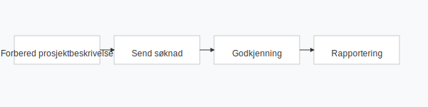

---
title: "Hva er Skattefunn?"
meta_title: "Hva er Skattefunn?"
meta_description: '**Skattefunn** er en statlig ordning som gir **skattefradrag** for kostnader knyttet til forskning og utvikling (FoU) i norske bedrifter. Ordningen administrere...'
slug: skattefunn
type: blog
layout: pages/single
---

**Skattefunn** er en statlig ordning som gir **skattefradrag** for kostnader knyttet til forskning og utvikling (FoU) i norske bedrifter. Ordningen administreres av Norges forskningsråd og Skatteetaten, og er en viktig del av satsingen på innovasjon. For å rapportere fradraget i skattemeldingen kreves utfylling av [næringsoppgave](/blogs/regnskap/hva-er-naeringsoppgave "Hva er næringsoppgave? Komplett Guide til Næringsoppgaven") og spesifikk dokumentasjon i [skattemeldingen](/blogs/regnskap/skattemelding "Skattemelding - Komplett Guide til Utfylling og Innlevering"). Skattefradraget beregnes i henhold til gjeldende satser for FoU-aktivitet og avregnes mot betalbar skatt i [skatteberegning](/blogs/regnskap/skatteberegning "Skatteberegning - Guide til Beregning av Bedriftsskatt og Personlig Skatt").

## Hva er Skattefunn?

Skattefunn-ordningen ble etablert i 2002 for å stimulere til mer forskning og utvikling i næringslivet. Ved å gi en andel av FoU-kostnadene som skattefradrag, skal ordningen redusere økonomisk risiko ved innovasjonsprosjekter.

Skattefunn består av to hovedformer:

| Type prosjekt           | Støttesats (enkeltpersonforetak/ANS) | Støttesats (AS og andre selskapsformer) |
|-------------------------|-------------------------------------:|-----------------------------------------:|
| Basisprosjekt (små)     | 78 %                                 | 78 %                                     |
| Hovedprosjekt (store)   | 18 %                                 | 18 %                                     |

Støtteberettigede FoU-kostnader omfatter blant annet lønn, driftsutstyr, eksterne tjenester og indirekte kostnader.

## Hvem kan søke?

Ordningen er åpen for norske foretak som driver *næringsvirksomhet*. Følgende selskapsformer kan søke:

* **Enkeltpersonforetak** som fører regnskap etter bokføringsloven
* **Aksjeselskap (AS)** og andre selskapsformer med skattepliktig inntekt
* **Ansvarlig selskap (ANS/DA)** når regnskapet føres etter regnskapsloven

For en fullstendig oversikt over krav til leveringsplikt, se [Hva er næringsoppgave?](/blogs/regnskap/hva-er-naeringsoppgave "Hva er næringsoppgave? Komplett Guide til Næringsoppgaven").

## Støtteberettigede kostnader

Følgende kostnadstyper kan inngå i grunnlaget for Skattefunn:

* **Lønnskostnader** for ansatte som utfører FoU-aktiviteter
* **Direkte driftskostnader** (for eksempel materialer og forsyninger)
* **Eksterne FoU-tjenester** kjøpt fra godkjente forskningsinstitusjoner
* **Indirekte kostnader** basert på en fast andel av direkte kostnader

### Eksempel på kostnadsfordeling

| Kostnadstype             | Andel av totale kostnader |
|--------------------------|--------------------------:|
| Lønn                     | 60 %                      |
| Materialer og utstyr     | 20 %                      |
| Eksterne tjenester       | 15 %                      |
| Indirekte kostnader      | 5 %                       |

## Slik søker du Skattefunn

For å få godkjent et Skattefunn-prosjekt må du gjennom tre hovedtrinn:

1. **Forbered prosjektbeskrivelse** og budsjett i Forskningsrådets eSøknadssystem
2. **Send søknad** innen fristen (vanligvis 1. september)
3. **Rapportering** av gjennomført aktivitet og kostnader til både Forskningsrådet og Skatteetaten

| Aktivitet                    | Ansvarlig                         | Frist           |
|------------------------------|----------------------------------|-----------------|
| Søknad til Forskningsrådet   | Prosjektleder                    | 1. september    |
| Inntektsføring i regnskap    | Regnskapsfører                   | Løpende         |
| Innlevering av skattemelding | Daglig leder / økonomiansvarlig   | 31. mai         |

## Praktiske tips

* Utarbeid **løpende dokumentasjon** av timeføring og kostnader for å unngå feil.
* Bruk **egen prosjektkode** i regnskapssystemet for å skille Skattefunn-kostnader.
* Sammenhold prosjektbeskrivelsen med faktisk gjennomføring for korrekt rapportering.
* Sørg for god internkontroll med avstemninger før innsending.

## Oppsummering

Skattefunn er et kraftig virkemiddel for å redusere kostnaden ved forskning og utvikling. Ved å følge en strukturert søknadsprosess og dokumentere alle kostnader kan norske bedrifter dra nytte av betydelige **skattefradrag**. Les mer om prosjektstyring i FoU-prosjekter i vår guide til [prosjektregnskap](/blogs/regnskap/hva-er-prosjektregnskap "Hva er Prosjektregnskap? Oversikt og Beste Praksis").

