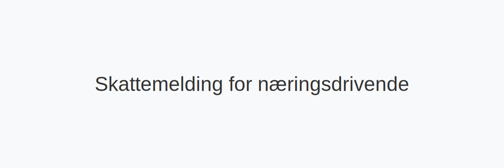

---
title: "Skattemelding for næringsdrivende"
meta_title: "Skattemelding for næringsdrivende"
meta_description: '*Skattemelding for næringsdrivende* er den delen av din [skattemelding](/blogs/regnskap/skattemelding "Skattemelding - Komplett Guide til Utfylling og Innlever...'
slug: skattemelding-for-naeringsdrivende
type: blog
layout: pages/single
---

*Skattemelding for næringsdrivende* er den delen av din [skattemelding](/blogs/regnskap/skattemelding "Skattemelding - Komplett Guide til Utfylling og Innlevering") som omhandler **næringsinntekter** og **fradrag** for selvstendig næringsdrivende og registrerte foretak. Denne guiden hjelper deg med å forstå leveringskrav, frister og digital innlevering i [Altinn](/blogs/regnskap/hva-er-altinn "Hva er Altinn? Digital kommunikasjonsplattform for offentlige etater").

## Hvorfor egen skattemelding for næringsdrivende?

Når du driver næringsvirksomhet, skiller skattemeldingen for næringsdrivende seg fra privat skattemelding ved å fokusere på:

* **Næringsinntekter** fra drift av virksomhet
* **Fradragsberettigede kostnader** knyttet til virksomheten
* **Innrapportering** av næringsspesifikasjoner i [næringsoppgave](/blogs/regnskap/naeringsoppgave-1 "Hva er næringsoppgave? Slik fyller du ut næringsoppgave 1 og 2")
* **Særlige poster** som utsatt skatt, inngående og utgående merverdiavgift

## Viktige frister og leveringskrav

| **Virksomhetstype**               | **Frist skattemelding** | **Merknad**                                 |
|-----------------------------------|-------------------------|----------------------------------------------|
| Enkeltpersonforetak (ENK)         | 31. mai                 | Kan utvide frist via Altinn                   |
| Aksjeselskap (AS)                 | 31. mai                 | Leverer samtidig næringsoppgave (RF-1175, RF-1167) |
| Ansvarlig selskap (ANS/DA)        | 31. mai                 | Deltakere rapporterer personlig               |
| Andre selskapsformer (stiftelser) | 31. mai                 | Se egne RF-skjemaer                           |

*Dersom fristen oversittes, kan Skatteetaten ilegge tilleggsskatt eller tvangsmulkt.*

## Steg-for-steg: Fra regnskap til innlevering

Denne prosessen hjelper deg å sikre korrekt og rettidig innsending:

1. **Forbered regnskapsunderlag**
   * Godkjent årsregnskap og hovedbok
   * Spesifikasjon av anleggsmidler og avskrivninger
2. **Fyll ut næringsoppgaven**
   * RF-1175 for anleggsmidler
   * RF-1167 for selskapsoppgave
3. **Kontroller skattemessige justeringer**
   * Permanente og midlertidige forskjeller
   * Fremførbart underskudd
4. **Logg inn i Altinn**
   * Søk opp din virksomhet
   * Last opp næringsoppgaven og eventuelle vedlegg
5. **Send inn og bekreft**
   * Last ned kvittering for innsendelse

## Digital innlevering i Altinn

Altinn er den digitale plattformen for innlevering av skattemelding. Følg disse trinnene:

1. Gå til din innboks i Altinn
2. Velg skjema RF-1175 / RF-1167 under «Innrapportering»
3. Fyll ut eller last opp ferdig utfylt XML
4. Send inn og noter bekreftelses-ID

| **Tips**                             |
|-------------------------------------|
| Sjekk at du har riktig organisasjonsnummer | 
| Bruk Altinn 2.0 for oppdatert grensesnitt | 

## Vanlige feil og praktiske tips

*Manglende eller feil sortering av bilag* kan forlenge behandlingstiden.

*Husk å kontrollere at alle kontoer er avstemt* før innsending.

**Pro tip:** Bruk regnskapsprogram med direkte eksport til Altinn for å minimere manuelt arbeid.

## Spesielle forhold for næringsdrivende

*Ved utenlandske inntekter* må du dokumentere valuta- og valutakursbeslutninger.
*Ved konsernrelaterte transaksjoner* sjekk om du skal rapportere bilaterale overføringer.

## Videre ressurser

Se også:

- [Skattemelding](/blogs/regnskap/skattemelding "Skattemelding - Komplett Guide til Utfylling og Innlevering")
- [Næringsoppgave 1](/blogs/regnskap/naeringsoppgave-1 "Hva er næringsoppgave? Slik fyller du ut næringsoppgave 1 og 2")
- [Forskuddsskatt](/blogs/regnskap/hva-er-forskuddsskatt "Hva er Forskuddsskatt? Beregning og Innbetaling")
- [Altinn](/blogs/regnskap/hva-er-altinn "Hva er Altinn? Digital kommunikasjonsplattform for offentlige etater")

