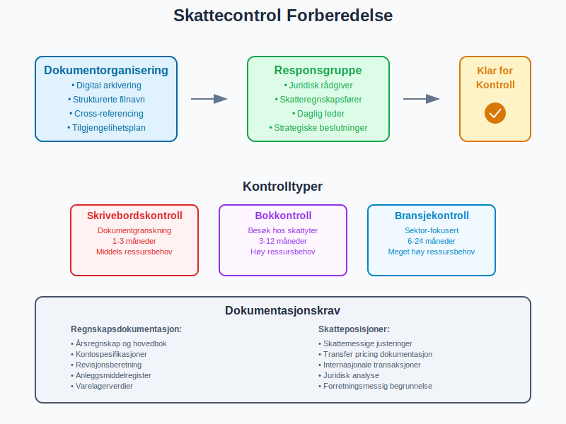

En **skattemelding** (tidligere kjent som [selvangivelse](/blogs/regnskap/selvangivelse "Selvangivelse - Guide til Norsk Skattemelding og Skatteoppgjør")) er den offisielle dokumentasjonen som bedrifter og enkeltpersoner må sende inn til Skatteetaten for å rapportere inntekter, fradrag og beregne skyldig [skatt](/blogs/regnskap/hva-er-skatt "Skatt - Komplett Guide til Bedriftsskatt, MVA og Skatteplanlegging"). For bedrifter er skattmeldingen en kritisk del av [regnskapsføringen](/blogs/regnskap/hva-er-bokforing "Hva er Bokføring? Grunnleggende Prinsipper og Prosesser") og påvirker både [kontantstrøm](/blogs/regnskap/hva-er-kontantstrom "Hva er Kontantstrøm? Analyse og Forvaltning av Bedriftens Pengestrøm") og strategisk planlegging.

Se ogsÃ¥ vÃ¥r spesialiserte guide for næringsdrivende: [Skattemelding for næringsdrivende](/blogs/regnskap/skattemelding-for-naeringsdrivende "Skattemelding for næringsdrivende “ Guide til Innlevering og Frister").

Se ogsÃ¥ [Skatteberegning](/blogs/regnskap/skatteberegning "Skatteberegning - Guide til Beregning av Bedriftsskatt og Personlig Skatt") for en detaljert gjennomgang av beregningsprosessen, og [Skatteetaten](/blogs/regnskap/skatteetaten "Skatteetaten “ Norges Skatteadministrasjon og Skatteforvaltning") for oversikt over myndighetens digitale tjenester og frister.

Ved manglende innlevering eller vesentlige mangler kan skattemyndighetene også foreta [forhåndsfastsetting](/blogs/regnskap/forhandsfastsetting "Hva er Forhåndsfastsetting?").

## Seksjon 1: Grunnleggende om Skattemelding

**Skattemeldingen** er grunnlaget for skattemyndighetenes **beregning av skattepliktig inntekt** og [endelig skatteoppgjør](/blogs/regnskap/skatteoppgjor "Skatteoppgjør Guide: Prosess, Tidslinje og Viktige Frister"). Den bygger på data fra [årsregnskapet](/blogs/regnskap/hva-er-arsregnskap "Hva er Årsregnskap? Innhold og Krav til Regnskapsrapportering") men justeres for skattemessige særregler og periodiseringsforskjeller.


### 1.1 Hvem må levere skattemelding?

**Leveringsplikt** gjelder for:

| **Selskapstype** | **Leveringskrav** | **Spesielle forhold** |
|------------------|-------------------|----------------------|
| Aksjeselskap (AS) | Alle, uavhengig av omsetning | [Konsernselskap](/blogs/regnskap/hva-er-konsern "Hva er Konsern? Struktur og Regnskapsføring") med ekstra krav |
| Ansvarlig selskap (ANS) | Alle med [skattepliktig inntekt](/blogs/regnskap/hva-er-skattepliktig-inntekt "Hva er Skattepliktig Inntekt? Beregning og Optimalisering") | Deltakerne rapporterer personlig |
| Enkeltpersonforetak (ENK) | NÃ¥r omsetning > 50.000 kr | Integrert med personlig skattemelding |
| Stiftelser | Alle med [næringsvirksomhet](/blogs/regnskap/naeringsvirksomhet "Hva er næringsvirksomhet? Definisjon og Regnskapsmessig Behandling") | Skattefrie aktiviteter unntas |

### 1.2 Skattemeldingens komponenter

**Hovedseksjonene** i skattemeldingen:

* **Inntekter og kostnader:** Basert på [resultatregnskapet](/blogs/regnskap/hva-er-resultatregnskap "Hva er Resultatregnskap? Oppbygning og Analyse")
* **Balanseoppstilling:** [Eiendeler](/blogs/regnskap/hva-er-eiendeler "Hva er Eiendeler? Klassifisering og Verdsettelse i Regnskap") og [gjeld](/blogs/regnskap/hva-er-gjeld "Hva er Gjeld? Typer og Regnskapsføring av Forpliktelser") per 31. desember
* **Skattemessige justeringer:** Forskjeller fra regnskapsmessige verdier
* **Spesialoppgaver:** Tilleggsopplysninger for komplekse forhold


## Seksjon 2: Forberedelse og Datainnsamling

### 2.1 Grunnlagsdokumentasjon

**Skattemeldingen bygger på:**

#### Regnskapsmateriale:
* **[Hovedbok](/blogs/regnskap/hva-er-hovedbok "Hva er Hovedbok? Struktur og Funksjon i Regnskapssystemet")** med alle konti og posteringer
* **[Ã…rsregnskap](/blogs/regnskap/hva-er-arsregnskap "Hva er Ã…rsregnskap? Innhold og Krav til Regnskapsrapportering")** godkjent av styre/generalforsamling
* **[Revisjonsberetning](/blogs/regnskap/hva-er-revisjon "Hva er Revisjon? Betydning og Prosess i Regnskapsføring")** (for revisjonspliktige selskap)
* **Kontospesifikasjoner** for alle vesentlige poster

#### Tilleggsdokumentasjon:
* **Anleggsmiddelregister** med [avskrivninger](/blogs/regnskap/hva-er-avskrivning "Hva er Avskrivning? Beregning og Regnskapsføring av Verdireduksjon")
* **[Varelagerverdier](/blogs/regnskap/hva-er-varelager "Hva er Varelager? Verdsettelse og Regnskapsføring")** og verdsettelsesmetoder
* **[Kundefordringer](/blogs/regnskap/hva-er-debitor "Hva er Debitor i Regnskap? Komplett Guide til Kundefordringer og Debitorhåndtering")** med tapsavsetninger
* **Internasjonale transaksjoner** og transfer pricing-dokumentasjon

### 2.2 Skattemessige vs. Regnskapsmessige Prinsipper

**Viktige forskjeller:**

| **Område** | **Regnskapsmessig** | **Skattemessig** | **Konsekvens** |
|------------|--------------------|--------------------|----------------|
| [Avskrivning](/blogs/regnskap/hva-er-saldoavskrivning "Hva er Saldoavskrivning? Beregning og Anvendelse i Skatteregnskap") | Lineære satser | Saldoavskrivning | [Utsatt skatt](/blogs/regnskap/hva-er-utsatt-skatt "Hva er Utsatt Skatt? Beregning og Regnskapsføring") |
| [Tapsavsetninger](/blogs/regnskap/hva-er-tapsavsetning "Hva er Tapsavsetning? Behandling av Kundefordringer") | Forventet tap | Konstatert tap | Midlertidig forskjell |
| [Pensjonskostnader](/blogs/regnskap/hva-er-pensjonskostnad "Hva er Pensjonskostnad? Beregning og Regnskapsføring") | Aktuarberegnet | Faktisk innbetalt | Periodiseringsforskjell |
| [Garantiavsetninger](/blogs/regnskap/hva-er-avsetning "Hva er Avsetning? Regnskapsføring av Usikre Forpliktelser") | Estimert forpliktelse | Ikke fradragsberettiget | Permanent forskjell |


### 2.3 Spesielle Poster og Justeringer

**Ikke-fradragsberettigede kostnader:**

* **Representasjon** utover lovlige rammer (30.000 kr)
* **Bøter og overtredelsesgebyr** til offentlige myndigheter
* **[Gaver](/blogs/regnskap/skattefradrag-gaver-veldedige-organisasjoner "Skattefradrag Gaver til Veldedige Organisasjoner - Komplett Guide")** utover fradragsgrenser
* **Privatforbruk** av firmabiler og telefoner

**Særlige inntektsposter:**

* **[Gevinst og tap](/blogs/regnskap/hva-er-gevinst-tap "Hva er Gevinst og Tap? Regnskapsføring av Verdiendringer")** på finansielle instrumenter
* **Tilbakeført [kostnadsavsetninger](/blogs/regnskap/hva-er-kostnader "Hva er Kostnader? Klassifisering og Regnskapsføring")**
* **Valutagevinster/-tap** på fordringer og gjeld

## Seksjon 3: Selskapsberegningen

### 3.1 Beregning av Skattepliktig Inntekt

**Trinn-for-trinn prosess:**

#### Steg 1: Utgangspunkt
```
Regnskapsmessig resultat før skatt
```

#### Steg 2: Permanente justeringer
```
+ Ikke-fradragsberettigede kostnader
+ Mottatte skattefrie utbytter (fratrekkes)
+ Andre permanente poster
```

#### Steg 3: Midlertidige forskjeller
```
+ Forskjell avskrivninger (skattemessig > regnskapsmessig)
+ Forskjell tapsavsetninger
+ Andre periodiseringsforskjeller
```

#### Steg 4: Fremførbart underskudd
```
- Anvendelse av tidligere års underskudd
```

#### Steg 5: Skattepliktig inntekt
```
= Grunnlag for selskapsskatt (22%)
```


### 3.2 Praktisk Beregningseksempel

**Eksempel: AS Regnskap Norge**

| **Post** | **Beløp (NOK)** | **Justering** |
|----------|-----------------|---------------|
| Regnskapsmessig resultat før skatt | 2.000.000 | Utgangspunkt |
| + Ikke-fradragsberettiget representasjon | 15.000 | Permanent tillegg |
| + Bøter og overtredelsesgebyr | 25.000 | Permanent tillegg |
| - Mottatt skattefritt [utbytte](/blogs/regnskap/hva-er-utbytte "Hva er Utbytte? Regnskapsføring og Skattemessige Konsekvenser") | (500.000) | Fritaksmetoden |
| - [Skjermingsfradrag](/blogs/regnskap/hva-er-skjermingsfradrag "Hva er Skjermingsfradrag? Skattefradrag for Alternativkostnad ved Aksjeinvestering") ved utbytte | Varierer | [Aksjonærmodellen](/blogs/regnskap/aksjonaermodellen "Aksjonærmodellen: Skattemodell for Utbytte og Gevinst") |
| + Forskjell avskrivninger | 80.000 | Midlertidig forskjell |
| - Fremførbart underskudd fra 2022 | (300.000) | Tidligere års tap |
| **= Skattepliktig inntekt** | **1.320.000** |  |
| **× Skattesats (22%)** | **290.400** | **Betalbar skatt** |

### 3.3 [Forskuddsskatt](/blogs/regnskap/hva-er-forskuddsskatt "Hva er Forskuddsskatt? Beregning og Innbetaling") og Sluttoppgjør

**Skattebetalinger gjennom året:**

#### Forskuddsskatt:
* **To terminer:** 15. februar og 15. mai
* **Grunnlag:** Forventet skattepliktig inntekt
* **Justering:** Kan endres ved vesentlige avvik
* **Forskuddstrekk ansatte:** Administreres via [skattetrekkskonto](/blogs/regnskap/hva-er-skattetrekkskonto "Hva er Skattetrekkskonto? Komplett Guide til Administrasjon og Regnskapsføring")

#### Sluttoppgjør:
* **Beregning:** Endelig skatt minus forskuddsskatt
* **Restskatt:** Betales ved positiv differanse
* **Tilgodehavende:** Utbetales ved negativ differanse


## Seksjon 4: RF-skjemaer og Tilleggsinformasjon

### 4.1 Standard RF-skjemaer

**Obligatoriske vedlegg:**

| **RF-skjema** | **Innhold** | **Når påkrevd** |
|---------------|-------------|-----------------|
| RF-1167 | Selskapsoppgave | Alle aksjeselskap |
| RF-1175 | Spesifikasjon [anleggsmidler](/blogs/regnskap/hva-er-anleggsmidler "Hva er Anleggsmidler? Klassifisering og Avskrivning") | Ved avskrivbare eiendeler |
| RF-1176 | Finansielle eiendeler | Betydelige finansinvesteringer |
| RF-1177 | [Kundefordringer](/blogs/regnskap/hva-er-fordringer "Hva er Fordringer? Komplett Guide til Kundefordringer og Andre Fordringer") og annen gjeld | Alle selskap |

### 4.2 Internasjonale Skjemaer

**For selskap med utenlandsvirksomhet:**

#### RF-1086 (Aksjeoppgave):
* **[Aksjeoppgave](/blogs/regnskap/hva-er-aksjeoppgave "Hva er en Aksjeoppgave? En Komplett Guide")** for alle norske aksjeselskaper
* **Rapporterer:** Alle aksjonærer og hendelser i selskapet
* **Brukes til:** Forhåndsutfylling av aksjonærenes skattemelding

#### RF-1088 (Transfer Pricing):
* **Dokumentasjon** av internprising
* **PÃ¥krevd:** NÃ¥r transaksjoner > 10 mill. kr
* **Benchmarking** mot armlengdeprinsippet

### 4.3 Spesialområder

**Komplekse transaksjoner krever tilleggsdokumentasjon:**

#### Fusjoner og oppkjøp:
* **Skattefri omorganisering** og kontinuitetsvilkår
* **Goodwill** og immaterielle eiendeler
* **[Gevinst og tap](/blogs/regnskap/hva-er-gevinst-tap "Hva er Gevinst og Tap? Regnskapsføring av Verdiendringer")** ved eiendelssalg

#### Finansielle instrumenter:
* **Derivater** og sikringsbokføring
* **Verdipapirbeholdning** og realisasjonsprinsippet
* **Valutakurseffekter** på utenlandsk gjeld


## Seksjon 5: Frister og Leveringsprosess

### 5.1 Viktige Frister

**Skattemeldingsfrister for selskap:**

| **Oppgave** | **Ordinær frist** | **Forlenget frist** | **Konsekvens ved forsinkelse** |
|-------------|-------------------|---------------------|-------------------------------|
| Skattemelding | 31. mai | 31. oktober (med revisor) | Forsinkelsesgebyr fra 200 kr |
| [Ã…rsregnskap](/blogs/regnskap/hva-er-arsregnskap "Hva er Ã…rsregnskap? Innhold og Krav til Regnskapsrapportering") | 30. juni | Ikke mulig | Tvangsmulkt |
| Revisjonsberetning | 30. juni | Ikke mulig | Aksjeloven brudd |
| CRS-rapportering | 30. juni | Ikke mulig | Overtredelsesgebyr |

### 5.2 Digital Innlevering

**Altinn-portalen** er obligatorisk leveringskanal:

#### Tekniske krav:
* **Autentisering** med BankID eller Commfides
* **Digital signering** av skattemeldingen
* **Vedlegg** i godkjente formater (PDF, Excel)
* **Kvittering** for mottatt innsending

#### Valideringsregler:
* **Konsistenssjekk** mellom skjemaer
* **Beløpsvalidering** og summer
* **Obligatoriske felt** må fylles ut
* **Logikkontroll** av sammenhenger


### 5.3 Kvalitetssikring før Innlevering

**Intern kontroll-rutiner:**

#### Sjekkliste for gjennomgang:
- [ ] [Ã…rsregnskap](/blogs/regnskap/hva-er-arsregnskap "Hva er Ã…rsregnskap? Innhold og Krav til Regnskapsrapportering") stemmer med skattemelding
- [ ] Alle [RF-skjemaer](/blogs/regnskap/skattemelding "Skattemelding - Komplett Guide til Utfylling og Innlevering") er utfylt
- [ ] Skattemessige justeringer er dokumentert
- [ ] [Transfer pricing](/blogs/regnskap/hva-er-transfer-pricing "Hva er Transfer Pricing? Internprising og Dokumentasjonskrav") er korrekt rapportert
- [ ] [Utsatt skatt](/blogs/regnskap/hva-er-utsatt-skatt "Hva er Utsatt Skatt? Beregning og Regnskapsføring") er beregnet riktig
- [ ] Beregninger er kontrollert mot tidligere år

#### Ekstern kvalitetssikring:
* **Revisor-gjennomgang** av skatteposisjoner
* **Skatterådgiver** for komplekse forhold
* **Benchmarking** mot sammenlignbare selskap

## Seksjon 6: Skatteposisjonering og Usikre Poster

### 6.1 Identifisering av Skatteposisjoner

**Usikre skatteposisjoner** oppstår ved:

#### Tolkningstvil:
* **Nye regnskapsregler** uten etablert praksis
* **Komplekse transaksjoner** med uklare skattemessige konsekvenser
* **Grensetilfeller** mellom fradragsberettiget og ikke-fradragsberettiget

#### Risiko-kategorisering:
| **Risiko** | **Sannsynlighet** | **Regnskapsmessig behandling** |
|------------|-------------------|-------------------------------|
| Høy | >50% tap ved kontroll | [Avsetning](/blogs/regnskap/hva-er-avsetning "Hva er Avsetning? Regnskapsføring av Usikre Forpliktelser") for tilleggsskatt |
| Middels | 20-50% tap | Opplysningsplikt i noter |
| Lav | <20% tap | Ingen regnskapsmessig effekt |

### 6.2 Dokumentasjon av Posisjoner

**Krav til dokumentasjon:**

#### Juridisk analyse:
* **Lovtekst** og forarbeider
* **Rettspraksis** fra domstolene
* **Forvaltningspraksis** og bindende forhåndsuttalelser
* **Professionale uttalelser** fra skatterådgivere

#### Faktisk dokumentasjon:
* **Kontraktsgrunnlag** for transaksjoner
* **Forretningsmessig begrunnelse** for disposisjoner
* **Beslutningsprotokoll** fra styre og ledelse
* **Valuarrapporter** for verdsettelse


### 6.3 Endringer og Korrigeringer

**Rettelse av skattemelding:**

#### Rettelsesfrist:
* **Innen 3 år** fra innleveringsfristen
* **Automatisk rettelse** for enkle feil
* **Manuell behandling** for komplekse endringer

#### Tilleggsskatt:
* **20%** ved uaktsom overtredelse
* **60%** ved forsettlig skatteunndragelse
* **Forholdsmessighetsregelen** kan gi reduksjon

## Seksjon 7: Spesielle Selskapstyper

### 7.1 Morselskap og Konsern

**Konsernforhold** påvirker skattemeldingen:

#### Fritaksmetoden:
* **Skattefritt [utbytte](/blogs/regnskap/hva-er-utbytte "Hva er Utbytte? Regnskapsføring og Skattemessige Konsekvenser")** fra datterselskap
* **Skattefri gevinst** ved salg av aksjer
* **Betingelser:** Minimum 90% eierskap

#### Konsernbidrag:
* **Fradrag** for giver-selskap
* **Inntekt** for mottaker-selskap
* **Samme konsern** og regnskapsår

### 7.2 Eiendomsselskap

**Spesielle regler for eiendom:**

#### RISK-beskatning:
* **20% særskatt** på andeler i RISK-selskap
* **Unntak:** Profesjonelle eiendomsutviklere
* **Dokumentasjon:** Betydelig utviklingsvirksomhet

#### [Dokumentavgift](/blogs/regnskap/hva-er-dokumentavgift "Hva er Dokumentavgift? Beregning og Regnskapsføring"):
* **2,5%** på eiendomsoverdragelser
* **Unntak:** Konserninternte transaksjoner
* **Periodisering:** PÃ¥virker ikke skattemeldingen

### 7.3 Finansielle Selskap

**Banker og forsikring:**

#### Spesielle fradrag:
* **Tapsavsetninger** på utlån
* **Aktuarmessige avsetninger** for forsikring
* **Sikringsbokføring** av finansielle instrumenter

#### Soliditetskapital:
* **[Egenkapital](/blogs/regnskap/hva-er-egenkapital "Hva er Egenkapital? Sammensetting og Endringer i Regnskap")-krav** påvirker [utbytte](/blogs/regnskap/hva-er-utbytte "Hva er Utbytte? Regnskapsføring og Skattemessige Konsekvenser")politikk
* **Basel-regler** og kapitaldekningsgrad
* **Oppkapitalisering** vs. [utbytte](/blogs/regnskap/hva-er-utbytte "Hva er Utbytte? Regnskapsføring og Skattemessige Konsekvenser")utdeling


## Seksjon 8: Internasjonale Aspekter

### 8.1 Utenlandske Dattersekskap

**Rapportering av utenlandsvirksomhet:**

#### CFC-regler (Controlled Foreign Company):
* **Lavskatteland:** Effektiv skatt under 19%
* **Passiv inntekt:** Renter, utbytte, royalty
* **Gjennomskatning:** Norsk skatt på ufordelt [overskudd](/blogs/regnskap/hva-er-overskudd "Hva er Overskudd? Beregning og Betydning i Bedriftsøkonomi")

#### Transfer pricing dokumentasjon:
* **Masterfil:** Konsernstruktur og forretningsmodell
* **Lokalfil:** Detaljert informasjon per enhet
* **Country-by-Country:** Konsoliderte finansielle data

### 8.2 Grenseoverskridende Transaksjoner

**Komplekse internasjonale forhold:**

#### Permanent etablering:
* **Skattemessig etablering** i utlandet
* **Fordelingsnøkler** for inntekt og kostnader
* **Skatteavtaler** og allokeringsregler

#### Valutakurseffekter:
* **Funksjonell valuta** vs. rapporteringsvaluta
* **Sikring** av valutaeksponering
* **Realisasjonsprinsippet** for kursgevinster


### 8.3 BEPS-implementering

**Base Erosion and Profit Shifting:**

#### Pilar 1 (Digital skatt):
* **Minimum omsetning:** USD 20 milliarder
* **Profitabilitet:** Over 10% margin
* **Markedsallokeringer:** 25% av overskudd

#### Pilar 2 (Minimum skatt):
* **15% minimum skattesats** globalt
* **Substance-based carve-out** for reell aktivitet
* **Safe harbor-regler** for lavrisiko-jurisdiksjoner

## Seksjon 9: Digitale Verktøy og Systemer

### 9.1 ERP-integrasjon

**Automatisering av skattemeldingsprosessen:**

#### Systemintegrasjon:
* **API-kobling** mellom regnskap og Altinn
* **Datamapping** fra kontoplan til RF-skjemaer
* **Automatisk validering** før innlevering

#### Arbeidsflyt-styring:
* **Godkjenningsrutiner** for skatteposisjoner
* **Versjonskontroll** av skattemelding
* **Auditspor** for alle endringer

### 9.2 AI og Maskinlæring

**Fremtidens skattemelding:**

#### Prediktiv analyse:
* **Automatisk** identifikasjon av skatteposisjoner
* **Benchmarking** mot sammenlignbare selskap
* **Risikoanalyse** for kontrollsannsynlighet

#### Natural Language Processing:
* **Automatisk** ekspert av data fra kontrakter
* **Klassifisering** av transaksjoner
* **Sammendrag** av komplekse juridiske tekster


### 9.3 Blockchain og Immutable Records

**Fremtidige muligheter:**

#### Transparent regnskapsføring:
* **Uendrelig** transaksjonshistorikk
* **Real-time** deling med skattemyndigheter
* **Smart contracts** for automatisk compliance

#### Kryptovaluta og DeFi:
* **Automatisk** sporing av kryptotransaksjoner
* **DeFi-protokoller** og yield farming
* **NFT** og digitale eiendeler

## Seksjon 10: Kvalitetssikring og Risikostyring

### 10.1 Intern Kvalitetskontroll

**Fire-øyne-prinsippet:**

#### Organisering av kontroll:
| **Rolle** | **Ansvar** | **Kontrollnivå** |
|-----------|------------|------------------|
| Regnskapsfører | Utarbeiding og førstegangskontroll | Operasjonell |
| Økonomisjef | Faglig gjennomgang og godkjenning | Taktisk |
| Daglig leder | Overordnet ansvar og signering | Strategisk |
| Revisor | Uavhengig kvalitetssikring | Ekstern |

#### Kontrollaktiviteter:
* **Analytical review** av nøkkeltall
* **Substansgjennomgang** av størte poster
* **Trend-analyse** mot tidligere år
* **Benchmarking** mot bransjesnittet

### 10.2 Risikoidentifikasjon

**Systematisk risikokartlegging:**

#### Operasjonelle riskier:
* **Fristoverskridelse** og forsinkelsesgebyr
* **Regnskapsføringsfeil** og korrigeringer
* **Manglende dokumentasjon** for posisjoner

#### Regulatoriske riskier:
* **Lovendringer** og overgangsregler
* **Tolkingsusikkerhet** for nye transaksjoner
* **Compliance-gap** i komplekse områder

#### Omdømmeriskier:
* **Mediefokus** på skatteplanlegging
* **Stakeholder-forventninger** til transparens
* **ESG-vurderinger** av skattestrategi


### 10.3 Kontinuerlig Forbedring

**Læring og utvikling:**

#### Post-prosess evaluering:
* **Debrief** etter hver innleveringsrunde
* **Identifikasjon** av forbedringspunkter
* **Benchmarking** mot beste praksis

#### Kompetanseutvikling:
* **Faglig oppdatering** på skatteregler
* **Systemopplæring** for nye verktøy
* **Tverrfaglig** kompetanse på regnskap og skatt

## Seksjon 11: Kontroll og Etterfølgende Prosesser

### 11.1 Skattemyndighetenes Kontrollaktivitet

**Hvordan Skatteetaten følger opp:**

#### Risikoseleksjon:
* **Automatiserte algoritmer** for avviksdeteksjon
* **Bransjeprogrammer** for spesifikke sektorer
* **Tilfeldig utvalg** for generell overvåking

#### Kontrollformer:
| **Kontrolltype** | **Omfang** | **Varighet** | **Ressursbehov** |
|------------------|------------|-------------|------------------|
| Skrivebordskontroll | Dokumentgranskning | 1-3 måneder | Middels |
| Bokkontroll | Besøk hos skattyter | 3-12 måneder | Høy |
| Bransjekontroll | Sektor-fokusert | 6-24 måneder | Meget høy |

### 11.2 Forberedelse til Skattecontrol

**Proaktiv tilnærming:**

#### Dokumentorganisering:
* **Digital arkivering** med strukturerte filnavn
* **Cross-referencing** mellom regnskap og skattemelding
* **Tilgjengelihetsplan** for kontroll-situasjoner

#### Responsgruppe:
* **Juridisk rådgiver** for tolkningsspørsmål
* **Skatteregnskapsførerfører** for detaljgjennomgang
* **Daglig leder** for strategiske beslutninger



### 11.3 Klager og Rettsmidler

**NÃ¥r man er uenig med skattemyndighetene:**

#### Klageadgang:
* **Klagefrist:** 3 uker fra varsel
* **Klagemyndighet:** Skatteklagenemda
* **Videre klage:** Tingretten for rettslige spørsmål

#### Klagestrategi:
* **Juridisk grunnlag:** Lovtekst og rettspraksis
* **Faktisk grunnlag:** Dokumentasjon og bevis
* **Prosedyre:** Formelle krav til klage

## Seksjon 12: Skattemelding for Ulike Bransjer

### 12.1 Teknologi og Software

**IT-selskapers særegenheter:**

#### Immaterielle eiendeler:
* **Programvare-utvikling:** Aktivering vs. kostnadføring
* **Cloud-tjenester:** Geografisk allokering
* **Patenter og IP:** Transfer pricing og verdsettelse

#### Internationale forhold:
* **Digital skatt** under OECD Pilar 1
* **VAT** på elektroniske tjenester
* **Substance-krav** for IP-selskap

### 12.2 Eiendom og Utvikling

**Eiendomsbransjens kompleksitet:**

#### [Prosjektavregning](/blogs/regnskap/hva-er-avregning "Hva er Avregning i Regnskap? Komplett Guide til Avregning"):
* **Ferdigstillelsesgrad** for prosjekter
* **[Work-in-progress](/blogs/regnskap/hva-er-wip "Hva er Work-in-Progress? Prosjektavregning og Regnskapsføring")** verdsettelse
* **Salg før ferdigstillelse** og periodisering

#### MVA-forhold:
* **Nybygg:** 25% MVA ved salg
* **Rehabilitering:** Fradragsrett for MVA
* **Utleie:** MVA-fritak for boliger

### 12.3 Olje og Gass

**Petroleumssektorens særordninger:**

#### Petroleumsskatten:
* **78% kombinert skatt** (22% + 56%)
* **Friløsning:** Kostnader før produksjon
* **Oppløsning:** Rettigheter etter endt virksomhet

#### Ring-fence regler:
* **Adskillelse** fra annen virksomhet
* **Transfer pricing** internt i konsern
* **Uplift:** 24% tillegg på investeringer


## Seksjon 13: Fremtidige Utviklingstrekk

### 13.1 Real-time Reporting

**Kontinuerlig skatteovervåking:**

#### Teknologiske muligheter:
* **API-integrasjon** mellom ERP og Skatteetaten
* **Real-time validering** av transaksjoner
* **Automatisk** skatteberegning og innbetaling

#### Implementeringsutfordringer:
* **Systemkostnader** for oppgradering
* **Privatsførsyn** og datasikkerhet
* **Internasjonalt** samarbeid og standarder

### 13.2 Kunstig Intelligens i Skatteregning

**AI-drevet skatteoptimalisering:**

#### Prediktive modeller:
* **Scenario-analyse** for skatteposisjoner
* **Optimization** av timing for transaksjoner
* **Risk assessment** for kontrolltøl-sannsynlighet

#### Automatisering:
* **Natural language** processing av kontrakter
* **Automated** entry av transaksjoner
* **Intelligent** kategorisering av kostnader

### 13.3 Bærekraft og ESG

**Grønn skattepolitikk:**

#### Miljøincentiver:
* **COâ‚‚-avgifter** og klimakvoter
* **Grønne fradrag** for bærekraftige investeringer
* **Sirkulærøkonomи** og avfallsreduksjon

#### Transparenskrav:
* **Country-by-country** public reporting
* **Tax strategy** publikasjon
* **Stakeholder** engasjement på skatteområdet


## Seksjon 14: Praktiske Verktøy og Ressurser

### 14.1 Sjekklister og Maler

**Strukturert tilnærming:**

#### Forberedelsesssjekkliste:
- [ ] [Ã…rsregnskap](/blogs/regnskap/hva-er-arsregnskap "Hva er Ã…rsregnskap? Innhold og Krav til Regnskapsrapportering") godkjent og signert
- [ ] Alle [RF-skjemaer](/blogs/regnskap/skattemelding "Skattemelding - Komplett Guide til Utfylling og Innlevering") identifisert
- [ ] Skattemessige justeringer beregnet
- [ ] [Transfer pricing](/blogs/regnskap/hva-er-transfer-pricing "Hva er Transfer Pricing? Internprising og Dokumentasjonskrav") dokumentasjon klar
- [ ] Kvalitetskontroll gjennomført
- [ ] Digital innlevering forberedt

#### Etterbehandlings-sjekkliste:
- [ ] Kvittering for mottatt skattemelding arkivert
- [ ] [Forskuddsskatt](/blogs/regnskap/hva-er-forskuddsskatt "Hva er Forskuddsskatt? Beregning og Innbetaling") for neste år vurdert
- [ ] [Baksmell](/blogs/regnskap/baksmell "Baksmell i Regnskap og Skatt: Årsaker, Eksempler og Behandling") vurdert ved likningsoppgjør
- [ ] Utsand skatt beregning oppdateret
- [ ] Dokumentasjon arkivert for fremtidige kontroller

### 14.2 Kalkulatorer og Beregningsverktøy

**Digitale hjelpemidler:**

| **Verktøy** | **Formål** | **Brukergruppe** |
|-------------|------------|------------------|
| Skattekalkulator | Estimering av skatteeffekt | SME, regnskapsførere |
| [Utsatt skatt](/blogs/regnskap/hva-er-utsatt-skatt "Hva er Utsatt Skatt? Beregning og Regnskapsføring") kalkulator | Beregning av midlertidige forskjeller | Regnskapsførere, revisorer |
| Transfer pricing benchmark | Armlengde-testing | MNE, skatterådgivere |
| CFC-kalkulator | Controlled Foreign Company beregning | Konsern med utenlandsvirksomhet |

### 14.3 Kompetanseutvikling

**Kontinuerlig læring:**

#### Formelle kurser:
* **Skatterett** grunnleggende og avansert
* **International** skattplanlegging
* **Digital** skatteforvaltning og teknologi

#### Bransjearrangementer:
* **Konferanser** og seminarer
* **Webinairer** med skatteeksperter
* **Professional** networks og diskusjonsfora


## Konklusjon

**Skattemeldingen** er en kritisk komponent i bedrifters regnskapsføring og finansielle rapportering som krever både teknisk presisjon og strategisk forståelse. Fra grunnleggende datainnsamling til komplekse internasjonale forhold påvirker skattemeldingsprosessen alle aspekter av [regnskapsføringen](/blogs/regnskap/hva-er-bokforing "Hva er Bokføring? Grunnleggende Prinsipper og Prosesser") og den strategiske planleggingen.

**Nøkkelinnsikter:**

* **Kvalitet over hastighet:** Grundig forberedelse reduserer risiko for senere korrigeringer
* **Dokumentasjon er avgjørende:** Solid dokumentasjon beskytter mot kontrollers og tvister  
* **Teknologi muliggjør effektivisering:** Automatisering frigjør ressurser til verdiskapende aktiviteter
* **Internasjonale trender:** BEPS, digital skatt og real-time reporting former fremtidens skattemelding

**Praktisk anvendelse:**

For regnskapsførere, økonomi-ansvarlige og bedriftsledere er korrekt skattemeldingsbehandling essensielt for:
- **Regelverksetterlevelse** og risikomynimering
- **Effektiv [kontantstrømstyring](/blogs/regnskap/hva-er-kontantstrom "Hva er Kontantstrøm? Analyse og Forvaltning av Bedriftens Pengestrøm")** gennem nøyaktig skatteplanlegging
- **Tillit** hos stakeholders og myndigheter
- **Strategisk beslutningsoptimalisering** basert på skattemessige konsekvenser
- **HÃ¥ndtering av restskatt:** Se [Restskatt](/blogs/regnskap/restskatt "Restskatt “ Hva er restskatt og hvordan beregnes den?") for rÃ¥d om beregning, bokføring og forebygging av restskatt

**Fremtidsperspektiv:**

Skattemeldingsprosessen gjennomgår en fundamental transformasjon drevet av digitalisering, internasjonalt regulatory-samarbeid og økte transparenskrav. Bedrifter som investerer i moderne verktøy, bygger robust kompetanse og implementerer effektive kvalitetssikringsrutiner vil være best posisjonert for å møte fremtidens krav til skatteforvaltning og skatteregioning.

Skattemeldingen er ikke bare en compliance-oppgave - den er en strategisk mulighet for å optimalisere skatteposisjoner, redusere kostnader og bidra til bedre [kapitalallokering](/blogs/regnskap/hva-er-kapital "Hva er Kapital? Komplett Guide til Kapitalformer og Kapitalforvaltning") i organisasjonen. Ved å behandle skattemeldingen som en integrert del av den finansielle styrings- og planleggingsprosessen kan bedrifter oppnå betydelige competitive fordeler i markedet.

Se også [Skatteberegning](/blogs/regnskap/skatteberegning "Skatteberegning - Guide til Beregning av Bedriftsskatt og Personlig Skatt") for en detaljert gjennomgang av beregningsprosessen.


