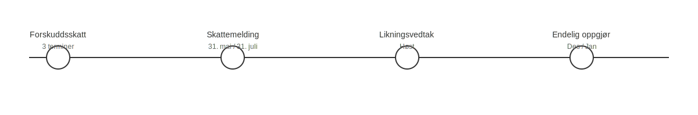

---
title: "Skatteoppgjør i Norsk Regnskap og Skatt"
meta_title: "Skatteoppgjør i Norsk Regnskap og Skatt"
meta_description: '**Hva er Skatteoppgjør?**'
slug: skatteoppgjor
type: blog
layout: pages/single
---

**Hva er Skatteoppgjør?**

Skatteoppgjør er det **endelige resultatet** av skattemyndighetenes beregning av skatt for en gitt periode. Det viser om du har betalt for mye (til gode) eller for lite (restskatt), og er en sentral milepæl for både **personlige skattytere** og **virksomheter**.

## Typer Skatteoppgjør

| Type               | Beskrivelse                                                                                                                                           |
|--------------------|-------------------------------------------------------------------------------------------------------------------------------------------------------|
| Restskatt          | Når faktisk skatt overstiger innbetalt forskudd, må du betale differansen.                                                                           |
| Tilgodebeløp       | Når forskuddsbetaling overstiger beregnet skatt, vil du få penger tilbake.                                                                            |
| Revisjonsoppgjør   | Justering etter at regnskap og skattemelding er revidert eller endret.                                                                               |

## Prosessen for Skatteoppgjør

Prosessen for skatteoppgjør består vanligvis av følgende trinn:

* **Forskuddsskatt** i løpet av året forutser skatteforpliktelsen.
* **Innsending av Skattemelding** (vanligvis 31. mai for personlige skattytere, 31. juli for næringsdrivende).
* **Foreløpig beregning** basert på innsendt informasjon.
* **Likningsvedtak** i høst med justeringer.
* **Endelig skatteoppgjør** i desember/januar når alle opplysninger er behandlet.

## Viktige Datoer og Frister

| Aktør                  | Skattemelding frist | Endelig skatteoppgjør         |
|------------------------|---------------------|-------------------------------|
| Personlige skattytere  | 31. mai             | Desember/januar               |
| Enkeltpersonforetak    | 31. juli            | Desember/januar               |
| Aksjeselskap (AS)      | 31. juli            | Desember/januar               |

## Dokumenter og Relaterte Begreper

* [Skattemelding](/blogs/regnskap/skattemelding "Skattemelding - Komplett Guide til Utfylling og Innlevering")
* [Årsoppgjør](/blogs/regnskap/hva-er-aarsavslutning "Hva er Årsavslutning? Årsavslutning Guide")
* [Forskuddsskatt](/blogs/regnskap/hva-er-forskuddsskatt "Hva er Forskuddsskatt? Beregning og Innbetaling")
* [Ã…rsregnskap](/blogs/regnskap/hva-er-arsregnskap "Hva er Ã…rsregnskap? Innhold og Krav til Regnskapsrapportering")
* [Utlignet skatt](/blogs/regnskap/utlignet-skatt "Utlignet skatt – Forklaring av endelig skatteoppgjør")
* [Trygdeopgjøret](/blogs/regnskap/trygdeopgjoret "Trygdeopgjøret: Guide til Årlig Oppgjør av Trygdeavgift og Ytelser")

## Hvordan Forberede Seg

For å unngå overraskelser ved skatteoppgjøret bør du:

* **Gjøre korrekte avsetninger** for skatt løpende i regnskapet.
* **Følge med på frister** for innlevering av skattemelding og betaling av forskuddsskatt.
* **Benytte prognoseverktøy** for å estimere endelig skattebelastning.
* **Korrigere feil** i regnskap og skattemelding før likningsvedtak.

## Konklusjon

Et godt planlagt skatteoppgjør bidrar til god likviditet og forutsigbarhet i både personlig økonomi og bedriftsregnskap. Ved å forstå prosessen, fristene og dokumentene som inngår, kan du sikre en smidig og nøyaktig skatteavslutning.
