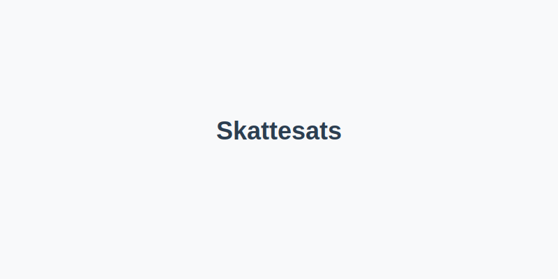
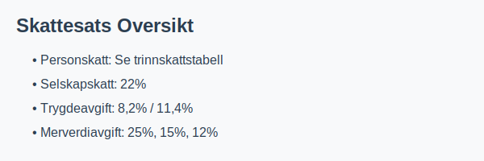

---
title: "Skattesats"
meta_title: "Skattesats"
meta_description: ''
slug: skattesats
type: blog
layout: pages/single
---

**Skattesats** viser til den **prosentandelen** av en grunnlagsverdi som skal betales i skatt. I det norske skattesystemet omfatter dette blant annet **personskatt**, **selskapskatt**, **trygdeavgift** og **merverdiavgift**. For en rask visuell oversikt, se illustrasjonen nedenfor.

## Oversikt over Skattesatser i Norge

| Skattekategori   | Skattesats                                      | Gjelder for                           | Referanse |
|------------------|-------------------------------------------------|---------------------------------------|-----------|
| **Personskatt**  | Se [Marginalskatt](/blogs/regnskap/hva-er-marginalskatt "Hva er Marginalskatt? Komplett guide til marginalskatt") | Personinntekt                         |           |
| **Selskapskatt** | 22%                                             | Skattepliktig overskudd for aksjeselskap og andre selskapsformer |           |
| **Trygdeavgift** | 8,2% (ansatt) / 11,4% (selvstendig næringsdrivende) | Lønn og næringsinntekt                | [Hva er Trygdeavgift?](/blogs/regnskap/hva-er-trygdeavgift "Hva er Trygdeavgift? En guide til trygdeavgift i Norge") |
| **Merverdiavgift** | 25%, 15%, 12%                                | Omsetning av varer og tjenester       | [Hva er Moms (MVA)?](/blogs/regnskap/hva-er-moms-mva "Hva er Moms (MVA)? Komplett Guide til Merverdiavgift i Norge") |

## Trinnskatt (Marginalskatt)

> Trinnskatt er den delen av **personskatten** som beregnes etter et progressivt trinnsystem, og utgjør en sentral komponent i marginalskatten.

| Inntektstrinn  | Trinnskatt sats |
|----------------|-----------------|
| Trinn 1        | 1,7%            |
| Trinn 2        | 4,0%            |
| Trinn 3        | 13,4%           |
| Trinn 4        | 16,4%           |

For en fullstendig guide til trinnskatt, se [Trinnskatt](/blogs/regnskap/trinnskatt "Trinnskatt – Guide til trinnskatt i Norge").
For mer detaljer om marginalskatt og trinnskatt, se [Hva er Marginalskatt?](/blogs/regnskap/hva-er-marginalskatt "Hva er Marginalskatt? Komplett guide til marginalskatt").

## Merverdiavgift (MVA)

| MVA-sats | Gjelder for                       |
|----------|-----------------------------------|
| 25%      | Standard sats for de fleste varer og tjenester |
| 15%      | Matvarer                          |
| 12%      | Persontransport, overnatting og kulturarrangementer |

## Avsluttende kommentarer

Denne artikkelen gir en oversikt over de vanligste **skattesatsene** i Norge. For spesifikke detaljer innen personskatt og justeringer i skatteberegningen, se våre artikler om [Skatteberegning](/blogs/regnskap/skatteberegning "Skatteberegning - Komplett Guide til Skatteberegning") og [Hva er Marginalskatt?](/blogs/regnskap/hva-er-marginalskatt "Hva er Marginalskatt? Komplett guide til marginalskatt").
