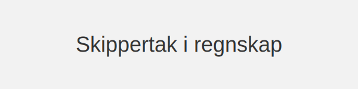

---
title: "Hva er Skippertak i Regnskap?"
meta_title: "Hva er Skippertak i Regnskap?"
meta_description: '**Skippertak** er et kjent fenomen i **norsk regnskap** der virksomheter utsetter viktige oppgaver som [Ã¥rsavslutning](/blogs/regnskap/hva-er-aarsavslutning "H...'
slug: skippertak
type: blog
layout: pages/single
---

**Skippertak** er et kjent fenomen i **norsk regnskap** der virksomheter utsetter viktige oppgaver som [årsavslutning](/blogs/regnskap/hva-er-aarsavslutning "Hva er Årsavslutning? Prosess og Viktige Steg") og [periodeavstemming](/blogs/regnskap/hva-er-periodisering "Hva er Periodisering? Prinsipper og Praktiske Eksempler") til siste liten. Et skippertak innebærer en **hektisk** og *intens* arbeidsperiode mot årsslutt, som kan føre til stress, økt feilmargin og redusert kvalitet i regnskapsrapporteringen.

## Hva er Skippertak?

Et **skippertak** i regnskap beskriver en kort, men svært intensiv arbeidsperiode hvor flere oppgaver samles til siste liten. Typiske kjennetegn er:

* Høyt tidspress og lange arbeidsdager
* Mindre tid til kvalitetssikring og [avstemming](/blogs/regnskap/hva-er-avstemming "Hva er Avstemming i Regnskap? Viktige Metoder og Eksempler")
* Økt risiko for *bokføringsfeil* og manglende dokumentasjon

## Hvorfor oppstår Skippertak?

Det finnes flere årsaker til at virksomheter ender opp med **skippertak**:

| **Ã…rsak**                         | **Beskrivelse**                                                                          |
|-----------------------------------|------------------------------------------------------------------------------------------|
| Manglende planlegging             | Ã…rsavslutningen planlegges ikke tilstrekkelig i forkant                                    |
| Ressursknapphet                   | FÃ¥ tilgjengelige ressurser i regnskapsavdelingen                                          |
| Uforutsette hendelser             | Systemproblemer eller endringer i forretningsmodellen fører til forsinkelser              |
| Lav prioritering av regnskapsoppgaver | Fokuset ligger på drift og salg, ikke løpende rapportering                         |

## Risiko og konsekvenser

Å gjennomføre et skippertak kan få alvorlige konsekvenser:

| **Risiko**              | **Konsekvens**                                                                    |
|-------------------------|-----------------------------------------------------------------------------------|
| Bokføringsfeil          | Feil i regnskapet kan føre til [baksmell](/blogs/regnskap/baksmell "Baksmell i Regnskap og Skatt: Årsaker, Eksempler og Behandling") eller revisjonsmerknader |
| Manglende dokumentasjon | Manglende sporbarhet reduserer pålitelighet i [bokettersyn](/blogs/regnskap/bokettersyn "Bokettersyn: Guide til Forebygging og Forberedelse") |
| Økt kostnad             | Ekstra timer og overtidsbetaling gir høyere kostnader                              |
| Stress og ansattfravær  | Langvarig høyt arbeidspress kan føre til redusert trivsel og sykefravær            |

## Hvordan unngå Skippertak?

For å redusere risikoen for skippertak anbefales det å:

* Utarbeide en detaljert årsavslutningsplan tidlig i regnskapsåret
* Fordele arbeidsoppgaver jevnt gjennom året basert på [periodiseringsprinsippet](/blogs/regnskap/hva-er-periodisering "Hva er Periodisering? Prinsipper og Praktiske Eksempler")
* Bruke sjekklister og automatisering ved hjelp av [API-integrasjon og Automatisering](/blogs/regnskap/api-integrasjon-automatisering-regnskap "API-integrasjon & Automatisering i Regnskap")
* Gjennomføre regelmessige avstemminger for å unngå opphopning av uavstemte poster
* Avsette ressurser for å håndtere uforutsette forsinkelser

## Planleggingsoversikt

Nedenfor er en forenklet tidslinje som viser viktige milepæler i planleggingen for å unngå skippertak:

| **Tidspunkt**         | **Aktivitet**                        |
|-----------------------|--------------------------------------|
| Januar “ mars         | Oppdater sjekklister og rutiner      |
| April “ juni          | HalvÃ¥rig [avstemming](/blogs/regnskap/hva-er-avstemming "Hva er Avstemming? Viktige Metoder og Eksempler")       |
| Juli “ september      | Revisjon av periodiseringsposter     |
| Oktober “ november    | Gjennomgang av [Ã¥rsoppgave](/blogs/regnskap/hva-er-aarsoppgave "Hva er Ã…rsoppgave? Guide til Skjemaer og Frister") |
| Desember              | Forberedende aktiviteter for årsavslutning |
| Januar (neste år)     | Fullføring av årsavslutning uten skippertak  |

## Sammendrag

Et godt planlagt regnskapsår gir mer tid til kvalitetskontroll, reduserer stress og minimerer risikoen for kostbare feil. Ved å forstå fenomenet **skippertak** og implementere effektive planleggingsrutiner, kan virksomheter sikre en jevn og kontrollert årsavslutning.

