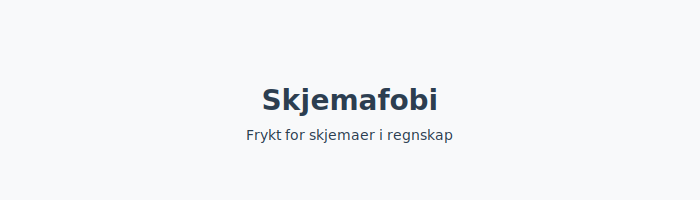

---
title: "Skjemafobi – Hvordan overvinne frykt for skjemaer i regnskap"
meta_title: "Skjemafobi “ Hvordan overvinne frykt for skjemaer i regnskap"
meta_description: '**Skjemafobi** er en betegnelse på *frykten eller motstanden mot å fylle ut skjemaer*, spesielt i en regnskaps- og administrasjonskontekst. I Norge kan **skje...'
slug: skjemafobi
type: blog
layout: pages/single
---

**Skjemafobi** er en betegnelse på *frykten eller motstanden mot å fylle ut skjemaer*, spesielt i en regnskaps- og administrasjonskontekst. I Norge kan **skjemafobi** føre til forsinkelser i rapportering, økt risiko for avvik og *administrativ byrde* for både små og store virksomheter.

## Hva er Skjemafobi?

Skjemafobi beskriver en ubehagelig reaksjon eller angst knyttet til utfylling av skjemaer, enten det er på papir eller i digitale systemer som [Altinn](/blogs/regnskap/hva-er-altinn "Hva er Altinn? En Guide til Offentlige Digitale Skjematjenester"). Fenomenet kan ha røtter i både psykologiske faktorer og praktiske utfordringer i arbeidsflyten.

## Årsaker til Skjemafobi

* **Kompleksitet:** Skjemaer kan inneholde avanserte felter, juridiske referanser og krav til dokumentasjon.
* **Mangel på verktøy:** Utilstrekkelig støtte fra digitale løsninger som [Altinn](/blogs/regnskap/hva-er-altinn "Hva er Altinn? En Guide til Offentlige Digitale Skjematjenester"), [Samordnet registermelding](/blogs/regnskap/samordnet-registermelding "Samordnet registermelding “ Effektivisering av skjemaer") og [API-integrasjon og automatisering](/blogs/regnskap/api-integrasjon-automatisering-regnskap "API-integrasjon og automatisering i regnskap “ Reduser skjemaøkosfæren").
* **Dårlig opplæring:** Ansatte mangler ofte opplæring i korrekt utfylling og behandling av skjemaer.
* **Endringsmotstand:** Organisasjoner kan være motvillige til å implementere nye digitale arbeidsprosesser.

## Konsekvenser i regnskap og administrasjon

| Konsekvens    | Beskrivelse                                                                                                        |
|---------------|--------------------------------------------------------------------------------------------------------------------|
| Forsinkelser  | Utsatt innsending av skattemelding, MVA-melding og andre lovpålagte skjemaer.                                       |
| Feil og avvik | Økt risiko for *feilrapportering* som kan føre til bøter, tilleggsskatt eller omkamp fra revisor.                   |
| Økt kostnad   | Flere arbeidstimer brukt på oppfølging, korrigering og intern feilretting av mangelfulle eller feilaktige skjemaer. |

## Hvordan overvinne Skjemafobi

* **Standardisering:** Utarbeid interne maler og sjekklister for de mest brukte skjemaene.
* **Opplæring:** Gjennomfør regelmessige workshop og kurs i korrekt utfylling og lovkrav.
* **Digitale verktøy:** Ta i bruk systemer med validering, forhåndsutfylling og direkte integrasjon mot [regnskapssystemer](/blogs/regnskap/hva-er-erp-system "Hva er ERP-system? En Innføring i Regnskapsteknologi").
* **Forenkle prosesser:** Reduser antall mellomledd og godkjenningsskritt ved å sentralisere attestering og automatisere godkjenningsflyter.

## Verktøy og metoder

* [Altinn](/blogs/regnskap/hva-er-altinn "Hva er Altinn? En Guide til Offentlige Digitale Skjematjenester") “ Norges sentrale portal for digital innsending av skjemaer.
* [Samordnet registermelding](/blogs/regnskap/samordnet-registermelding "Samordnet registermelding “ Effektivisering av skjemaer") “ Samler flere rapporteringer i én. Bidrar til å redusere skjemaflom og skjemafobi.
* [API-integrasjon og automatisering](/blogs/regnskap/api-integrasjon-automatisering-regnskap "API-integrasjon og automatisering i regnskap “ Reduser skjemaøkosfæren") “ Automatiser utfylling og innsending.
* [Digital bokføring](/blogs/regnskap/hva-er-bokforing "Hva er Bokføring? En Komplett Guide til Norsk Bokføringspraksis") “ Papirløse løsninger som minimerer manuell håndtering.

## Oppsummering

Skjemafobi påvirker effektiviteten og kvaliteten i regnskapsarbeid, men kan håndteres med standardiserte prosesser, riktig opplæring og moderne verktøy. Ved å ta i bruk digitale løsninger og fokusere på endringsledelse kan virksomheter redusere administrativ byrde og unngå unødige forsinkelser og kostnader.

