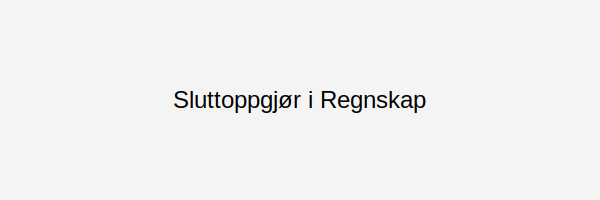

---
title: "Sluttoppgjør i regnskap"
seoTitle: "Sluttoppgjør i regnskap"
description: '**Sluttoppgjør i regnskap** er den siste fasen i regnskapsprosessen hvor alle kontoer avstemmes, justeringer gjennomføres og regnskapet endelig godkjennes. Sl...'
---

**Sluttoppgjør i regnskap** er den siste fasen i regnskapsprosessen hvor alle kontoer avstemmes, justeringer gjennomføres og regnskapet endelig godkjennes. Sluttoppgjøret sikrer at [årsavslutningen](/blogs/regnskap/hva-er-aarsavslutning "Årsavslutning i regnskap") er komplett og at regnskapet gir et **rettvisende bilde** av virksomhetens økonomiske situasjon.

## Hva er Sluttoppgjør?

Sluttoppgjør refererer til den formelle avslutningen av regnskapsperioden, der alle transaksjoner er registrert, kontoer er avstemt og nødvendige justeringer er utført. Prosessen er en del av den samlede [årsavslutningen](/blogs/regnskap/hva-er-aarsavslutning "Årsavslutning i regnskap") og legger grunnlaget for godkjenning og rapportering.

## Hvorfor er Sluttoppgjør viktig?

- **Sikrer nøyaktighet:** Bekrefter at alle regnskapsdata stemmer.
- **Oppfyller lovkrav:** Overholder kravene i regnskapsloven og god regnskapsskikk.
- **Underbygger beslutninger:** Gir ledelsen pålitelige tall for strategiske beslutninger.
- **Forenkler revisjon:** Klargjør dokumentasjon for revisorer.

## Prosessen for Sluttoppgjør

| Steg | Beskrivelse |
|------|-------------|
| 1. Avstemming | Kontroller at balanse- og resultatkonti stemmer med kilder som bank, leverandør og interne data |
| 2. Periodisering | Sørg for at inntekter og kostnader er bokført i riktig periode |
| 3. Revisjon | Gjennomfør intern eller ekstern revisjon for kvalitetssikring |
| 4. Godkjenning | Få formell godkjenning fra ledelse eller styre |
| 5. Rapportering | Utarbeid og distribuer endelige regnskapsrapporter til interessenter |

## Viktige kontrollpunkter

- Fullstendige bilag og dokumentasjon
- Kontroll av alle justeringsposter
- Avviksanalyser og forklaringer på større differanser
- Godtgjørelse av skattemessige justeringer

## Internkontroll og dokumentasjon

God internkontroll er avgjørende for et korrekt sluttoppgjør. Se også artikkelen om [Internkontroll i regnskap](/blogs/regnskap/hva-er-internkontroll "Hva er Internkontroll i regnskap") for flere detaljer.

