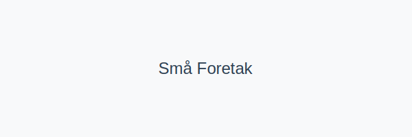

For en oversikt over generelle foretaksdefinisjoner, se [Hva er et Foretak?](/blogs/regnskap/hva-er-foretak "Hva er et Foretak? Komplett Guide til Foretaksformer i Norge").

Begrepet **små foretak** refererer til virksomheter som oppfyller bestemte terskelverdier for omsetning, balansesum og antall ansatte. Disse foretakene kan benytte **forenklede regnskapsregler** i henhold til regnskapsstandard for små foretak (RSFF).

## Hva er små foretak?

Ifølge bokføringsforskriften defineres små foretak av følgende kriterier per regnskapsår:

| Kriterium               | Terskel                 |
|-------------------------|-------------------------|
| Omsetning               | Under NOK 70 000 000    |
| Balansesum              | Under NOK 35 000 000    |
| Gjennomsnittlig ansatte | Under 50 [Ã¥rsverk](/blogs/regnskap/arsverk "Ã…rsverk") |

Foretak som oppfyller minst to av disse tre kriteriene kan rapportere som små foretak med **forenklet rapportering**.

## Regler og krav for små foretak

Små foretak reguleres av [bokføringsforskriften](/blogs/regnskap/hva-er-bokforingsforskriften "Hva er Bokføringsforskriften? Guide til regnskapsstandarder og krav"). De viktigste regnskapsstandardene og prinsippene er:

* **Forenklet IFRS** for små foretak
* **God regnskapsskikk** som grunnlag
* **Forenklede** notekrav sammenlignet med full NRS
* **Lavere krav** til detaljert årsberetning

Se også [God regnskapsskikk](/blogs/regnskap/god-regnskapsskikk "God regnskapsskikk: Introduksjon til regnskapsprinsipper") og [Norsk standard regnskap](/blogs/regnskap/norsk-standard-regnskap "Norsk Regnskapsstandard: Oversikt og vei videre").

## Fordeler ved forenklinger

Å føre regnskap som små foretak gir flere fordeler:

* Redusert administrativ byrde og lavere kostnader
* Mindre omfangsrike notekrav og rapporteringsdetaljer
* Enklere årsoppgjør og kortere tidsbruk ved regnskapsavslutning
* Bedre likviditetsstyring ved enklere rapportering

## Begrensninger og anbefalinger

Selv om reglene for små foretak er forenklet, må du fortsatt:

* Oppfylle **bokføringsplikt** i henhold til [bokføringsplikt](/blogs/regnskap/hva-er-bokforingsplikt "Hva er Bokføringsplikt? Komplett Guide til Regler og Krav")
* Sørge for korrekt **dokumentasjon** og oppbevaring i minimum 5 år
* Vurdere om du overskrider kriteriene årlig; ved overskridelse må full NRS eller IFRS benyttes

## Hvordan avgjøre om du er et små foretak

Følg disse trinnene for å avgjøre om virksomheten din kvalifiserer:

1. Samle siste års **omsetning**, **balansesum** og **antall ansatte**.
2. Sammenlign tallene med terskelverdiene i tabellen over.
3. Hvis du oppfyller to av tre kriterier, kan du rapportere som små foretak.
4. Evaluer status årlig før årsavslutning for å sikre korrekt anvendelse av regnskapsstandard.

For mer om årsavslutning, se [Hva er årsavslutning?](/blogs/regnskap/hva-er-aarsavslutning "Hva er Aarsavslutning? Komplett Guide til Årsavslutning").

