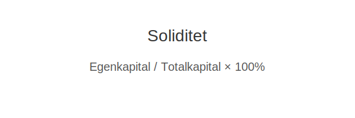

---
title: "Soliditet"
meta_title: "Soliditet"
meta_description: '**Soliditet** er en sentral **soliditetsindikator** som måler andelen egenkapital i forhold til totalkapitalen og gir innsikt i en virksomhets langsiktige fina...'
slug: soliditet
type: blog
layout: pages/single
---

**Soliditet** er en sentral **soliditetsindikator** som måler andelen egenkapital i forhold til totalkapitalen og gir innsikt i en virksomhets langsiktige finansielle robusthet.

Soliditet beregnes ved Ã¥ sette [egenkapital](/blogs/regnskap/hva-er-egenkapital "Hva er Egenkapital? Komplett Guide til Egenkapital i Regnskap") i forhold til [aktiva (totalkapital)](/blogs/regnskap/hva-er-aktiva "Hva er Aktiva? Komplett Oversikt over Aktiva og Totalkapital") og [totalkapital](/blogs/regnskap/totalkapital "Totalkapital “ Sum av egenkapital og gjeld i regnskapet").



## Hva er soliditet?

Soliditet, også kalt solvens, viser hvor stor del av virksomhetens eiendeler som er finansiert med egenkapital. En høy soliditet indikerer at selskapet har et solid finansielt fundament og bedre evne til å tåle tap eller uforutsette utgifter.

## Hvordan beregnes soliditet?

Formelen for soliditet er:

```
Soliditet = Egenkapital / Totalkapital × 100 %
```

Der Totalkapital tilsvarer summen av alle eiendeler (aktiva), som også reflekterer summen av egenkapital og gjeld.

## Tolkning av soliditetsnivåer

| Soliditetsnivå    | Tolkning                                                   |
|-------------------|-------------------------------------------------------------|
| Over 50 %         | **Høy soliditet**: Svært god evne til å tåle økonomiske tap   |
| 20“50 %           | **Moderat soliditet**: Akseptabel, men følg med og begrens risiko |
| Under 20 %        | **Lav soliditet**: Potensielt risikofylt med begrenset buffer |

## Faktorer som påvirker soliditet

* **Resultatutvikling:** Overskudd gir økt egenkapital, mens tap reduserer den
* **Utbyttepolitikk:** Høyt utbytte kan svekke egenkapitalen
* **Nyemisjon eller tilførsel av kapital:** Styrker soliditeten ved å tilføre egenkapital
* **Gjeldsnivå:** Høyere gjeld gir lavere egenkapitalandel

## Sammenheng med andre nøkkeltall

Soliditet bør vurderes sammen med andre finansielle nøkkeltall som [likviditet](/blogs/regnskap/hva-er-likviditet "Hva er Likviditet? Komplett Guide til Kontantstrømsanalyse") og [rentabilitet](/blogs/regnskap/hva-er-egenkapitalrentabilitet "Hva er Egenkapitalrentabilitet? Guide til Avkastning på Egenkapital").

## Oppsummering

Soliditet gir et viktig bilde av virksomhetens evne til å stå imot økonomiske påkjenninger. Ved å overvåke egenkapitalandelen kan ledelsen fatte informerte beslutninger om finansiering, utbytte og bærekraftig vekst.


