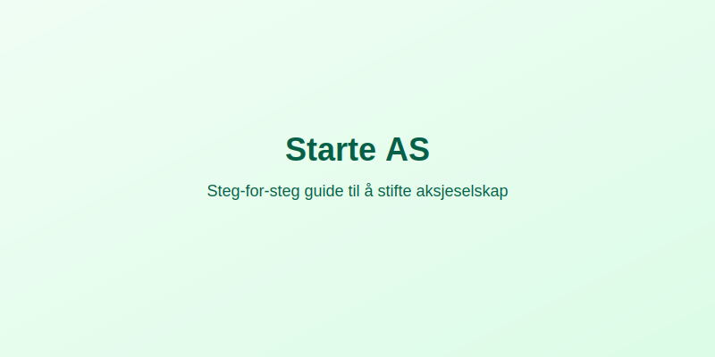

---
title: "Starte AS"
meta_title: "Starte AS"
meta_description: 'Se vår [Hva er et Aksjeselskap?](/blogs/regnskap/hva-er-et-aksjeselskap "Hva er et Aksjeselskap? Komplett Guide til Selskapsformen") for en oversikt over **aks...'
slug: starte-as
type: blog
layout: pages/single
---

Se vår [Hva er et Aksjeselskap?](/blogs/regnskap/hva-er-et-aksjeselskap "Hva er et Aksjeselskap? Komplett Guide til Selskapsformen") for en oversikt over **aksjeselskapets** egenskaper før du starter prosessen.

Å **starte et aksjeselskap (AS)** krever nøye planlegging og oppfyllelse av flere formelle krav. Denne guiden tar deg gjennom prosessen steg for steg.

### Oversikt over stegene

1. Planlegg selskapet og forretningsidéen.
2. Utarbeid [vedtekter](/blogs/regnskap/vedtekter "Vedtekter: Definisjon, Krav og Betydning i Norsk Regnskap") og stiftelsesdokument.
3. Gjennomfør stiftelsesmøte og tegn aksjer.
4. Registrer selskapet i [Enhetsregisteret](/blogs/regnskap/hva-er-foretaksregisteret "Hva er Foretaksregisteret? Enhetsregister, Org.nr og Selskapsregister").
5. Ã…pne bankkonto og innbetal aksjekapital.
6. Meld selskapet i [MVA-registeret](/blogs/regnskap/mva-plikt "MVA-plikt: Komplett Guide til Merverdiavgiftsplikt i Norge") om nødvendig.
7. Motta bekreftelse fra Brønnøysund og start driften.

### Tidslinje og kostnader

| Steg                                | Ansvarlig    | Kostnad     | Estimert tid  |
|-------------------------------------|--------------|-------------|--------------|
| Planlegging                         | Gründer      | 0 kr        | 1 dag        |
| Stiftelsesmøte og [vedtekter](/blogs/regnskap/vedtekter "Vedtekter: Definisjon, Krav og Betydning i Norsk Regnskap") | Gründer      | 0–5 000 kr* | 1 dag        |
| Registrering i Brønnøysund          | Gründer      | [Stiftelsesgebyr](/blogs/regnskap/stiftelsesgebyr "Stiftelsesgebyr ved registrering av AS") | 1–3 dager    |
| MVA-registrering                    | Selskap      | Gratis      | 0–5 dager    |
| **Totalsum**                        | –            | **[5 570 kr](/blogs/regnskap/stiftelsesgebyr "Stiftelsesgebyr ved registrering av AS")** | **3–10 dager**|

*Kan tilkomme honorarer til rådgiver eller jurist.

### Viktige krav for å starte AS

- **Minimum aksjekapital** på 30 000 kr (kan være penger eller tingsinnskudd).
- **Minst én stifter** (person eller selskap) som tegner alle aksjene.
- **[Vedtekter](/blogs/regnskap/vedtekter "Vedtekter: Definisjon, Krav og Betydning i Norsk Regnskap")** som inneholder selskapsnavn, formål og aksjekapital.
- Gjennomført **stiftelsesmøte** med protokoll.
- Innbetaling av aksjekapital til separat **selskapskonto**.
- **Organisasjonsnummer** tildeles via Foretaksregisteret.
- Rapportering til **Altinn** og eventuell registrering i [A-meldingen](/blogs/regnskap/hva-er-a-melding "Hva er A-melding? Rapporteringsplikt for arbeidsgiver").

### Etter registrering

NÃ¥r selskapet er registrert, kan du:

- **Opprette fakturamal** i [fakturaprogram](/blogs/regnskap/fakturaprogram "Hva er Fakturaprogram? En Komplett Guide til Fakturaverktøy").
- **Sette opp regnskapssystem** og kontakte [ARS](/blogs/regnskap/hva-er-ars "Hva er ARS? Autorisert Regnskapsførerselskap - Krav, Fordeler og Prosess").
- Utforske finansiering via [hylleselskap](/blogs/regnskap/hylleselskap "Hva er et Hylleselskap? Guide til Ferdigregistrerte Selskaper i Norge") om rask oppstart er viktig.
- **Utarbeide [Ã¥pningsbalanse for aksjeselskap](/blogs/regnskap/apningsbalanse-for-aksjeselskap "Ã…pningsbalanse for aksjeselskap") for korrekt registrering av startbalanse.**

For komplett informasjon om aksjeselskapets egenskaper, se [Hva er et Aksjeselskap?](/blogs/regnskap/hva-er-et-aksjeselskap "Hva er et Aksjeselskap? Komplett Guide til Selskapsformen") og avsnittet “Krav for å Starte et Aksjeselskap”.
