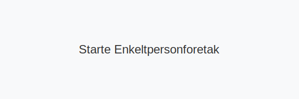

---
title: "Starte Enkeltpersonforetak"
seoTitle: "Starte Enkeltpersonforetak"
meta_description: 'Se vår [Hva er et Enkeltpersonforetak?](/blogs/regnskap/hva-er-enkeltpersonforetak "Hva er et Enkeltpersonforetak? Komplett Guide til Selskapsformen") for en o...'
slug: starte-enkeltpersonforetak
type: blog
layout: pages/single
---

Se vår [Hva er et Enkeltpersonforetak?](/blogs/regnskap/hva-er-enkeltpersonforetak "Hva er et Enkeltpersonforetak? Komplett Guide til Selskapsformen") for en oversikt over egenskaper og definisjon av enkeltpersonforetak før du starter prosessen.

Å **starte et enkeltpersonforetak (ENK)** innebærer en rekke steg for å sikre korrekt registrering, organisering og oppfyllelse av lovpålagte krav. Denne guiden tar deg gjennom hele prosessen, fra planlegging til oppstart.

## Oversikt over stegene

1. Planlegging og forretningsidé
2. Registrering i Enhetsregisteret
3. Bankkonto og økonomi
4. MVA-registrering og skattemelding
5. Oppsett av regnskap og bokføring

## Tidslinje og kostnader

| Steg                        | Ansvarlig    | Kostnad      | Estimert tid   |
|-----------------------------|--------------|--------------|---------------|
| Planlegging og forberedelser| Gründer      | 0 kr         | 1“3 dager     |
| Registrering i Enhetsregisteret| Gründer  | Gratis*      | 1“2 dager     |
| Opprettelse av bankkonto    | Gründer      | Gratis       | 1 dag         |
| MVA-registrering            | Gründer      | Gratis       | 0“5 dager     |
| Oppsett regnskapssystem     | Gründer      | Variabel     | 1“2 dager     |
| **Totalt**                  | “            | **0 kr***    | **3“10 dager**|

*Obligatorisk ved omsetning over 50 000 kr.

## Detaljerte krav for oppstart

### Registrering

* **Frivillig registrering** i [Enhetsregisteret](/blogs/regnskap/hva-er-enhetsregisteret "Hva er Enhetsregisteret?") hvis forventet omsetning < 50 000 kr.
* **Obligatorisk registrering** hvis omsetning > 50 000 kr. MVA-plikt ved omsetning > 50 000 kr per år.
* Digital registrering via Altinn eller Brønnøysund.

### Navn og eierskap

* Driftes under **eiers eget navn** eller valgt **forretningsnavn**.
* Eieren må være myndig og bosatt i Norge.

### Bank og økonomi

* Åpne **forretningskonto** for å skille privat og virksomhet.
* Sett opp **likviditets- og budsjettplan** før oppstart.

## Skatt og avgifter

* **Personinntekt**: Overskuddet beskattes som [personinntekt](/blogs/regnskap/personinntekt "Personinntekt “ Komplett guide til personinntekt i norsk regnskap").
* **MVA-registrering** ved omsetning > 50 000 kr: se [MVA-plikt](/blogs/regnskap/hva-er-avgiftsplikt-mva "Hva er Avgiftsplikt (MVA)? Komplett Guide til Merverdiavgift i Norge").
* Levering av **næringsoppgave** via [skattemelding for næringsdrivende](/blogs/regnskap/hva-er-naeringsoppgave "Hva er Næringsoppgave? Komplett Guide til Næringsoppgaven i Norge").

## Gode råd for en vellykket oppstart

* **Planlegg nøye**: Sett realistiske mål og vurder risiko.
* **Hold orden på økonomien**: Bruk digitale verktøy for [bokføring](/blogs/regnskap/hva-er-bokforing "Hva er Bokføring? Komplett Guide til Bokføring og Regnskapsføring").
* **Forsikre virksomheten**: Vurder yrkesansvarsforsikring og andre relevante forsikringer.
* **Oppfølging**: Følg løpende opp regnskap, skatter og avgifter.

## Relaterte artikler

* [Hva er et Enkeltpersonforetak?](/blogs/regnskap/hva-er-enkeltpersonforetak "Hva er et Enkeltpersonforetak? Komplett Guide til Selskapsformen")
* [Starte AS](/blogs/regnskap/starte-as "Starte AS: Steg-for-steg guide for å registrere aksjeselskap (AS)")
* [Organisasjonsform](/blogs/regnskap/organisasjonsform "Organisasjonsform: Oversikt over selskapsformer i Norge")
* [MVA-plikt](/blogs/regnskap/hva-er-avgiftsplikt-mva "Hva er Avgiftsplikt (MVA)? Komplett Guide til Merverdiavgift i Norge")

