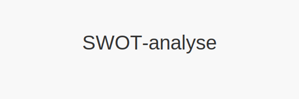

**SWOT-analyse** er en strukturert metode for å kartlegge og evaluere både interne og eksterne faktorer som påvirker en virksomhets suksess. Navnet er en forkortelse for **Strengths**, **Weaknesses**, **Opportunities** og **Threats**.

SWOT-analysen brukes ofte i forbindelse med [forretningsplaner](/blogs/regnskap/hva-er-forretningsplan "Hva er en Forretningsplan? Komplett Guide til Forretningsplan i Norske Virksomheter") og [risikoanalyser](/blogs/regnskap/hva-er-avvikshandtering "Hva er Avvikshåndtering i Regnskap? Prosess, Metoder og Beste Praksis") for å gi et helhetlig bilde av virksomhetens posisjon.

## Hva er SWOT-analyse?

En **SWOT-analyse** består av to hovedkategorier:

* **Interne faktorer** som inkluderer *styrker* og *svakheter* i egen virksomhet.
* **Eksterne faktorer** som omfatter *muligheter* og *trusler* i omgivelsene.

Denne metoden gir et rammeverk for å strukturere tanker, samle inn relevant informasjon og prioritere tiltak.

## Hvorfor bruke SWOT-analyse i regnskap og økonomistyring?

Å inkludere SWOT-analyse i regnskaps- og økonomiprosesser gir flere fordeler:

* **Helhetlig oversikt:** Kombinerer både interne og eksterne perspektiver.
* **Strategisk innsikt:** Understøtter beslutninger knyttet til budsjett, investeringer og likviditetsplanlegging.
* **Risikovurdering:** Komplementerer andre analyser som [internkontroll](/blogs/regnskap/hva-er-internkontroll "Hva er Internkontroll? Kritisk for Effektiv Kontroll og Risikostyring").
* **Forbedringsområder:** Avdekker svakheter som bør adresseres raskt og muligheter som kan utnyttes.

## Hvordan gjennomføre en SWOT-analyse

En typisk arbeidsflyt for SWOT-analyse kan være:

1. **Definer målsetning:** Klargjør hva analysen skal støtte (f.eks. ny forretningsmodell, budsjettrevisjon).
2. **Innsamling av data:** Samle regnskapsdata, markedsundersøkelser og interne rapporter.
3. **Identifisering av faktorer:** List opp styrker, svakheter, muligheter og trusler.
4. **Analyse og prioritering:** Vurder hvilken betydning og sannsynlighet hver faktor har.
5. **Tiltaksplan:** Utarbeid konkrete tiltak basert på analysen.

## SWOT-matrisen

|                       | **Interne faktorer**         | **Eksterne faktorer**        |
|-----------------------|------------------------------|-----------------------------|
| **Positive aspekter** | **Styrker (Strengths)**      | **Muligheter (Opportunities)** |
| **Negative aspekter** | **Svakheter (Weaknesses)**   | **Trusler (Threats)**          |

## Eksempel på SWOT-analyse for regnskapskontor

|                        | Styrker                              | Muligheter                              |
|------------------------|--------------------------------------|-----------------------------------------|
| _Internt_              | Erfaren regnskapsfører               | Digitalisering av regnskap              |
| _Eksternt_             | Godt nettverk i bransjen             | Økt etterspørsel etter rådgivningstjenester |

|                        | Svakheter                            | Trusler                                 |
|------------------------|--------------------------------------|-----------------------------------------|
| _Internt_              | Manglende automatisering             | Endringer i skattelovgivning           |
| _Eksternt_             | Sterk konkurranse i markedet         | Økonomisk usikkerhet i norsk næringsliv |

## Tips for en effektiv SWOT-analyse

* **Vær konkret:** Bruk tall og eksempler fra regnskapet.
* **Tverrfaglig team:** Involver økonomi-, salg- og ledelsesteam.
* **Oppdater jevnlig:** Gjennomfør SWOT-analyse årlig eller ved store endringer.
* **Kombiner med andre verktøy:** Vurder også **PESTEL-analyse** for å kartlegge makroøkonomiske trender.

En grundig **SWOT-analyse** er et verdifullt verktøy for norske virksomheter som ønsker å styrke sin strategi, redusere risiko og skape vekst.

