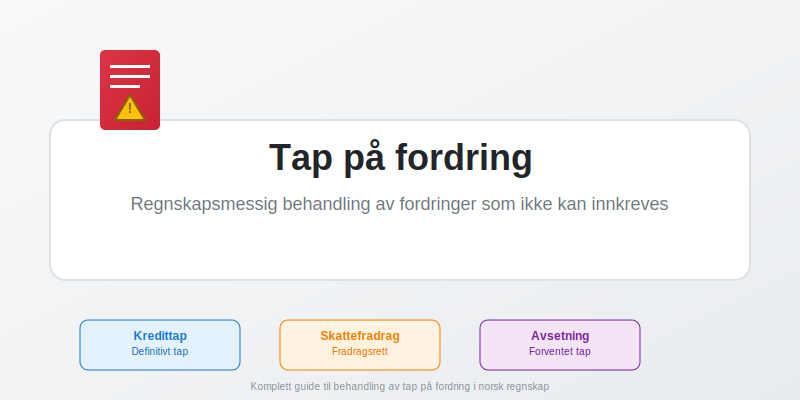
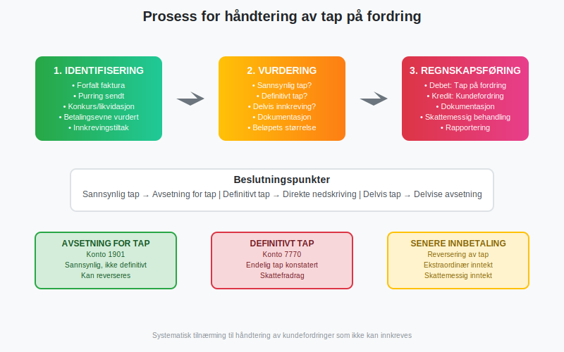
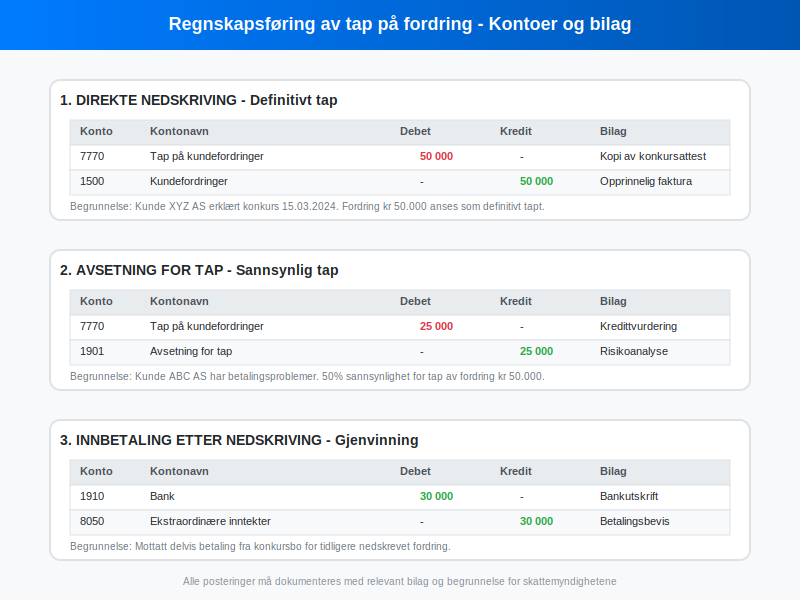
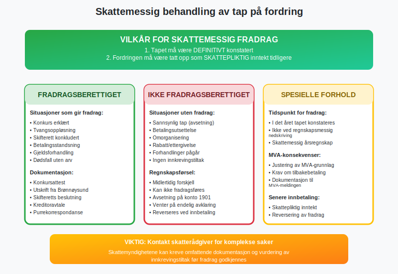
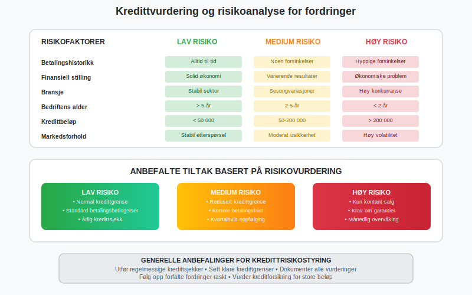
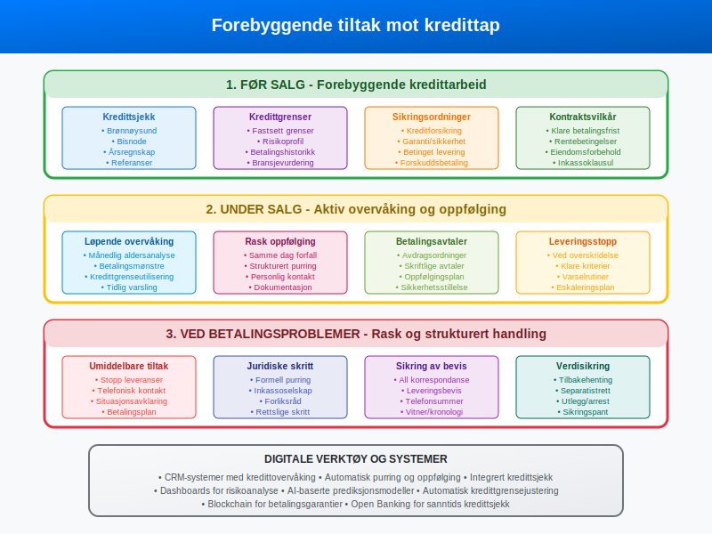
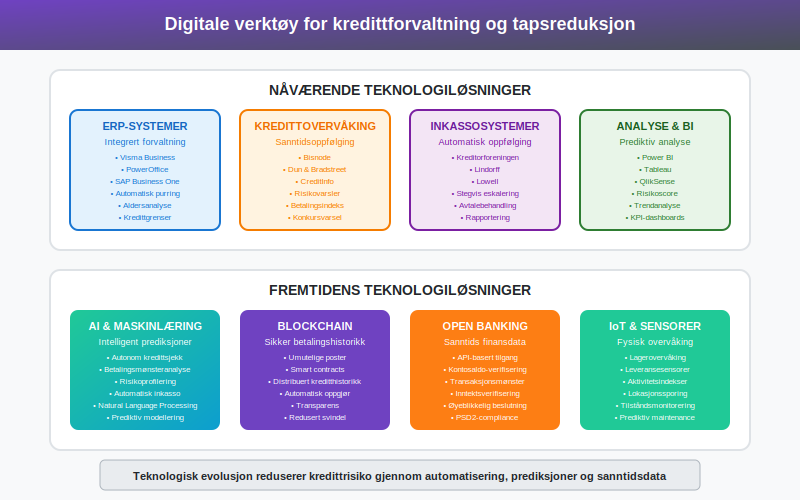

---
title: "Tap på fordring"
seoTitle: "Tap på fordring"
description: '**Tap på fordring** er en regnskapsmessig og skattemessig realitet som alle bedrifter med kreditsalg må forholde seg til. Når kunder ikke kan eller vil betal...'
---

**Tap på fordring** er en regnskapsmessig og skattemessig realitet som alle bedrifter med kreditsalg må forholde seg til. Når kunder ikke kan eller vil betale sine [kundefordringer](/blogs/regnskap/hva-er-kundefordring "Hva er kundefordring? En Guide til Norske Kundefordringer"), må bedriften ta høyde for at deler av eller hele fordringen kan gå tapt. En grundig forståelse av hvordan slike tap skal håndteres er avgjørende for [god regnskapsskikk](/blogs/regnskap/god-regnskapsskikk "God regnskapsskikk - prinsipper og retningslinjer") og korrekt skattebehandling.

 
For en generell innføring i fordringer, se [Hva er fordring?](/blogs/regnskap/hva-er-fordring "Hva er fordring? En komplett guide til fordringer").



Tap på fordring oppstår når en bedrift må erkjenne at en kunde ikke kommer til å betale sin gjeld. Dette kan skyldes kundens [konkurs](/blogs/regnskap/hva-er-konkurs "Hva er konkurs? Juridiske og regnskapsmessige konsekvenser"), betalingsevneproblemer, eller at kunden rett og slett nekter å betale. Uavhengig av årsaken må bedriften håndtere dette profesjonelt og i tråd med gjeldende regnskaps- og skatteregler.

## Hva er tap på fordring?

Tap på fordring refererer til den delen av [kundefordringer](/blogs/regnskap/hva-er-kundefordringer "Hva er kundefordringer? Administrasjon og oppfølging") som en bedrift ikke lenger forventer å motta betaling for. Dette kan være et **definitivt tap** hvor det er fastslått at fordringen aldri vil bli betalt, eller et **sannsynlig tap** hvor det er stor risiko for at betalingen ikke kommer.

**Definitivt tap** oppstår når:
* Kunden er erklært konkurs
* Selskapet er tvangsoppløst
* Kunden er død uten arv som kan dekke gjelden
* Alle praktiske innkrevingstiltak er uttømt

**Sannsynlig tap** kan identifiseres gjennom:
* Betalingsvansker over lengre tid
* Manglende respons på purringer
* Konkurstruede virksomheter
* Generelle markedsforhold i kundens bransje



## Regnskapsføring av tap på fordring

Regnskapsføring av tap på fordring følger [regnskapsprinsippene](/blogs/regnskap/regnskapsprinsipper "Regnskapsprinsipper - grunnlaget for norsk regnskap") og avhenger av om tapet er definitivt eller sannsynlig. 

### Definitivt tap - direkte nedskriving

Når et tap er **definitivt konstatert**, skal fordringen nedskrives direkte:

**Bilagspost:**
```
Debet:  Konto 7770 - Tap på kundefordringer    50 000
Kredit: Konto 1500 - Kundefordringer          50 000
```

Denne posteringen fjerner fordringen fra [balansen](/blogs/regnskap/hva-er-balanse "Hva er balanse? Balanseligning og struktur") og belaster [resultatregnskapet](/blogs/regnskap/hva-er-resultatregnskap "Hva er resultatregnskap? Oppbygning og analyse") med tapet.

### Sannsynlig tap - avsetning

For **sannsynlige tap** brukes avsetning for tap:

**Bilagspost:**
```
Debet:  Konto 7770 - Tap på kundefordringer    25 000
Kredit: Konto 1901 - Avsetning for tap        25 000
```

Avsetning for tap er en [kontrapost](/blogs/regnskap/kontrapost "Kontrapost i regnskap - definisjon og bruk") som reduserer den bokførte verdien av kundefordringer uten å fjerne selve fordringen.



### Senere innbetaling

Dersom en tidligere nedskrevet fordring senere blir betalt helt eller delvis, regnskapsføres dette som **ekstraordinær inntekt**:

**Bilagspost:**
```
Debet:  Konto 1910 - Bank                      30 000
Kredit: Konto 8050 - Ekstraordinære inntekter 30 000
```

## Skattemessig behandling

Den skattemessige behandlingen av tap på fordring er strengere regulert enn den regnskapsmessige. For å få **skattemessig fradrag** må spesifikke vilkår være oppfylt.



### Vilkår for skattefradrag

**Hovedvilkår:**
1. **Definitivt tap**: Tapet må være endelig konstatert
2. **Skattepliktig inntekt**: Fordringen må tidligere være tatt opp som skattepliktig inntekt
3. **Dokumentert innkrevingsforsøk**: Alle rimelige innkrevingstiltak må være forsøkt

**Situasjoner som gir fradragsrett:**
* Konkurs erklært av skifteretten
* Tvangsoppløsning av selskap
* Gjeldsforhandling hvor tap er dokumentert
* Betalingsstandsning med endelig avklaring
* Dødsfall uten arv som kan dekke gjelden

**Dokumentasjon som kreves:**
* Konkursattest fra skifteretten
* Utskrift fra [Enhetsregisteret](/blogs/regnskap/hva-er-enhetsregisteret "Hva er Enhetsregisteret?") i Brønnøysund
* Purrekorrespondanse og inkassodokumenter
* Kreditoravtaler eller forliksavtaler
* Bevis på gjennomførte innkrevingstiltak

### Tidspunkt for fradrag

Skattemessig fradrag kan først kreves når tapet er **definitivt konstatert**. Dette kan være senere enn når det regnskapsmessige tapet er bokført. Avsetninger for sannsynlige tap gir ikke skattefradrag før tapet er realisert.

### MVA-konsekvenser

Når et tap på fordring er konstatert, må bedriften også vurdere [MVA-konsekvenser](/blogs/regnskap/hva-er-mva "Hva er MVA? Merverdiavgift i Norge"). Dersom den opprinnelige fakturaen inkluderte MVA, kan bedriften ha krav på tilbakebetaling av MVA på det tapte beløpet.

## Identifisering og vurdering av kredittrisiko

Effektiv **kredittrisikostyring** er avgjørende for å minimere tap på fordringer. Dette innebærer systematisk overvåking og vurdering av kunders betalingsevne.



### Kredittsjekk før salg

**Grunnleggende kredittsjekk:**
* Sjekk i [Brønnøysund Register](/blogs/regnskap/bronnoyund-register "Brønnøysund Register - opplysninger og tjenester")
* Henting av [årsregnskap](/blogs/regnskap/hva-er-aarsregnskap "Hva er Årsregnskap? Innhold, oppbygging og lovkrav i Norge") fra tidligere år
* Kredittrapporter fra Bisnode, DnB eller lignende
* Referanser fra andre leverandører
* Vurdering av bransje og markedsforhold

**Nøkkeltall for vurdering:**
| Nøkkeltall | Beregning | Tolkning |
|------------|-----------|----------|
| **Soliditetsgrad** | Egenkapital / Totalkapital | Høyere = bedre |
| **Likviditetsgrad** | Omløpsmidler / Kortsiktig gjeld | > 2 = bra |
| **Gjeldsgrad** | Total gjeld / Totalkapital | Lavere = bedre |
| **Rentabilitet** | Resultat / Omsetning | Positiv trend |

### Løpende overvåking

**Månedlige oppgaver:**
* [Aldersanalyse](/blogs/regnskap/aldersanalyse "Aldersanalyse av kundefordringer") av kundefordringer
* Oppfølging av forfalne poster
* Vurdering av kredittgrenseutnyttelse
* Identifisering av betalingsmønstre

**Varselsindikatorer:**
* Forsinkede betalinger
* Reduserte bestillinger
* Endrede kontaktmønstre
* Negative nyheter om kunden
* Bransjeproblemer

## Forebyggende tiltak

Det beste tapet er det som ikke oppstår. Systematiske **forebyggende tiltak** kan redusere kredittap betydelig.



### Før salg

**Kredittgrenser og vilkår:**
* Etabler klare kredittgrenser basert på risikovurdering
* Definer betalingsvilkår i salgsavtaler
* Inkluder [eiendomsforbehold](/blogs/regnskap/eiendomsforbehold "Eiendomsforbehold - sikring av krav") i kontrakter
* Vurder krav om [sikkerhet](/blogs/regnskap/sikkerhet-gjeld "Sikkerhet for gjeld - pant og garantier") eller garantier

**Kredittforsikring:**
* Vurder handelskredittforsikring for store kunder
* Evaluer kostnad/nytte av forsikringsdekning
* Forstå forsikringsvilkår og egenandeler

### Under salg

**Aktiv oppfølging:**
* Etabler rutiner for purring ved forfall
* Oppretthold personlig kontakt med betalingsansvarlige
* Reagér raskt på endringer i betalingsmønster
* Dokumenter all kommunikasjon grundig

**Betalingsfasilitering:**
* Tilby fleksible betalingsløsninger
* Vurder avdragsordninger ved midlertidige problemer
* Implementer enkle betalingsmetoder
* Send tydelige og profesjonelle fakturaer

### Ved problemer

**Umiddelbare tiltak:**
* Stopp leveranser ved overskridelse av kredittgrenser
* Ta direkte kontakt for avklaring av situasjon
* Etabler realistiske betalingsplaner
* Sikre skriftlig dokumentasjon av avtaler

## Digitale verktøy og fremtidens kredittforvaltning

Moderne teknologi tilbyr kraftige verktøy for **kredittrisikostyring** og tapsreduksjon.



### Nåværende teknologi

**ERP-systemer** som Visma Business, PowerOffice og SAP Business One tilbyr:
* Automatisk purring og oppfølging
* Integrert aldersanalyse
* Kredittgrenseovervåking
* Rapportering og dashboards

**Kredittovervåkingstjenester** som Bisnode og CreditInfo gir:
* Sanntidsovervåking av kunders økonomiske situasjon
* Automatiske varsel ved endringer
* Betalingsindekser og risikovurderinger
* Konkursvarsler og andre kritiske hendelser

### Fremtidens løsninger

**Kunstig intelligens og maskinlæring:**
* Prediktive modeller for kredittrisiko
* Automatisk kundesegementerering
* Mønstergjenkjenning i betalingsdata
* Intelligente purrestrategier

**Blockchain og smart contracts:**
* Sikker og transparent betalingshistorikk
* Automatisk oppgjør ved oppfylte vilkår
* Redusert svindelrisiko
* Distribuert kredittinformasjon

**Open Banking:**
* Sanntidsverifikasjon av kunders betalingsevne
* API-basert tilgang til finansielle data
* Øyeblikkelige kredittvurderinger
* Automatiserte betalingsløsninger

## Juridiske aspekter og inkasso

Når forebyggende tiltak ikke er tilstrekkelige, må bedriften ty til **juridiske virkemidler** for å inndrive fordringer.

### Inkassoprosess

**Vanlig eskaleringsmodell:**
1. **Purring 1**: Vennlig påminnelse med 14 dagers frist
2. **Purring 2**: Tydeligere krav med rente og gebyr
3. **Inkassovarsel**: Formell varsling med juridiske konsekvenser
4. **Inkasso**: Overdragelse til inkassoselskap
5. **Rettslige skritt**: Forliksråd eller ordinær rettsgang

**Kostnader og gebyrer:**
* Lovbestemte inkassogebyrer etter inkassoloven
* Forsinkelsesrente fra forfallsdato
* Rettsgebyrer og advokatkostnader
* Kostnad-nytte-vurdering av rettslig forfølgning

### Sikringsordninger

**Utlegg og arrest:**
* Utlegg i kundens eiendeler
* Arrest for å sikre fremtidig krav
* [Dividende ved konkurs](/blogs/regnskap/dividende-ved-konkurs "Dividende ved konkurs: Prioriteringsrekkefølge og fordeling av utbytte i konkursbo")
* Tidsbegrensede sikringsmuligheter

**Eiendomsforbehold:**
* Bevaring av eiendomsrett til leveranser
* Rett til tilbakehenting av varer
* Separatistrett i konkurs
* Krav til registrering og merking

## Bransjevariasjoner og spesielle forhold

Ulike bransjer har **forskjellige utfordringer** knyttet til tap på fordringer.

### Byggebransjen

* Lange prosjektperioder øker risiko
* Komplekse kontraktsforhold
* Krav om [garantier](/blogs/regnskap/garantier "Garantier i regnskap og økonomi") og sikkerhet
* [Rettsforbehold](/blogs/regnskap/rettsforbehold "Rettsforbehold i byggebransjen") ved betalingstvister

### Handel og tjenester

* Høy kundeomsetning krever effektive systemer
* Sesongvariasjoner påvirker betalingsevne
* Kort kredittperiode reduserer eksponering
* Viktighet av automatiserte prosesser

### Eksportbedrifter

* Valutarisiko kompliserer kredittarbeid
* Kulturelle forskjeller i betalingsskikk
* Behov for [eksportkredittforsikring](/blogs/regnskap/eksportkredittforsikring "Eksportkredittforsikring for norske bedrifter")
* Juridiske utfordringer på tvers av landegrenser

## Rapportering og analyse

Systematisk **rapportering** av kredittap gir viktig styringsinformasjon.

### Nøkkeltall og KPI-er

**Kredittaps-ratio:**
```
Kredittaps-ratio = Tap på fordringer / Total omsetning × 100
```

**Kundefordringenes omløpstid:**
```
Omløpstid = (Gjennomsnittlige kundefordringer / Omsetning) × 365
```

**Forfallsstruktur:**
* 0-30 dager: 60%
* 31-60 dager: 25%
* 61-90 dager: 10%
* Over 90 dager: 5%

### Trendanalyse

**Månedlig oppfølging:**
* Utvikling i kredittap over tid
* Sammenligning med budsjett og forrige år
* Identifisering av sesongmønstre
* Vurdering av effekten av tiltak

**Årsrapportering:**
* Samlet kredittapsbelastning
* Fordeling på kundegrupper og bransjer
* Effektivitet av forebyggende tiltak
* Benchmarking mot bransjen

## Kontrolltiltak og internkontroll

Robust [internkontroll](/blogs/regnskap/hva-er-internkontroll "Hva er internkontroll? Systemer og prosedyrer") er essensielt for kredittforvaltning.

### Autorisasjon og ansvarsfordeling

**Kredittgrenser:**
* Klar ansvarsfordeling for kredittbeslutninger
* Dokumenterte fullmakter og grenser
* Regelmessig revidering av kredittgrenser
* Fire-øyne-prinsipp for store kreditter

**Oppfølging og purring:**
* Automatiserte purrerutiner
* Oppfølging av manuelle vurderinger
* Dokumentasjon av alle henvendelser
* Eskaleringsrutiner ved manglende betaling

### Revisjon og kvalitetssikring

**Periodiske gjennomganger:**
* Revidering av kredittpolitikk og prosedyrer
* Kontroll av avsetningers tilstrekkelighet
* Vurdering av dokumentasjons kvalitet
* Benchmarking mot beste praksis

## Fremtidige trender og utviklingstrekk

Kredittforvaltning er i **kontinuerlig utvikling** drevet av teknologi og regulatoriske endringer.

### Regulatoriske endringer

**Nye regnskapsstandarder:**
* IFRS 9 og [forventet kredittap-modellen](/blogs/regnskap/ifrs-9-kredittap "IFRS 9 - forventet kredittap modellen")
* Økt fokus på fremadskuende vurderinger
* Mer sofistikerte beregningsmodeller
* Økte dokumentasjonskrav

**Personvernregulering:**
* GDPR påvirker kredittinformasjonshåndtering
* Krav til samtykke og dataportabilitet
* Begrensninger i datalagring og deling
* Økt fokus på datasikkerhet

### Teknologiske innovasjoner

**Automatisering:**
* AI-drevet risikoscore og kundeklassifisering
* Robotprosess-automatisering (RPA) for rutinetasks
* Chatbots for kundehenvendelser
* Automatisk dokumenthåndtering

**Dataanalyse:**
* Big Data for bedre risikoprediksjoner
* Sanntidsanalyse av kundeadferd
* Integrering av tredjepartsdata
* Prediktive modeller for konkursprediksjon

## Konklusjon

Tap på fordring er en naturlig del av forretningsdrift for bedrifter som yter kreditt til sine kunder. **Proaktiv kredittrisikostyring** kombinert med korrekt regnskapsmessig og skattemessig behandling er avgjørende for å minimere de negative effektene.

Nøkkelen til suksess ligger i:
* Grundig kredittsjekk før salg
* Systematisk overvåking under kundeforholdet
* Rask og strukturert oppfølging ved betalingsproblemer
* Korrekt dokumentasjon for skattemessige formål
* Investering i moderne teknologiløsninger

Ved å implementere disse prinsippene kan bedrifter betydelig redusere sine kredittap samtidig som de opprettholder konkurransedyktige salgsvilkår. Den kontinuerlige teknologiske utviklingen tilbyr stadig bedre verktøy for **risikostyring og tapsreduksjon**, og fremtidens kredittforvaltning vil være enda mer datadrevet og automatisert.

For bedrifter som opplever økende kredittap eller mangler systematiske rutiner, er det viktig å søke profesjonell rådgivning fra [regnskapsførere](/blogs/regnskap/regnskapsforer "Regnskapsfører - rolle og ansvar") eller økonomirådgivere som kan bistå med både praktisk implementering og strategisk utvikling av kredittforvaltningsprosesser.


