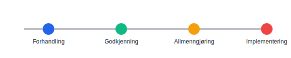

---
title: "Tariff"
meta_title: "Tariff"
meta_description: '**Tariff** er et begrep som beskriver **kollektive avtaler** om lønns- og arbeidsvilkår for bestemte bransjer eller grupper av ansatte. Slike avtaler forhandl...'
slug: tariff
type: blog
layout: pages/single
---

**Tariff** er et begrep som beskriver **kollektive avtaler** om lønns- og arbeidsvilkår for bestemte bransjer eller grupper av ansatte. Slike avtaler forhandles vanligvis fram mellom arbeidsgiverforeninger og fagforeninger, og kan også allmenngjøres av staten.

## Hva er en tariffavtale?

Les mer om detaljert innhold, forhandlingsprosesser og **regnskapsmessige aspekter** i vår dedikerte artikkel om [tariffavtaler](/blogs/regnskap/tariffavtale "Hva er en Tariffavtale? En Komplett Guide til Tariffavtaler") i norsk regnskap.

## Typer tariffavtaler

| Nivå                   | Omfang                        | Eksempel                          |
|------------------------|-------------------------------|-----------------------------------|
| Landsomfattende        | Hele bransjer eller sektorer  | [Fagforeninger](/blogs/regnskap/hva-er-fagforening "Hva er Fagforening? En Guide til Fagforening") |
| Lokale avtaler         | Enkeltbedrifter eller regioner| Virksomhetstilpassede avtaler     |
| Bedriftsavtaler        | Spesifikke bedrifter          | Egenavtaler mellom bedrift og tillitsvalgte |

## Forhandlings- og beslutningsprosess

Prosessen for tariffavtaler følger vanligvis flere steg:

1. **Forhandling** mellom partene
2. **Godkjenning** i medlemsmøter
3. **Allmenngjøring** ved vedtak i staten (dersom aktuelt)
4. **Implementering** i bedriftene

## Relevans for regnskap og lønn

Tariffavtaler påvirker regnskapsføringen ved å fastsette hvilke satser som gjelder for lønn og ytelser. Du finner mer om hvordan **tariffavtaler** integreres i lønnsprosesser i [Hva er lønn?](/blogs/regnskap/hva-er-lonn "Hva er lønn? Komplett Guide til Lønn i Regnskap").

## Dokumentasjon og rapportering

Ved bokføring av lønn og ytelser må bedriften dokumentere at gjeldende tariffavtaler er fulgt. Relevant dokumentasjon inkluderer:

* Kopi av gjeldende tariffavtaler
* Protokoller fra forhandlinger og godkjenning
* Referanse til allmenngjorte satser i [LOV-2019-06-28-58 om allmenngjøring av tariffavtaler](/blogs/regnskap/hva-er-allmenngjoringsloven "Hva er Allmenngjøringsloven?")

## Se også

* [Ansiennitet](/blogs/regnskap/ansiennitet "Ansiennitet i Norsk Regnskap")
* [Minstelønn](/blogs/regnskap/minstelonn "Minstelønn i Regnskap")
* [Timelønn](/blogs/regnskap/hva-er-timelonn "Hva er Timelønn? Guide til Timelønn og Overtid")
* [Feriepenger i prosent](/blogs/regnskap/feriepenger-i-prosent "Feriepenger i Prosent: Satser, Beregning og Regnskapsføring")

