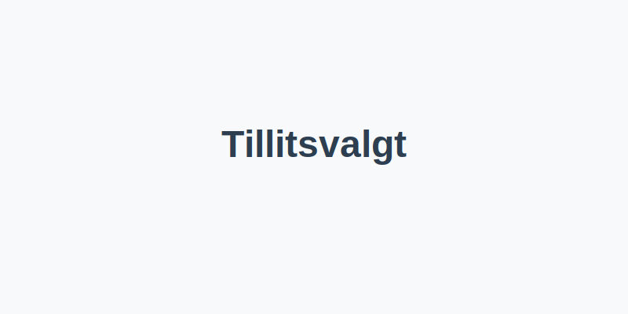

En **tillitsvalgt** er en arbeidstaker valgt av sine kolleger for å representere deres interesser overfor **arbeidsgiver**, fagforening og offentlige myndigheter. **Tillitsvalgte** spiller en nøkkelrolle i norske virksomheter ved å bidra til **godt arbeidsmiljø**, **trygghet** og **rettferdige arbeidsvilkår**.

## Hva er en tillitsvalgt?

En tillitsvalgt fungerer som bindeledd mellom de ansatte og ledelsen. Rollen kan omfatte:

- Dialog om arbeidsforhold og **faglige spørsmål**
- Oppfølging av arbeidsmiljø og HMS-tiltak (se [Hva er HMS?](/blogs/regnskap/hms "Hva er HMS?"))
- Medvirkning i lokale forhandlinger om lønn og arbeidstider
- Oppfølging av bedriftens interne reglement og avtaler

I mange virksomheter har tillitsvalgte særskilte rettigheter etter **Arbeidsmiljøloven**, blant annet innsynsrett i arbeidsavtaler og mulighet for tilrettelegging av arbeidsoppgaver.

## Juridisk grunnlag og rettigheter

| Lover og avtaler           | Innvirkning for tillitsvalgte                                 |
|----------------------------|---------------------------------------------------------------|
| Arbeidsmiljøloven § 8-1    | Rett til informasjon og drøfting ved beslutninger             |
| Hovedavtalen § 1-3         | Vern av tillitsvalgt og krav til organisasjonsrett            |
| Hovedavtalen § 4-1         | Rett til permisjon for tillitsvalgtarbeid                     |
| Tariffavtaler              | Lokale forhandlinger og avtaleverk                            |

Tabellen viser de viktigste bestemmelser som gir tillitsvalgte formelle rettigheter i virksomheten.

## Rolle i regnskaps- og økonomiarbeid

> Tillitsvalgte bidrar til at regnskap og økonomiske beslutninger skjer i forståelse med de ansattes behov.

I samspill med **regnskapsfører** og økonomiansvarlig kan tillitsvalgte:

- Drøfte budsjettprioriteringer som påvirker arbeidsvilkår
- Følge opp lønnsavtaler, bonusordninger og godtgjørelser
- Bidra til korrekt regnskapsføring av ytelser etter kollektivavtale

Se [Hva er Lønn?](/blogs/regnskap/hva-er-lonn "Hva er Lønn?") for mer om hvordan lønns- og godtgjørelsessatser fastsettes.

## Fordeler ved en aktiv tillitsvalgt

- **Økt tillit** mellom ansatte og ledelse
- **Bedre kommunikasjon** av økonomiske beslutninger
- **Tidlig varsling** om endringer som påvirker arbeidsforhold
- **Bedre etterlevelse** av lover og tariffavtaler

## Eksempel: Tillitsvalgtes medvirkning i ferieplanlegging

| Steg       | Handling                                                           |
|------------|--------------------------------------------------------------------|
| 1. Dialog      | Ansatte presenterer ferieønsker til tillitsvalgt               |
| 2. Forhandling | Tillitsvalgt drøfter fellesferie og ferieordninger med ledelsen |
| 3. Avtale      | Endelig plan godkjennes, dokumenteres i [Arbeidskontrakten](/blogs/regnskap/arbeidskontrakten "Arbeidskontrakten") |

## Best practices og anbefalinger

For å styrke rollen som tillitsvalgt og sikre god regnskapspraksis anbefales det å:

1. Delta i møter med regnskapsførere ved budsjett- og lønnsforhandlinger.
2. Skaffe løpende oversikt over tariffavtaler og interne retningslinjer.
3. Dokumentere alle drøftinger skriftlig for å støtte opp om **internkontroll** (se [Hva er Internkontroll?](/blogs/regnskap/hva-er-internkontroll "Hva er Internkontroll?" )).
4. Samarbeide med HMS-ansvarlig for å sikre at arbeidsmiljølovens krav ivaretas.

## Oppsummering

En **tillitsvalgt** er en sentral aktør som fremmer de ansattes interesser, bidrar til transparente økonomiske beslutninger og styrker lov- og avtaleverkets etterlevelse i virksomheter. Godt samarbeid mellom tillitsvalgt, arbeidsgiver og regnskapsførere sikrer et **trygt arbeidsmiljø** og korrekt regnskapsføring.

## Relaterte artikler

- [Arbeidskontrakten](/blogs/regnskap/arbeidskontrakten "Arbeidskontrakten – Roller og Ansvar i Norsk Arbeidsliv og Regnskap")
- [Ferieloven](/blogs/regnskap/ferieloven "Ferieloven – Lov om ferie av 29. april 1988 nr. 21")
- [Fellesferie](/blogs/regnskap/fellesferie "Fellesferie: Hva, regler og planlegging i Norge")
