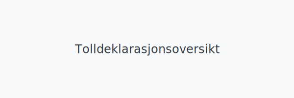

---
title: "Tolldeklarasjonsoversikt – Guide til Tolldeklarasjon i Norsk Regnskap"
meta_title: "Tolldeklarasjonsoversikt – Guide til Tolldeklarasjon i Norsk Regnskap"
meta_description: '**Tolldeklarasjonsoversikt** gir en grundig gjennomgang av **tolldeklarasjon** (ofte kalt *SAD-dokument*) og hvordan dette komplekse skjemaet brukes i norsk reg...'
slug: tolldeklarasjonsoversikt
type: blog
layout: pages/single
---

**Tolldeklarasjonsoversikt** gir en grundig gjennomgang av **tolldeklarasjon** (ofte kalt *SAD-dokument*) og hvordan dette komplekse skjemaet brukes i norsk regnskap ved import og eksport. Vi dekker nøkkelopplysninger, fileringsprosess, digitale krav og beste praksis for norske bedrifter.

## Hva er en tolldeklarasjon?

En **tolldeklarasjon** er et standardisert dokument som deklarerer varens art, verdi og opprinnelse ved grensekryssing. Deklarasjonen er påkrevd for alle varer som importeres til eller eksporteres fra Norge, og behandles av [Tollvesenet](/blogs/regnskap/hva-er-toll "Hva er Toll? Toll og Tollbehandling i Norge") gjennom systemet TVINN.

Tolldeklarasjonen utgjør grunnlaget for beregning av avgifter som **toll**, *import‑MVA* og eventuelle særavgifter, og fungerer som et formelt bilag i regnskapet.

## Nødvendige opplysninger i tolldeklarasjon

En komplett tolldeklarasjon inneholder flere obligatoriske opplysninger som må være korrekte for å sikre juridisk gyldighet og riktig avgiftsberegning:

| **Felt**                  | **Beskrivelse**                                     | **Eksempel**                      |
|---------------------------|-----------------------------------------------------|-----------------------------------|
| **Declarant**             | Registrert identifikasjon av deklarant (EORI‑nummer) | NO123456789                       |
| **Varens beskrivelse**    | Detaljert beskrivelse av varen                      | Kontormøbler, stoler og bord      |
| **KN‑nummer**             | Kombinert Nomenklatur (tariffkode)                  | 94033000                          |
| **Tollverdi (CIF)**       | Verdi inkl. forsikring og frakt frem til grensen    | 50 000 NOK                        |
| **Opprinnelsesland**      | Land der varen er fremstilt eller bearbeidet         | DE (Tyskland)                     |
| **Mengde og vekt**        | Antall enheter og totalvekt                          | 100 enheter, 750 kg               |
| **Leverandørfaktura**     | Referanse til original faktura fra leverandør       | INV‑2024‑0456                     |
| **Dato for import/eksport**| Dato varene krysset grensen                         | 15.04.2024                        |

## Fileringsprosess for tolldeklarasjon

Tolldeklarasjon sendes elektronisk via TVINN, Tollvesenets hovedsystem for digitale deklarasjoner:

* **Forberedelse av data** – Registrering av varer, verdier og koder i systemet
* **Elektronisk innsending** – Send deklarasjonen via TVINN‑grensesnitt eller integrasjon med [ERP‑system](/blogs/regnskap/hva-er-erp-system "Hva er ERP‑system?")
* **Digital signering** – Sertifisert signatur for autentisitet og integritet
* **Forkontroll** – Automatisk risikovurdering før varens ankomst
* **Fysisk kontroll eller frigivelse** – Varer inspiseres ved behov eller frigis for transport

## Digitale krav og TVINN

For at tolldeklarasjonen skal være **juridisk gyldig**, må den oppfylle krav til autentisitet, integritet, lesbarhet og tilgjengelighet:

* **Autentisitet**: Verifisert opprinnelse via EORI og digital signatur
* **Integritet**: Ingen endringer mulig uten sporbar historikk
* **Lesbarhet**: Elektroniske kopier må kunne leses gjennom hele oppbevaringsperioden
* **Tilgjengelighet**: Oppbevares i systemer som kan gjøres tilgjengelige for myndigheter ved forespørsel

## Beste praksis for tolldeklarasjon

For å sikre effektiv håndtering og korrekt regnskapsføring av tolldeklarasjoner anbefales følgende tiltak:

* **Standardiserte maler** – Bruk faste deklarasjonsprofiler i TVINN for repeterende varegrupper
* **Automatisering** – Integrer ERP‑ og tolldeklarasjonssystemer for å redusere manuelle feil
* **Kontrollrutiner** – Regelmessig avstemming av importdata mot regnskapssystemet
* **Opplæring** – Sørg for at ansatte får jevnlig opplæring i tollregelverk og TVINN‑bruk

## Oppbevaring og internkontroll

Tolldeklarasjoner er regnskapsbilag og omfattes av krav til oppbevaring i henhold til [bokføringsforskriften](/blogs/regnskap/hva-er-bokforingsforskriften "Hva er Bokføringsforskriften?"). Alle dokumenter knyttet til import/eksport må oppbevares minimum 5 år:

| **Dokumenttype**         | **Oppbevaringstid** | **Lovgrunnlag**                               |
|--------------------------|---------------------|------------------------------------------------|
| **Tolldeklarasjon**      | Minst 5 år          | Bokføringsforskriften § 13-2, Tolloven § 12-1  |
| **Leverandørfaktura**    | Minst 5 år          | Bokføringsforskriften § 13-2                  |
| **Transportdokumenter**  | Minst 5 år          | Bokføringsforskriften § 13-2                  |

For mer informasjon om oppbevaringskrav, se [Oppbevaring av regnskapsmateriale](/blogs/regnskap/oppbevaring-av-regnskapsmateriale "Oppbevaring av Regnskapsmateriale - Krav og frister").
