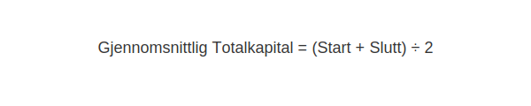
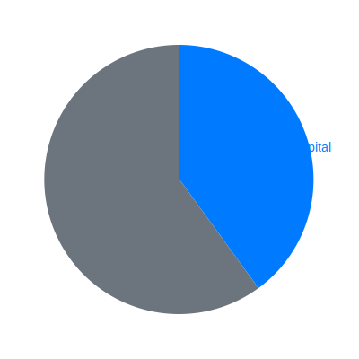

**Totalkapital** er den totale kapitalen som finansierer en virksomhet, definert som summen av [egenkapital](/blogs/regnskap/hva-er-egenkapital "Hva er Egenkapital? Komplett Guide til Egenkapital i Regnskap") og [gjeld](/blogs/regnskap/hva-er-gjeld "Hva er Gjeld? Guide til Gjeldstyper i Regnskap"). Totalkapitalen tilsvarer også [aktiva](/blogs/regnskap/hva-er-aktiva "Hva er Aktiva? Komplett Oversikt over Aktiva og Totalkapital") i balansen og gir innsikt i bedriftens kapitalstruktur.


## Definisjon av Totalkapital

> **Totalkapital** er summen av alle eiendeler som er finansiert av både egenkapital og gjeld.

Totalkapitalen kan uttrykkes med følgende formel:


```text
Totalkapital = Egenkapital + Gjeld
```

## Gjennomsnittlig Totalkapital

I mange nøkkeltall brukes gjennomsnittlig totalkapital for å jevne ut sesongsvingninger:



| Parameter                       | Beskrivelse                                    |
|:-------------------------------|:------------------------------------------------|
| Totalkapital ved periodens start| Totalkapital ved regnskapsårets begynnelse      |
| Totalkapital ved periodens slutt| Totalkapital ved regnskapsårets slutt           |
| Gjennomsnittlig Totalkapital    | (Start + Slutt) ÷ 2                             |

## Viktige nøkkeltall basert på Totalkapital

| Nøkkeltall                    | Formel                                                | Hva det måler                         |
|:------------------------------|:------------------------------------------------------|:--------------------------------------|
| **Totalkapitalrentabilitet**  | (Driftsresultat ÷ Gjennomsnittlig Totalkapital) × 100% | Effektivitet i kapitalbruk           |
| **Kapitalomløpshastighet**    | Omsetning ÷ Gjennomsnittlig Totalkapital               | Hvor effektivt aktiva genererer salg |
| **Soliditet**                 | Egenkapital ÷ Totalkapital × 100%                       | Andel egenkapital i totalkapital      |

## Illustrasjon av kapitalstruktur



## Praktisk bruk i norsk regnskap

Totalkapital er et sentralt grunnlag for analyser av [soliditet](/blogs/regnskap/soliditet "Soliditet “ ForstÃ¥else av egenkapitalandel og finansiell robusthet"), [balanse](/blogs/regnskap/hva-er-balanse "Hva er Balanse i Regnskap?"), og [Hva er Totalkapitalrentabilitet?](/blogs/regnskap/hva-er-totalkapitalrentabilitet "Hva er Totalkapitalrentabilitet?"). Ã… forstÃ¥ totalkapital hjelper regnskapsførere og ledelse med Ã¥ vurdere bedriftens finansielle stabilitet og lÃ¥nekapasitet.


