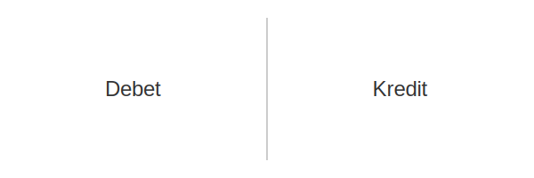

---
title: "Transaksjon"
meta_title: "Transaksjon"
meta_description: 'En **transaksjon** er enhver økonomisk hendelse eller bytte av verdier mellom to parter som påvirker et foretaks **finansielle stilling**. I norsk regnskap da...'
slug: transaksjon
type: blog
layout: pages/single
---

En **transaksjon** er enhver økonomisk hendelse eller bytte av verdier mellom to parter som påvirker et foretaks **finansielle stilling**. I norsk regnskap danner transaksjoner grunnlaget for all [bokføring](/blogs/regnskap/hva-er-bokforing "Hva er Bokføring? En Komplett Guide til Norsk Bokføringspraksis"), [bilagsføring](/blogs/regnskap/hva-er-bilagsforing "Hva er Bilagsføring? Komplett Guide til Bilagsbehandling og Dokumentasjon") og [dobbel bokføring](/blogs/regnskap/hva-er-dobbel-bokforing "Hva er Dobbel bokføring? En Komplett Guide til Dobbelt Bokføringssystem").

Transaksjoner kan være både **kontantbaserte** og **kredittransaksjoner**, og omfatter alt fra daglige kjøp og salg til komplekse interne overføringer. Korrekt håndtering av transaksjoner sikrer både **fullstendighet**, **nøyaktighet** og **sporbarhet** i regnskapet.

## Typer Transaksjoner

| Type                   | Beskrivelse                                                           | Eksempel                                                |
|------------------------|-----------------------------------------------------------------------|---------------------------------------------------------|
| Kontanttransaksjon     | Umiddelbar betaling med kontanter eller bankkort                      | Kjøp av kontorrekvisita med bankkort                     |
| Kredittransaksjon      | Utsettelse av betaling til et senere tidspunkt                        | Salg av varer på kreditt til en kunde                    |
| Intern transaksjon     | Overføring mellom kontoer eller avdelinger innen samme virksomhet     | Avdeling A overfører varer til Avdeling B uten kontantoppgjør |
| Ikke-kontante transaksjoner | Bytte av varer eller tjenester uten pengestrøm (barter)            | Bytte av reklameplass mot regnskapstjenester             |

## Viktige Prinsipper for Transaksjoner

For at en transaksjon skal bli korrekt behandlet i regnskapet, bør følgende prinsipper følges:

* **Transaksjonsprinsippet:** Registrer transaksjonen på det faktiske tidspunktet for økonomisk hendelse.
* **Dokumentasjonskrav:** Hver transaksjon må støttes av gyldig [bilag](/blogs/regnskap/hva-er-bilag "Hva er Bilag i Regnskap? Komplett Guide til Regnskapsbilag").
* **Periodiseringsprinsippet:** Kostnader og inntekter knyttet til transaksjonen registreres i riktig regnskapsperiode. Se [Periodisering](/blogs/regnskap/hva-er-periodisering "Hva er Periodisering i Regnskap? Komplett Guide til Periodiseringsprinsippet").
* **Fullstendighet:** Alle transaksjoner skal inkluderes for å sikre at regnskapet gir et fullstendig bilde av virksomhetens aktivitet.
* **Nøyaktighet:** Transaksjoner må registreres med riktig beløp og valuta, inkludert eventuelle [valutakonverteringer](/blogs/regnskap/hva-er-betalingsmidler "Hva er Betalingsmidler? Komplett Guide til Valuta og Betalingsmetoder").

## Dekning i Dobbel Bokføring

I [dobbel bokføring](/blogs/regnskap/hva-er-dobbel-bokforing "Hva er Dobbel bokføring? En Komplett Guide til Dobbelt Bokføringssystem") registreres hver transaksjon med minst to poster for å bevare regnskapslikningen:

| Konto Debet            | Konto Kredit                                                           |
|------------------------|------------------------------------------------------------------------|
| Konto som mottar verdi | Konto som gir fra seg verdi                                            |

## Dokumentasjon og Sporbarhet

Alle transaksjoner må dokumenteres og arkiveres i henhold til bokføringsforskriften. Typiske bilag inkluderer:

* **Fakturaer** og **kvitteringer**
* **Banktransaksjoner** fra kontoutskrift eller elektroniske filer
* **Konteringsbilag** som spesifiserer kontering av transaksjonen
* **Intern dokumentasjon** ved interne overføringer eller avdelingsstøtte

Ved periodiske kontroller og revisjon er det avgjørende å kunne følge hver enkelt transaksjon fra originalt bilag til post i hovedbok.

----

For mer informasjon om relatert praksis og regnskapsprinsipper, se også [Bokføringsregler](/blogs/regnskap/hva-er-bokforingsregler "Bokføringsregler: Norske Lover og Forskrifter for Regnskapsføring").

