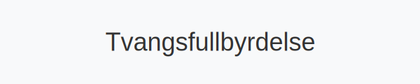

**Tvangsfullbyrdelse** er prosessen for å *gjøre rettskraftige krav gjeldende* gjennom offentlige namsmyndigheter, med sikte på å dekke kreditorers krav ved [Utleggsforretning](/blogs/regnskap/utleggsforretning "Hva er Utleggsforretning? Guide til utleggsforretning i Norge"), *tvangssalg* og *pantsettelser*.

## Hva er Tvangsfullbyrdelse?

**Tvangsfullbyrdelse** innebærer at en skyldner tvangsvis blir pålagt å oppfylle et rettskraftig krav når frivillige innkrevingsmetoder som [Inkasso](/blogs/regnskap/hva-er-inkasso "Hva er Inkasso? Komplett Guide til Inkassovirksomhet og Fordringshåndtering") ikke fører frem. Prosessen ledes av [Namsmannen](/blogs/regnskap/namsmannen "Namsmannen: Norsk tvangsfullbyrdelse og Namsmannens rolle") etter bestemmelsene i tvangsfullbyrdelsesloven.

## Juridisk grunnlag

| Lovgivning               | Formål                                                          |
|--------------------------|-----------------------------------------------------------------|
| Tvangsfullbyrdelsesloven | Regulering av gjennomføring av tvangsfullbyrdelse               |
| Namsmannsloven           | Regulering av namsmannens rolle og fullmakter                   |
| Konkursloven             | Bestemmelser om håndtering av insolvente bo                     |

## Prosess for Tvangsfullbyrdelse

| Steg               | Ansvarlig                     | Handling                                                  |
|--------------------|-------------------------------|-----------------------------------------------------------|
| 1. Formalisering   | Kreditor / Inkassoselskap     | Sikre rettskraftig krav gjennom dom eller namsak           |
| 2. Varsel          | Namsmannen                    | Innkalle skyldner til utleggsforretning                    |
| 3. Utleggsforretning| Namsmannen                   | Beslag av skyldners midler eller løsøre                    |
| 4. Utleggspant     | Namsmannen                    | Sikre pant i utvalgte eiendeler                            |
| 5. Tvangssalg      | Namsmannen                    | Salg av beslaglagte eiendeler for å dekke kravet           |
| 6. Fordeling       | Namsmannen                    | Fordeling av realisert beløp til kreditorene               |

## Typer Tvangsfullbyrdelse

| Type utlegg                 | Beskrivelse                                   |
|-----------------------------|-----------------------------------------------|
| Utlegg i lønn og trygd      | Beslag i lønn, pensjon og trygdeytelser       |
| Utleggspant i løsøre        | Pantsettelse av løsøre som kjøretøy og maskiner|
| Tvangssalg av fast eiendom  | Offentlig auksjon av eiendom                   |
| Midlertidig sikring         | Sikring av eiendeler før endelig utlegg        |

## Roller og ansvar

* **Kreditor:** Initiere prosess etter mislykket inkasso og framlegge rettskraftig krav.
* **Namsmannen:** Gjennomføre varsel, utleggsforretning, utleggspant og tvangssalg.
* **Skyldner:** Motta varsel om utlegg, eventuelt reinfri kravet eller møte i namsmøte.

## Forhold til Inkasso

Tvangsfullbyrdelse er en **siste utvei** etter frivillige inkassometoder. For en grundig gjennomgang av inkassoprosessen, se [Hva er Inkasso?](/blogs/regnskap/hva-er-inkasso "Hva er Inkasso? Komplett Guide til Inkassovirksomhet og Fordringshåndtering").

## Vanlige fallgruver

1. **Manglende varsler:** Feil i varsel til skyldner kan føre til ugyldig utlegg.
2. **Feil i dokumentasjon:** Utilstrekkelig bevis for kravet svekker tvangsgrunnlaget.
3. **Oversittede frister:** Forsinket oppfølging kan gi skyldner innsigelser.

## Videre lesning

* [Hva er Inkasso?](/blogs/regnskap/hva-er-inkasso "Hva er Inkasso? Komplett Guide til Inkassovirksomhet og Fordringshåndtering")
* [Utleggsforretning](/blogs/regnskap/utleggsforretning "Hva er Utleggsforretning? Guide til utleggsforretning i Norge")
* [Namsmannen](/blogs/regnskap/namsmannen "Namsmannen: Norsk tvangsfullbyrdelse og Namsmannens rolle")
* [Hva er Betalingsanmerkning?](/blogs/regnskap/betalingsanmerkning "Betalingsanmerkning i Norsk Regnskap")
* [Hva er Gjeldsregisteret?](/blogs/regnskap/gjeldsregisteret "Hva er Gjeldsregisteret? En Guide til Gjeldsregisteret")

