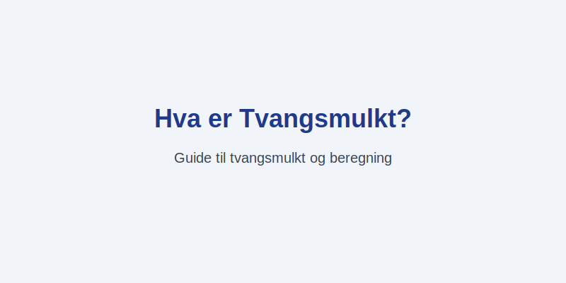

---
title: "Hva er Tvangsmulkt?"
meta_title: "Hva er Tvangsmulkt?"
meta_description: '**Tvangsmulkt** er en **økonomisk sanksjon** som ilegges som dagbøter ved manglende eller forsinket **lovpålagt rapportering** til offentlige myndigheter som...'
slug: tvangsmulkt
type: blog
layout: pages/single
---

**Tvangsmulkt** er en **økonomisk sanksjon** som ilegges som dagbøter ved manglende eller forsinket **lovpålagt rapportering** til offentlige myndigheter som Skatteetaten via [Altinn](/blogs/regnskap/hva-er-altinn "Hva er Altinn? Norges Digitale Portal for Næringsliv og Privatpersoner"). Formålet er å sikre at bedrifter overholder sine rapporteringsfrister for blant annet [A-melding](/blogs/regnskap/hva-er-a-melding "Hva er A-meldingen?") og [MVA-melding](/blogs/regnskap/hva-er-mva-melding "Hva er MVA-melding?").

## Hva er Tvangsmulkt?

Tvangsmulkt er en form for daglig bot som påløper for hver dag en virksomhet ikke leverer lovpålagte rapporter til myndighetene innen fastsatte frister. Beløpet akkumuleres dag for dag helt til rapporteringen er fullført, og kan bli en betydelig kostnad dersom forsinkelsen varer over tid.

## Juridisk grunnlag

Tvangsmulkt er hjemlet i flere lover og forskrifter som regulerer ulike typer rapporteringsplikt:

| Lovgivning                 | Anvendelsesområde                             |
|----------------------------|-----------------------------------------------|
| Skattebetalingsloven §24-2 | Dagbøter for manglende A-melding              |
| Mvaloven §29-1             | Dagbøter for forsinket MVA-melding            |
| Regnskapsloven §7-5        | Dagbøter for forsinket innsending av årsregnskap |
| Bokføringsforskriften §9-6 | Dagbøter for manglende regnskapsdokumentasjon |

## Satser og beregning

Skatteetaten fastsetter dagmulktsatser som gjelder for de ulike rapportene. Under er noen eksempler på standard satser:

| Rapporttype    | Dagmulktsats | Maksimalt beløp | Lovhjemmel                    |
|----------------|--------------|-----------------|-------------------------------|
| A-melding      | 1 000 kr     | 100 000 kr      | Skattebetalingsloven §24-2    |
| MVA-melding    | 1 000 kr     | 100 000 kr      | Mvaloven §29-1                |
| Årsregnskap    | 1 000 kr     | 50 000 kr       | Regnskapsloven §7-5           |

## Hvordan unngå tvangsmulkt?

For å redusere risikoen for dagbøter bør virksomheter etablere gode rutiner for rapportering:

* Bruk av **automatiserte systemer** som integrerer [regnskapssystem](/blogs/regnskap/hva-er-regnskap "Hva er Regnskap? En Enkel Forklaring") og direkte overføring til Altinn.
* Regelmessig **avstemming** og kontroll av interne data før innsending.
* Tydelig **ansvarsfordeling** og kalenderstyring av frister internt.
* Tidlig **påminnelse** og oppfølging ved manglende innsending.
* Sørg for **fullmakter** og tilgangsnivåer i Altinn er oppdatert.

## Forhold til Tvangsfullbyrdelse

Tvangsmulkt er en administrativ sanksjon som kan ilegges uten rettslig kjennelse. Dersom rapportering eller betaling fremdeles uteblir, kan myndighetene gå videre med [tvangsfullbyrdelse](/blogs/regnskap/tvangsfullbyrdelse "Hva er Tvangsfullbyrdelse? Guide til Norsk Gjelds- og Utleggfullbyrdelse") for å kreve inn utestående beløp.

## Relaterte artikler

* [Hva er A-meldingen?](/blogs/regnskap/hva-er-a-melding "Hva er A-meldingen?")
* [Hva er MVA-melding?](/blogs/regnskap/hva-er-mva-melding "Hva er MVA-melding?")
* [Hva er Altinn?](/blogs/regnskap/hva-er-altinn "Hva er Altinn? Norges Digitale Portal for Næringsliv og Privatpersoner")
* [Hva er opplysningsplikt?](/blogs/regnskap/hva-er-opplysningsplikt "Hva er opplysningsplikt? Komplett guide til rapporteringsplikt")
* [Hva er Regnskap?](/blogs/regnskap/hva-er-regnskap "Hva er Regnskap? En Enkel Forklaring")
* [Hva er Tvangsfullbyrdelse?](/blogs/regnskap/tvangsfullbyrdelse "Hva er Tvangsfullbyrdelse? Guide til Norsk Gjelds- og Utleggfullbyrdelse")

