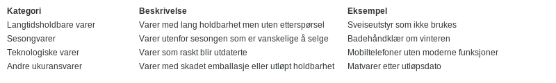

---
title: "Ukurans"
meta_title: "Ukurans"
meta_description: '**Ukurans** er **nedskrivning** av varelager som ikke lenger kan realiseres til full verdi. Korrekt håndtering av ukurans sikrer at balansen gjenspeiler reell ...'
slug: ukurans
type: blog
layout: pages/single
---

**Ukurans** er **nedskrivning** av varelager som ikke lenger kan realiseres til full verdi. Korrekt håndtering av ukurans sikrer at balansen gjenspeiler reell **netto realisasjonsverdi** av lagerbeholdningen, i samsvar med [regnskapsregler](/blogs/regnskap/hva-er-regnskap "Hva er Regnskap? En komplett guide") og [bokføringsloven](/blogs/regnskap/hva-er-bokforingsloven "Hva er Bokføringsloven? Oversikt over Regnskapets Lovverk").

## Seksjon 1: Hva er Ukurans?

**Ukurans** oppstår når varer i lageret har falt så mye i verdi at deres antatte salgsverdi er lavere enn anskaffelseskost. Dette kan skyldes skadet emballasje, endret etterspørsel, sesongsvingninger eller teknologisk utdatering.

### Viktigheten av korrekt ukuransvurdering

* Sikrer at regnskapet viser realistiske verdier
* Forebygger feilinformasjon i balansen
* Støtter korrekte beslutninger ved lagerstyring og innkjøp

## Seksjon 2: Regnskapsregler for Ukurans

I Norge reguleres ukuransvurdering av [regnskapsloven § 5-2](/blogs/regnskap/hva-er-regnskapsloven "Hva er Regnskapsloven? En komplett oversikt"): varelager skal vurderes til laveste av anskaffelseskost og netto realisasjonsverdi.

### Norsk standard vs. IFRS

| Aspekt               | Norske regler                                | IFRS (IAS 2)                                      |
|-----------------------|-----------------------------------------------|---------------------------------------------------|
| Avsetningskrav        | Laveste av kost og netto realisasjonsverdi    | Laveste av kost og netto realisasjonsverdi        |
| Dokumentasjon        | Detaljert dokumentasjon av metoder           | Prinsippbasert dokumentasjon                      |
| Periodisering         | Påkrevd konsistens og jevn behandling        | Krever vurdering av vesentlighet                  |

## Seksjon 3: Kategorier av Ukurans

| Kategori                | Beskrivelse                                         | Eksempel                             |
|-------------------------|-----------------------------------------------------|--------------------------------------|
| **Langtidsholdbare varer** | Varer med lang holdbarhet men uten etterspørsel      | Sveiseutstyr som ikke brukes         |
| **Sesongvarer**          | Varer utenfor sesongen som er vanskelige å selge      | Badehåndklær om vinteren             |
| **Teknologiske varer**    | Varer som raskt blir utdaterte                        | Mobiltelefoner uten moderne funksjoner |
| **Andre ukuransvarer**    | Varer med skadet emballasje eller utløpt holdbarhet  | Matvarer etter utløpsdato            |

## Seksjon 4: Prosess for håndtering av Ukurans

### Steg i prosessen

1. **Identifiser potensielt ukurante varer** basert på alder, etterspørsel og kvalitet
2. **Vurder netto realisasjonsverdi** ved markedsundersøkelser eller prisforespørsler
3. **Beregn nedskrivningsbeløp** som differanse mellom anskaffelseskost og netto realisasjonsverdi
4. **Dokumenter og godkjenn** nedskrivningsbeslutning internt
5. **Registrer nedskrivning** i regnskap ved bokføring av kostnadsføring mot lagerkonto

## Seksjon 5: Skattemessige konsekvenser

Selv om skattemyndighetene godtar nedskriving for ukurans, kreves det dokumentasjon som viser beregningsgrunnlaget. Nedskrivning av lager kan redusere skattegrunnlaget, men må følges opp med god intern kontroll og dokumentasjon.

## Seksjon 6: Beste praksis for Ukurans-håndtering

* Etabler klare retningslinjer for måling og dokumentasjon av ukurans
* Gjennomfør regelmessige lagertellinger og vurder nettorealisasjonsverdi
* Bruk digitale verktøy for å spore varedata, alder og salgsstatistikk
* Involver revisjon eller ekstern ekspertise ved vesentlige nedskrivninger

## Relaterte Artikler

* [Hva er Varelager?](/blogs/regnskap/hva-er-varelager "Hva er Varelager? Komplett Guide til Lagerregnskapsføring og Verdivurdering")
* [Hva er Bokføringsloven?](/blogs/regnskap/hva-er-bokforingsloven "Hva er Bokføringsloven? Oversikt over Regnskapets Lovverk")
* [Hva er Periodisering?](/blogs/regnskap/hva-er-periodisering "Hva er Periodisering? Prinsipper og Praktiske Eksempler")

