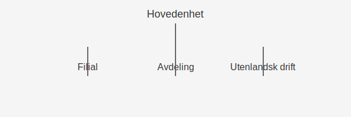

---
title: "Underenhet"
meta_title: "Underenhet"
meta_description: ''
slug: underenhet
type: blog
layout: pages/single
---

En **underenhet** er en del av en juridisk enhet som opererer under hovedenheten, ofte brukt for å organisere og rapportere regnskapsinformasjon for spesifikke deler av virksomheten. Underenheter kan være filialer, avdelinger eller andre organisatoriske enheter som har egne oppgaver, budsjetter og rapporteringskrav.

Underenheter registreres ofte i [Enhetsregisteret](/blogs/regnskap/enhetsregisteret "Enhetsregisteret: Oversikt over enhetsregisteret i Norge") når de oppfyller visse kriterier. De er også sentrale i både [internregnskap](/blogs/regnskap/hva-er-internregnskap "Hva er Internregnskap? Guide til Intern Rapportering") og ekstern rapportering.

## Hva er en Underenhet?

> *Underenhet* er en organisatorisk eller juridisk avdeling av en hovedenhet (morforetak) som driver virksomhet med en viss grad av selvstendighet, men uten å være en selvstendig juridisk person.

**Nøkkelaspekter ved underenhet:**

* Organisatorisk del av hovedenhet
* Ikke egen juridisk person, men kan ha eget ansvarsområde
* Eget budsjett og regnskapsrapportering
* Registreringskrav ved visse omsetningsgrenser

## Typer Underenheter

| Underenergtype        | Beskrivelse                                                   |
|-----------------------|---------------------------------------------------------------|
| **Filial**            | Et stedlig utsalgssted med adresse og egen drift              |
| **Avdeling**          | Intern divisjon med eget ansvar for produkter eller tjenester |
| **Utenlandsk drift**  | Forretningsenhet i utlandet uten egen juridisk status         |

## Registrering i Enhetsregisteret

Underenheter må registreres i [Enhetsregisteret](/blogs/regnskap/enhetsregisteret "Enhetsregisteret: Oversikt over enhetsregisteret i Norge") hvis de har:

* Egen forretningsadresse
* Selvstendig regnskapsføring
* Fast virksomhet lokalisert utenfor hovedenhetens adresse

| Kriterium            | Registreringskrav                        |
|----------------------|------------------------------------------|
| Forretningsadresse   | Ja                                       |
| Egen regnskapsføring | Ja                                       |
| Fast virksomhet      | Ja                                       |

## Betydning for Regnskap og Rapportering

Underenheter gir **detaljert innsikt** i virksomhetens ulike deler og støtter:

* Kostnads- og lønnsomhetsanalyser per underenhet
* Budsjettkontroll og ansvarliggjøring
* Intern og ekstern rapportering med avviksanalyse
* Oppfyllelse av lovpålagte rapporteringskrav

## Illustrasjon av Underenhetstruktur

Figuren viser hvordan en underenhet er plassert under hovedenheten med egne ansvarsområder.

## Praktiske RÃ¥d for HÃ¥ndtering av Underenheter

1. **Definer klare ansvarsområder:** Spesifiser formål og rapporteringskrav for hver underenhet.
2. **Etabler budsjett og rapporteringsrutiner:** Utarbeid egne budsjetter og maler for regnskapsrapportering.
3. **Sørg for korrekt registrering:** Kontroller om underenheten skal registreres i Enhetsregisteret.
4. **Integrer i internregnskapet:** Bruk underenheter for å segmentere analyser i internregnskapet.

## Oppsummering

En **underenhet** er en viktig komponent i moderne regnskapsorganisering, som gir mulighet for detaljert analyse og styring av virksomhetens ulike deler. Riktig etablering, registrering og rapportering av underenheter sikrer både intern kontroll og ekstern etterlevelse.

