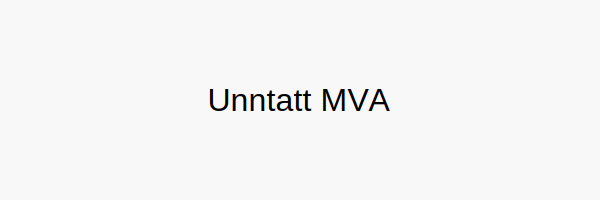

---
title: "Unntatt MVA"
meta_title: "Unntatt MVA"
meta_description: '**Unntatt MVA** refererer til varer og tjenester som i henhold til norsk regelverk ikke belastes merverdiavgift. Ã… kjenne til hvilke leveranser som er **unntat...'
slug: unntatt-mva
type: blog
layout: pages/single
---

**Unntatt MVA** refererer til varer og tjenester som i henhold til norsk regelverk ikke belastes merverdiavgift. Å kjenne til hvilke leveranser som er **unntatt MVA** er avgjørende for korrekt fakturering og regnskapsføring i bedriften.

## 1. Hva betyr Unntatt MVA?

Når noe er unntatt MVA, betyr det at leverandøren ikke skal legge til MVA på fakturaen. Dette er forskjellig fra *0-sats*, der MVA beregnes men settes til 0 %.

Les mer om [MVA-satser og unntak i Norge](/blogs/regnskap/hva-er-moms-mva "Hva er Moms (MVA)? Komplett Guide til Merverdiavgift i Norge").

## 2. Vanlige eksempler på unntatte varer og tjenester

| **Kategori**                                     | **Eksempler**                                                 |
|--------------------------------------------------|--------------------------------------------------------------|
| **Helse- og omsorgstjenester**                   | Lege- og tannlegetjenester, fysioterapi                       |
| **Undervisningstjenester**                       | Grunnskole, videregående skole, universiteter                 |
| **Finans- og forsikringstjenester**              | Banktjenester, forsikringspremier                             |
| **Kultur, idrett og frivillighet**               | Kino, teater, sportsarrangementer under visse vilkår          |
| **Utleie av fast eiendom**                       | Utleie av bolig, kontorlokaler (unntatt korttidsutleie/hotell)|
| **Transporttjenester (internasjonal)**           | Internasjonal frakt av varer                                  |

## 3. Praktiske råd for regnskapsføring

* **Kontroller fakturahåndtering:** Sørg for at fakturamaler ikke legger til MVA på unntatte leveranser.
* **Skille kontoer:** Bruk egne regnskapskontoer for unntatte leveranser.
* **Dokumentasjon:** Behold avtaler og kontrakter som viser at tjenesten er lovpålagt unntatt MVA.

For e-handel til privatpersoner håndtert via VOEC-ordningen, se [Hva er VOEC?](/blogs/regnskap/voec "Hva er VOEC? Komplett guide til VOEC-ordningen").

