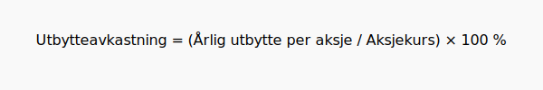

---
title: "Utbytteaksjer"
meta_title: "Utbytteaksjer"
meta_description: '**Utbytteaksjer** er aksjer i selskaper som deler ut jevnlige kontantutbetalinger til aksjonærene, kalt *utbytte*. Slike aksjer er populære blant investorer s...'
slug: utbytteaksjer
type: blog
layout: pages/single
---

**Utbytteaksjer** er aksjer i selskaper som deler ut jevnlige kontantutbetalinger til aksjonærene, kalt *utbytte*. Slike aksjer er populære blant investorer som søker **stabil inntekt** og langsiktig avkastning. Denne guiden gir deg alt du trenger å vite om utbytteaksjer i norsk marked, inkludert hvordan utbytteavkastning beregnes, eksempler på investeringer, risikofaktorer og kriterier for å velge de beste utbytteaksjene.

## Hva er utbytteaksjer?
Utbytteaksjer er aksjer i selskaper som regelmessig beslutter å utdele deler av overskuddet til aksjonærene. Når du eier en utbytteaksje, mottar du kontantbetalinger – **utbytte** – som kan gi en stabil inntektsstrøm. Dette skiller seg fra selskaper som enten reinvesterer hele overskuddet eller kun betaler mindre andeler.

## Hvordan beregnes utbytteavkastning?
Utbytteavkastning (dividend yield) viser forholdet mellom årlig utbytte per aksje og aksjekurs, uttrykt i prosent. Formelen er:

**Utbytteavkastning (%) = (Årlig utbytte per aksje / Aksjekurs) × 100**

## Eksempel på utbytteavkastning
| Selskap | Ã…rlig utbytte per aksje | Aksjekurs | Utbytteavkastning |
|---------|-------------------------|-----------|-------------------|
| Alpha   | 5,00 kr                 | 100,00 kr | 5,0 %             |
| Beta    | 8,00 kr                 | 200,00 kr | 4,0 %             |
| Gamma   | 3,00 kr                 |  50,00 kr | 6,0 %             |

Tabellen viser hvordan små endringer i utbytte og kurs gir forskjellig avkastning. Høy utbytteavkastning kan indikere *stabil* kontantstrøm, men også økt risiko.

## Hvorfor investere i utbytteaksjer?
Nedenfor er noen grunner til at investorer velger utbytteaksjer:

* **Stabil inntekt:** Jevnlige kontantutbetalinger gir forutsigbar avkastning.
* **Lavere volatilitet:** Utbytteaksjer tenderer til å være mindre svingende enn vekstaksjer.
* **Gjeninvestering:** Utbytter kan gjeninvesteres og gi *sammensatt* avkastning over tid.
* **Inflasjonsbeskyttelse:** Økende utbyttenivåer kan dempe verdifall ved inflasjon.

## Risiko ved utbytteaksjer
Selv om utbytteaksjer har fordeler, finnes det risikoer:

* **Utdelingskutt:** Dårlig inntjening kan føre til lavere eller ingen utbytteutbetaling.
* **Konsentrasjon:** Mange høyutbytteaksjer finnes i sektorer med sykliske svingninger.
* **Renteendringer:** Høyere rentenivåer kan gjøre utbytteaksjer mindre attraktive.

## Skattehensyn
Inntekter fra utbytte er skattepliktige. For detaljert gjennomgang av skattemessige regler, se [Hva er Skatt på Utbytte?](/blogs/regnskap/skatt-pa-utbytte "Hva er Skatt på Utbytte? Regnskapsføring og Skattemessige Forhold").

## Hvordan velge gode utbytteaksjer?
Ved valg av utbytteaksjer kan du vurdere:

1. **Utbyttehistorikk:** Se etter selskaper med stabil eller økende utbytte over tid.
2. **Utbetalingsgrad:** Andel av overskudd som deles ut – for høy kan være uholdbar.
3. **Kontantstrøm:** Sterk kontantstrøm sikrer evne til å betale utbytte.
4. **Gjeldsnivå:** Lav gjeld gir større fleksibilitet ved utbyttebetaling.
5. **Selskapsstørrelse og sektor:** Store, modne selskap i forsvarlige sektorer gir ofte jevn utbytte.

For mer om analyser av aksjer generelt, se [Hva er en Aksje?](/blogs/regnskap/hva-er-en-aksje "Hva er en Aksje? En Enkel Forklaring") og [Hva er Avkastning?](/blogs/regnskap/hva-er-avkastning "Hva er Avkastning? Komplett Guide til Investeringer og Avkastning").

---

**Oppsummering:** Utbytteaksjer gir jevn inntekt og kan være en kjernekomponent i en langsiktig investeringsstrategi. Ved å forstå utbytteavkastning, risikofaktorer og skattemessige forhold, kan du velge de beste aksjene for en stabil portefølje.
