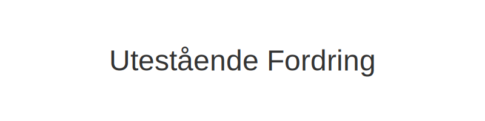
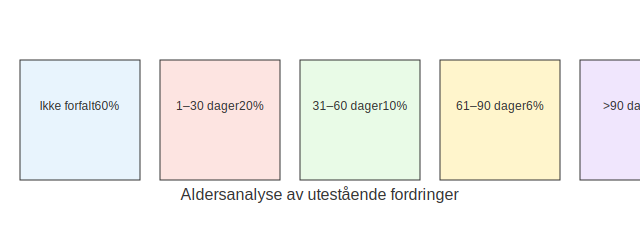

---
title: "Utestående Fordring"
meta_title: "Utestående Fordring"
meta_description: '**Utestående Fordring** er den delen av din **kundefordring** som ennå ikke er betalt innen forfallsdato, og representerer en risiko for likviditet og kreditt...'
slug: utestaende-fordring
type: blog
layout: pages/single
---

**Utestående Fordring** er den delen av din **kundefordring** som ennå ikke er betalt innen forfallsdato, og representerer en risiko for likviditet og kredittrisiko. Effektiv styring av utestående fordringer krever systematisk oppfølging, aldersanalyse og beslutningsprosesser for nedskrivning eller inkasso.

## Hva betyr Utestående Fordring?

En utestående fordring oppstår når fakturabeløpet ikke er betalt ved forfall. Bedriften må da følge opp fordringen gjennom påminnelser, inkassovarsel og eventuelt rettslige skritt for å sikre innbetaling.

For en overordnet forståelse av fordringer, se [Hva er Fordring?](/blogs/regnskap/hva-er-fordring "Hva er Fordring? En Komplett Guide til Fordringer i Norsk Regnskap").

## Aldersanalyse av utestående fordringer

For å vurdere kredittrisikoen og behovet for tapsavsetninger, deles utestående fordringer ofte inn i forfallsintervaller:

| Forfallsintervall        | Andel av totale fordringer | Anbefalt tapsavsetning (%) |
|--------------------------|----------------------------|-----------------------------|
| Ikke forfalt            | 60 %                       | 0 %                         |
| 1“30 dager forfalt      | 20 %                       | 2 %                         |
| 31“60 dager forfalt     | 10 %                       | 10 %                        |
| 61“90 dager forfalt     | 6 %                        | 30 %                        |
| Over 90 dager forfalt   | 4 %                        | 70 %                        |

## Oppfølging og inkassoprosess

En klar prosess for oppfølging bidrar til raskere innbetaling:

* **Påminnelse:** Send vennlige betalingspåminnelser kort tid etter forfall.
* **Inkassovarsel:** Formell varsling før inkassosak, i henhold til Inkassoloven.
* **Inkasso:** Overlevering til inkassobyrå hvis betaling uteblir.
* **Rettslig skritt:** Søk utlegg eller betalingsanmerkning om nødvendig.

Se også [Hva er kundefordring?](/blogs/regnskap/hva-er-kundefordring "Hva er Kundefordring? En Guide til Kundefordringer i Regnskap") for regnskapsføring av fordringer.

## Nedskrivning og tapsvurdering

Fordringer som anses som tapt, må nedskrives i regnskapet etter gjeldende regnskapsregler. Vurdering av nedskrivninger baseres på aldersanalyse, kundekredittvurdering og historiske tap.

| Tiltak                    | Beskrivelse                                                     |
|---------------------------|-----------------------------------------------------------------|
| Individuell nedskrivning  | Vurdering per kunde for store fordringer                       |
| Gruppebasert nedskrivning | Statistisk basert avsetning for mindre beløp                  |

## Juridiske rammer

Inkasso må skje i henhold til [Inkassoloven](/blogs/regnskap/hva-er-inkassoloven "Hva er Inkassoloven? Regler for Inkasso i Norge") og god inkassoskikk. Feil håndtering kan føre til renter, gebyrer og rettslige konsekvenser.

## Oppsummering

Systematisk bruk av **aldersanalyse**, **oppfølging** og **tapsvurdering** er avgjørende for effektiv styring av utestående fordringer og for å sikre bedriftens likviditet.

