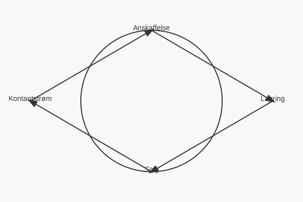

---
title: "Hva er varekretsløpet?"
meta_title: "Hva er varekretsløpet?"
meta_description: '**Varekretsløpet** beskriver den helhetlige prosessen varer gjennomgår i en virksomhet, fra anskaffelse til salg og tilbakeføring av kapital. Prosessen er se...'
slug: varekretslopet
type: blog
layout: pages/single
---

**Varekretsløpet** beskriver den helhetlige prosessen varer gjennomgår i en virksomhet, fra anskaffelse til salg og tilbakeføring av kapital. Prosessen er sentral for å forstå sammenhengen mellom lagerstyring, **kontantstrøm** og **arbeidskapital**, og påvirker både likviditet og lønnsomhet.

## 1. Oversikt over varekretsløpet

Varekretsløpet består av følgende hovedfaser:

* **Anskaffelse:** Kjøp eller produksjon av varer.
* **Lagring:** Varetelling, for eksempel ved [avstemming](/blogs/regnskap/hva-er-avstemming "Hva er Avstemming?") og verdivurdering etter [laveste verdi-prinsippet](/blogs/regnskap/hva-er-balansebasert-verdivurdering "Hva er Balansebasert Verdivurdering?").
* **Salg:** Distribusjon av varer til kunder og inntektsføring i [resultatregnskapet](/blogs/regnskap/resultatregnskap "Hva er Resultatregnskap?").
* **Kontantstrøm tilbake til virksomheten:** Innbetaling fra kunder og reinvestering i nytt varelager eller annen drift.

## 2. Anskaffelseskost og lagerverdivurdering

Anskaffelseskost er grunnlaget for **verdivurdering** av lager, og inkluderer innkjøpspris, frakt, toll og andre direkte kostnader. For tekniske metoder som FIFO, LIFO eller vektet gjennomsnitt, se den detaljerte artikkelen om [Hva er varelager?](/blogs/regnskap/hva-er-varelager "Hva er Varelager? Komplett Guide til Lagerstyring og Regnskapsføring") under seksjon 2. Verdivurdering.

## 3. Salg og inntektsføring

Ved salg av varer må to bokføringer gjøres parallelt:

| Transaksjon              | Debet                        | Kredit                       |
|--------------------------|------------------------------|------------------------------|
| Salg av varer            | [Kundefordringer](/blogs/regnskap/hva-er-fakturering "Hva er Fakturering?") eller Bank | Salgsinntekter |
| Kostpris solgte varer    | Kostpris solgte varer        | Varelager                    |

## 4. Internkontroll og digitalisering

God internkontroll i varekretsløpet oppnås gjennom:

* Systematisk dokumentasjon av varemottak og vareuttak.
* Periodiske avstemninger av lagerbeholdning.
* Bruk av [ERP-systemer](/blogs/regnskap/hva-er-erp-system "Hva er ERP-system?") for sanntidsoversikt.
* Automatisering av lagerprosesser med digitale verktøy.

## 5. Skattemessige og regnskapsmessige forhold

I Norge følger verdivurdering av lager regnskapslovens prinsipper og skattemessige regler. Laveste verdi-prinsippet krever at lager verdsettes til laveste av anskaffelseskost og netto realisasjonsverdi. Riktig håndtering påvirker skattepliktig overskudd og balanseføring.

## Videre lesning

For mer om varelager og regnskapsprinsipper, se også [Hva er varelager?](/blogs/regnskap/hva-er-varelager "Hva er Varelager? Komplett Guide til Lagerstyring og Regnskapsføring").
