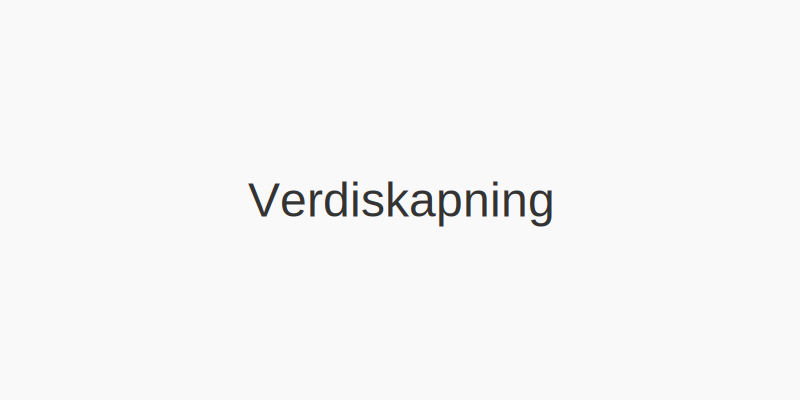

**Verdiskapning** er prosessen hvor en bedrift skaper **økonomisk verdi** og **bærekraftig vekst** gjennom effektiv ressursbruk, innovasjon og smart kapitalallokering. Å forstå verdiskapning er essensielt for å vurdere selskapets *lønnsomhet*, *soliditet* og *langsiktige konkurransekraft*.

For mer om beslektede begreper, se [Hva er bærekraft?](/blogs/regnskap/baerekraft "Hva er Bærekraft? Prinsipper for Bærekraftsrapportering") og [Hva er omsetning?](/blogs/regnskap/hva-er-omsetning "Hva er Omsetning? Komplett Guide til Omsetningsanalyse").

## Hva driver Verdiskapning?

Verdiskapning i bedrifter avhenger primært av tre hovedelementer:

| Driver               | Beskrivelse                                                      |
|----------------------|------------------------------------------------------------------|
| Økonomisk vekst      | Økning i omsetning og fortjeneste                                |
| Bærekraft            | Langsiktig miljømessig og sosial verdi                           |
| Ressurseffektivitet  | Optimal bruk av ressurser for maksimal avkastning                |

## Hvorfor er Verdiskapning viktig?

- Gir innsikt i selskapets **lønnsomhet** og **kapitalavkastning**.
- Underbygger strategisk planlegging og **investeringsbeslutninger**.
- Støtter [Budsjettering](/blogs/regnskap/hva-er-budsjettering "Hva er Budsjettering? Komplett Guide til Budsjettplanlegging") og [Investering](/blogs/regnskap/hva-er-investere "Hva er å Investere? Komplett Guide til Investeringer i Regnskap").
- Fremmer en helhetlig tilnærming til **bærekraft** og samfunnsansvar.

## Hvordan måle Verdiskapning?

Verdiskapning kan måles ved ulike nøkkeltall:

| Nøkkeltall                       | Formål                                                         |
|----------------------------------|----------------------------------------------------------------|
| **Resultatgrad**                 | Viser hvor stor andel av omsetningen som blir fortjeneste       |
| **Kapitalavkastning (ROCE)**     | Måler avkastning på investert kapital                           |
| **Economic Value Added (EVA)**   | Måler verdiskapning utover kapitalkostnaden (se [Inntjeningsbasert verdivurdering](/blogs/regnskap/hva-er-inntjeningsbasert-verdivurdering "Hva er Inntjeningsbasert Verdivurdering? Komplett Guide til Verdsettelsesmetoder")) |

## Eksempler på Verdiskapning

1. **Produktinnovasjon:** Lansering av nye produkter som øker omsetningen og marginene.
2. **Digitalisering:** Implementering av automatiserte systemer som reduserer driftskostnader.
3. **Bærekraftige tiltak:** Investering i grønn teknologi som bygger omdømme og reduserer risiko.

## Oppsummering

**Verdiskapning** er kjernen i en bedrifts langsiktige suksess. Ved å fokusere på **økonomisk vekst**, **bærekraft** og **ressurseffektivitet** kan selskaper skape varig verdi for både eiere og samfunnet.
