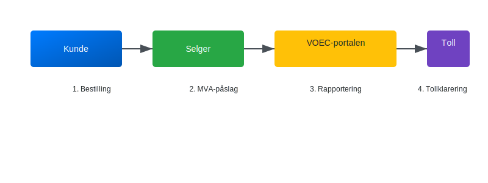

---
title: "Hva er VOEC?"
meta_title: "Hva er VOEC?"
meta_description: '**VOEC** (Value Added Tax on E-Commerce) er en ordning som forenkler innkreving av **merverdiavgift (MVA)** på varer kjøpt fra utlandet av norske privatperson...'
slug: voec
type: blog
layout: pages/single
---

**VOEC** (Value Added Tax on E-Commerce) er en ordning som forenkler innkreving av **merverdiavgift (MVA)** på varer kjøpt fra utlandet av norske privatpersoner. Ordningen gjelder spesielt små forsendelser og gjør det mulig for utenlandske selgere å registrere seg direkte i det norske MVA-registeret for e-handel.

For mer informasjon om merverdiavgift generelt, se [Hva er Avgiftsplikt (MVA)?](/blogs/regnskap/hva-er-avgiftsplikt-mva "Hva er Avgiftsplikt (MVA)? Komplett Guide til Merverdiavgift i Norge").
For en oversikt over unntak og spesielle regler, se [Unntatt MVA](/blogs/regnskap/unntatt-mva "Unntatt MVA - NÃ¥r varer er fritatt for merverdiavgift").

## Seksjon 1: Hva er VOEC-ordningen?

VOEC står for **Value Added Tax on E-Commerce** og er en del av EUs og Norges tiltak for å fange opp MVA på varer som sendes til privatpersoner. Ordningen trådte i kraft i Norge 1. april 2023 og erstatter hovedsakelig fritaksordningen for småforsendelser under 350 NOK.

**Hovedprinsipper for VOEC:**

* **Registrering**: Utenlandske selgere må registrere seg i det norske MVA-registeret for e-handel.
* **Rapportering**: MVA rapporteres og betales kvartalsvis gjennom VOEC-portalen.
* **Eierskap**: MVA kreves inn før varen krysser grensen, direkte fra selger til forbruker.

## Seksjon 2: Hvem omfattes av VOEC?

Tabellen under viser hvilke aktører og transaksjoner som dekkes av VOEC-ordningen:

| Aktør                   | Type kunde     | Varer                | Verdigrenser                  | MVA-behandling                         |
|--------------------------|----------------|----------------------|-------------------------------|----------------------------------------|
| Utenlandsk nettbutikk    | Privatpersoner | Fysiske varer        | Opptil 3 000 NOK per forsendelse | MVA påslag ved salg                    |
| Utenlandsk nettbutikk    | Privatpersoner | Fysiske varer        | Over 3 000 NOK per forsendelse | Importmoms og toll ved grensen         |
| Utenlandsk nettbutikk    | Foretak        | Fysiske varer        | Uansett beløp                 | Omvendt avgiftsplikt                  |

## Seksjon 3: Hvordan fungerer prosessen?

Prosessen under VOEC-ordningen for en typisk forsendelse under 3 000 NOK:

1. Kunden legger inn bestilling i en utenlandsk nettbutikk.
2. Nettbutikken beregner og legger til norsk MVA før utsending.
3. Nettbutikken rapporterer salgene til VOEC-systemet og betaler inn samlet MVA.
4. Tollen frigir varene uten ytterligere avgiftsberegning ved grensen.

| Trinn | Handling                 | Ansvarlig          |
|-------|--------------------------|--------------------|
| 1     | Bestilling og betaling   | Kunde              |
| 2     | MVA-påslag og salg       | Selger             |
| 3     | MVA-rapportering         | Selger             |
| 4     | Tollklarering            | Tollmyndigheter    |

## Seksjon 4: Fordeler og ulemper

**Fordeler:**

* **Raskere levering** uten forsinkelse i tollen.
* **Enklere for selgere** som unngår krav om tollhåndtering.
* **Forutsigbar pris** for forbrukeren med MVA inkludert ved kjøp.

**Ulemper:**

* **Administrativ byrde** for små nettbutikker som må registrere seg.
* **Likviditetskrav** ved innbetaling av MVA før forsendelse.

## Seksjon 5: Vanlige spørsmål

### Hva er grenseverdien for VOEC?

VOEC gjelder for forsendelser **under 3 000 NOK**. For forsendelser over grensen må importmoms og eventuelt toll beregnes ved grensen.

### Hvordan registrere seg i VOEC?

Registrering skjer gjennom [VOEC-portalen](https://www.skatteetaten.no/voec) hos Skatteetaten, hvor utenlandske selgere oppretter konto og får et VOEC-ID.

### Hva skjer ved overskridelse av grenseverdien?

For forsendelser over 3 000 NOK er varene ikke lenger omfattet av VOEC, og kunden må betale norsk importmoms og eventuell toll ved grensen.

